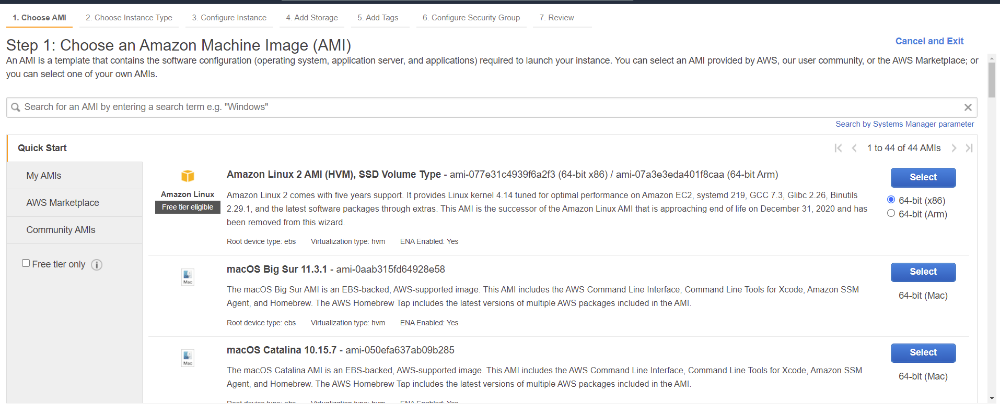
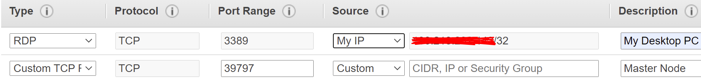
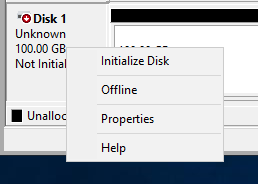
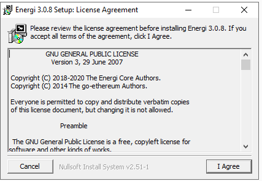
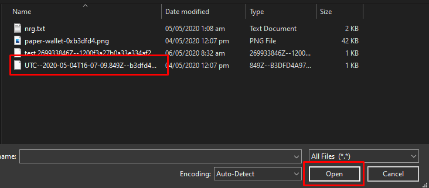

## ​1.​ Create / Login to your AWS Account {#create}

### 1.1. Login via a web browser (**Brave, Firefox, Chrome, etc.**)

Navigate to [**https://aws.amazon.com/**](https://aws.amazon.com/)


1.1.1. If you do not have an **AWS Account**, click **Create an AWS Account** and continue the steps to create one.


1.1.2. If you already have an **AWS Account**, click **My Account** and then click **AWS Management Console** to log into your AWS account.


### 1.2. AWS Management Console

You will then be redirected to the AWS Management Console, which looks like this:


1.2.1. In the top right-hand corner, next to your name, you will find the location of your **AWS Service**. Click the **location** and choose a **location closest to you**. In our example below, we will use **US East (Ohio) us-east-2**


1.2.2. On the **AWS Management Console** page, click on **EC2** under the **All Services** tab.


### 1.3. Navigate to the **Resources** page and click **Launch Instance**.


### 1.4. Choose an Amazon Machine Image (AMI).



1.4.1. In the search bar, type **Windows**. You will find **Microsoft Windows Server 2019 Base**. On the right of this, click **Select**.


1.4.2. You will be sent to the next page — **Step 2: Choose an Instance Type.** Here, we choose **t2.medium**. This is recommended for Core Node. When chosen, on the bottom right corner of the page, click **Next: Configure Instance Details**.


1.4.3. You will then arrive at **Step 3: Configure Instance**. Here you can continue by clicking **Next: Add Storage**

**Note**: You can tick the box that says **Unlimited** for greater performance for this instance when it’s needed. You will be charged more. Read more [here](https://docs.aws.amazon.com/AWSEC2/latest/UserGuide/burstable-performance-instances-unlimited-mode.html?icmpid=docs_ec2_console)


1.4.4. You will then arrive at **Step 4: Add Storage.** Here we will add a second storage. Click **Add New Volume**.


1.4.5. After Clicking **Add New Volume**, ensure the **Size** of the second volume is **150 GiB** minimum (recommended **200** GiB), the **Volume type** is **General Purpose SSD,** and **Delete on Termination** is **ticked.** Then, click **Next: Add Tags**.


1.4.6. At **Step 5:** **Add Tags**, there is nothing to be done. Just click **Next: Configure Security Group**.


1.4.7. You will then be directed to **Step 6: Configure Security Group**. Here, we will set up the firewall rules for your VPS Instance.


1.4.7.1. If you already have a **Security Group** you would like to use, choose **Select an existing security group**. Choose the group and click **Review and Launch.**


1.4.7.2. If you would like to create one, we recommend the following settings below. If your **PC IP address** changes frequently, it is recommended you change **My IP** to **Anywhere.** When completed, click **Review and Launch**




1.4.8. You are then shown the **Select an existing key pair or create a new key pair** pop-up. Here, you can choose an **existing key pair**, **create a new key pair** or **proceed without one**. For this guide, we prefer to **Create a new key pair**.


1.4.9. Give the **Key Pair** a name, and click **Download Key Pair.** Ensure you download the **Key Pair** and keep it in a safe place. When completed, press **Launch Instances**


:::tip Success
**Congratulations**, you have successfully created a **Windows VPS Instance on AWS**.
:::

## ​2.​ Log into the Windows VPS Instance on AWS {#login}

### 2.1. Click on the **Instance ID**. The example below shows an ID **i-0bb1e92d16297fe08**.


2.1.1. You will then be redirected to **EC2 – Instance Page**. There you will see your VPS with a **blank name**. Let’s name it now. Give it any name you want.


2.1.2. Next, let’s connect to your **Windows VPS Instance**. Right-click anywhere on VPS Instance name and click **Connect**.


2.1.3. You will be carried to the **Connect to Instance** page and click on **RDP Client**.


2.1.4. Here you will be given instructions on how to connect to the VPS instance. We first need to press **Download remote desktop file**. Save this file on your desktop.


2.1.5. We require the password for the VPS. To get this, press **Get Password.** You are required to provide the **Key Pair** file we downloaded earlier. Click “browse” to find and select the key pair file on your desktop.


2.1.6. When you have completed this, click **Decrypt Password.**


2.1.7. Your password should now be visible. Copy and save the password in a safe location. We will need this to login to the VPS.


### 2.2. Open the RDP File you downloaded and saved to your desktop.


2.2.1. You may see this window pop up. Click **Continue.**


2.2.2. You will be prompted for a password. This will be the password we got a few steps ago. After entering your password, click **OK**. Check **Remember me** if you do not want to be prompted for the password in the future.


2.2.3. You will then see this new pop-up. Click **Yes.**


:::tip Success
Congratulations. We have successfully connected to our Windows VPS Instance.
:::


## 3. Configure Windows VPS Instance on AWS {#configure}

### 3.1. Disk Configuration: Click the **Start Button** on the bottom left corner of the screen. Then type: **Disk Management** in the search box.


3.1.1. You should see **Create and format hard disk partitions.** Click on that.


3.1.2. A new Window called **Disk Management** will appear.


3.1.3. If you have been following this guide, you will see **Disk1**.


3.1.4. Right click on **Disk 1**, then click **Online.**


3.1.5. Right Click on **Disk 1** again, then click **Initialize Disk.**



3.1.6. Initialize Disk Window should appear. Ensure the radio button is set to MBR, then click **OK**.


3.1.7. Right-click on the area that says **100.00 GB Unallocated**. Click **New Simple Volume**.


3.1.8. The **New Simple Volume Wizard** will appear. Click **Next.**


3.1.9. On the **Specify Volume Size** section, click **Next**.


3.1.10. On the **Assign Drive Letter or Path** section, Click **Next**.


3.1.11. On the **Format Partition** section, you can change the **Volume Label** and then click **Next**.


3.1.12. We have completed creating a partition for our Energi Blockchain Data. Click **Finish**.


3.1.13. Your **Disk Manager** should now look like the picture below.


### 3.2. Download and Install Core Node

3.2.1. Open **Internet Explorer**.


3.2.2. In the address bar, use

```
https://wiki.energi.world/en/downloads/core-node#windows
```

to download the latest version of Core Node software. Click **Windows x64 – Installer.**


3.2.3. There will be a pop-up like the screenshot below. Click **Add**.


3.2.3.1. Click **Add** again, then **Close**.


3.2.3.2. Click **Windows x64 – Installer** again.


3.2.4. There will be a popup at the bottom of Internet Explorer. Click **Save**.


When it is finished downloading, click **Run**


3.2.5. The Energi Installation will pop up. Click **I agree.**



3.2.6. On the Setup: Installation Options section, click **Next**.


3.2.7. You can keep the **Destination Folder** the same as below and click **Install**.


3.2.8. It will take a few seconds to install. Click **Close** when completed.

3.2.9. The **Core Node** is now fully installed.

### 3.3 Configure Core Node

3.3.1. Click **Start**


3.3.2. You should see the **Energi Gen 3** folder. Click it.


3.3.3. Here you will see **Core Node. Right-click** on it.

3.3.4. Move your cursor to **More** and click **Open file location.**


3.3.5. A folder will open.


3.3.6. Right click on **Core Node** and then click **Properties**.


3.3.7. In the target field you should find:

**"C:\Program Files\Energi Gen 3\energi3.exe" --cache=512**

Change it to:

```
"C:\Program Files\Energi Gen 3\energi3.exe" --cache=512 --datadir "D:\EnergiCore3" --masternode
```


Click **OK**.

3.3.8. Run **Core Node**.


3.3.9. A Window should appear. This will create the necessary folders we require for **Core Node**. We will access the folder later. Minimize the Window.


3.3.10. Now you can open **Attach** to interact with your **Core Node**.


:::info
Your Core Node has been installed and will start synchronizing with the blockchain!
You can follow the synchronization progress by using the <kbd>nrg.syncing</kbd> command on your <kbd>Attach</kbd> terminal.
**Keep in mind that for new installations, it can take an average of 48 hours to completely synchronize your node to the latest block**.
:::

### 3.4 Import Keystore File (Method 1)

3.4.1. On the bottom left of your screen, you should find Windows Explorer. Click it.


3.4.2. Click on the **D: Drive**.


3.4.3. You should find the folder **EnergiCore3.** Open it.


3.4.4. Inside you should find the **Keystore folder**. Open it. It will be empty.


3.4.5. Find your **keystore file** on your computer/host machine. Right click on it and click **Copy**. Usually, the keystore file starts with UTC.


3.4.6. Return to your Remote Desktop Session by clicking the icon in your task bar to return to our keystore file folder on our Windows Virtual Machine.


3.4.7 Right click in the empty/white space of the folder, then click **Paste**. This copies your keystore file from your PC to the Windows Virtual Machine.


### 3.5 Import Keystore File (Method 2)

3.5.1. Open a notepad or any other file editor you may have.


3.5.2. Click File \> Open and navigate to your keystore file location.


3.5.3. Change the dropdown on the right from **Text Document** to **All Files**.


3.5.4. All the files in the folder should appear. Select your **keystore file** (usually the file name starts with UTC). Then click **Open.**




3.5.5. Click **Edit** \> **Select All**.


3.5.6. Click **Edit**, then **Copy**.


3.5.7. Return to your Remote Desktop Session by clicking the icon in your taskbar to return to our keystore file folder on our Windows Virtual Machine.


3.5.8. Click Start. Type notepad. Click on **Notepad**.


3.5.9. Click **Edit**, then **Paste**.The contents of your keystore file should now be seen in this text file. Click **File**, then **Save As.**


3.5.10. Navigate to **D:\\EnergiCore3\\keystore**


3.5.11. Change **File Name** to **energiwallet.json** and change **Save as type** to **All Files.**


3.5.12. Click **Save.**


## 4. Deposit Collateral & Announce Masternode {#deposit}

### 4.1. If **Core Node** is not already open, Start **Core Node** and **Attach** to the Core Node. Otherwise, Start **Attach.**

### 4.2. In **Attach**, type the command:

```
personal.listAccounts
```

This should show your wallet address:


### 4.3. We can now add collateral to our Masternode. Type the following command to add 1000 NRG collateral:

```
masternode.depositCollateral(personal.listAccounts[0], web3.toWei('1000', 'ether'), 'password')
```

Change **password** to the password used to unlock your **keystore file**. For example, the screenshot below shows the password **1234** to unlock the keystore file. The output is the transaction id.


### 4.4. We can now announce our Masternode. Type the following command:

```
masternode.announce(personal.listAccounts[0], admin.nodeInfo.enode, 'password')
```

Change **password** to the password used to unlock your **keystore file**. For example, the screenshot below shows the password **1234** to unlock the keystore file. The output is a transaction id.


### 4.5. We can now check our Masternode status to ensure it’s working correctly. Type the following command:

```
masternode.masternodeInfo (personal.listAccounts[0])
```

**isActive** and **isAlive** should be **true**. If it isn’t, wait for your node to fully sync with the blockchain. If you need any help, contact Energi Support.


:::tip Success
Congratulations! You have set up your masternode on a Windows VPS at AWS.
:::
