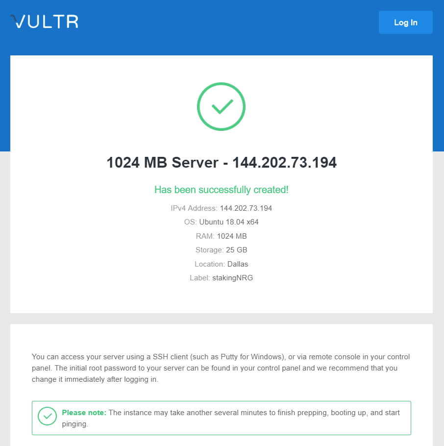
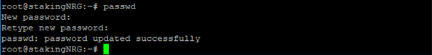
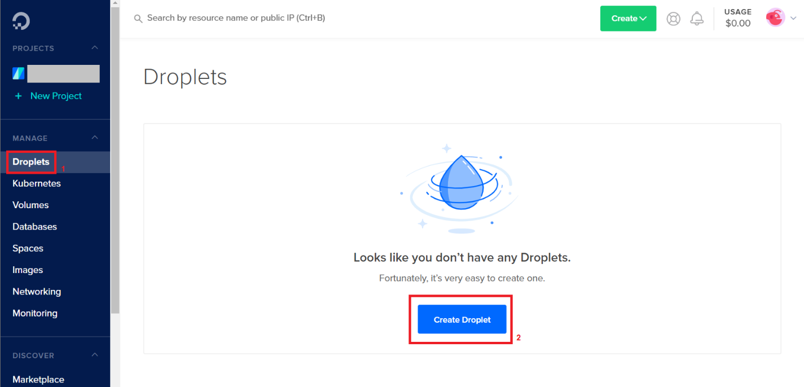

import Tabs from '@theme/Tabs';
import TabItem from '@theme/TabItem';

The following table lists the specifications for a VPS to run a Energi Gen 3 Masternode:

<center>
<table>
    <tr>
        <th>Hardware</th>
        <th>Minimum</th>
        <th>Recommended</th>
    </tr>
    <tr>
        <td>CPU (Core)</td>
        <td>1 x 1 GHz</td>
        <td>2 x 2 GHz</td>
    </tr>
    <tr>
        <td>RAM (Memory)</td>
        <td>2 GB</td>
        <td>4 GB</td>
    </tr>
    <tr>
        <td>Storage</td>
        <td>150 GB</td>
        <td>200 GB</td>
    </tr>
    <tr>
        <td>SWAP</td>
        <td>2 GB</td>
        <td>0 GB</td>
    </tr>
    <tr>
        <td>Operating System</td>
        <td>Ubuntu 20.04 x64</td>
        <td>Ubuntu 20.04 x64</td>
    </tr>
</table>
</center>

:::tip
Use the **Recommended** configuration for best results
:::

```mdx-code-block
<Tabs groupId="author-front-matter">
<TabItem value="aws" label="Amazon Web Services">
```

## 1.1. Select Location


## 1.2. Setup VPS at AWS

### 1.2.1. Services


### 1.2.2. EC2


### 1.2.3. Instances


### 1.2.4. Launch Instances


### 1.2.5. Choose AMI


### 1.2.6. Choose Instance Type


### 1.2.7. Edit Security Group


### 1.2.8. Custom TCP for Core Node


### 1.2.9. Launch VPS Instance


### 1.2.10. Download Key Pair


### 1.2.11. View Instance


### 1.2.12. Select Public DNS


## 2. PuTTY Key Generator


## 3. Setup PuTTY


## 4. Login as root

```
sudo su -
```

## 5. Run Provisioning Script

Follow the instructions in [Install Energi Core Node on Linux VPS](https://wiki.energi.world/en/3-1/advanced/scripted-linux-installation) to install and setup Energi Core Node on the VPS.

```mdx-code-block
</TabItem>
<TabItem value="vultr" label="Vultr">
```

## 1.1. - Setup VPS at Vultr
:::info
> **[Vultr](https://www.vultr.com/?ref=8416824-6G) will provide a 100 USD bonus for new accounts.**
:::

**1.1.1 -** Choose a server location that is closest to you and cost effective. For Staking/Masternode, the location is not important.


**1.1.2 -** Select Ubuntu 20.04 x64 as the Server Type.


**1.1.3 -** This plan (below) matches our recommended system requirements


**1.1.4 -** Leave the additional features section blank. This guide will not use any startup scripts. So leave that option alone as well.

:::info
***OPTIONAL:** You can choose to set up an SSH key to make it easier to securely log into your server. Click add new and follow the tutorial for creating an SSH key. This step is optional, but recommended. Using an SSH key to login is not only easier than using a password, but much more secure.*
:::

**1.1.5 -** Enter a hostname and label (example: stakingNRG) for your server and click Deploy Now


**1.1.6 -** Wait for your server to install. It should only take a few minutes.

You will receive an email confirming that your server has been created, with information on how to access it remotely.



## 2. - Login to your VPS

> You can either open the console within Vultr or use any SSH (secure shell) software to connect to the VPS. If you’re using Windows, we recommend [PuTTY](https://www.chiark.greenend.org.uk/~sgtatham/putty/latest.html).

**2.1.1 -** For Mac & Linux

Both `ssh` and `sftp` already come with the system to login and securely transfer files respectively. Open a Terminal and run this command:

```
ssh user@[server ip address]
```

**Example:**

```
ssh root@144.202.73.194

```

**2.1.2 -** For Windows

In Putty, enter your server’s IP address, make sure `SSH` and Port `22` are selected and then click on <kbd>Open</kbd>.


**2.2 -** You may get a security alert about the server’s rsa2 key fingerprint. Just click <kbd>Yes</kbd> to trust the server and connect via SSH.


**2.3 -** You will be prompted to enter your username and password. See the informations on your Vultr dashboard.


:::tip Success
**You are now connected to your VPS!**
:::

**2.4 -** We **HIGHLY** recommend you to change your password by running the command:

```
passwd
```



## 3. Run Provisioning Script

Follow the instructions in [Install Energi Core Node on Linux VPS](https://wiki.energi.world/en/3-1/advanced/scripted-linux-installation) to install and setup Energi Core Node on the VPS.

## Next Step - Staking & Masternode

Before setting up Staking node / Masternode, [bootstrap](https://wiki.energi.world/core-node-troubleshoot#linux) the node. This will expedite the sync process.

Now that you are all set with Energi Core Node, you can either follow the Staking or the Masternode Guide :

- Staking Guide

> [Staking Guide](staking-guide)

- Masternode Guide

> [Masternode Guide](https://wiki.energi.world/en/masternode-guide)

## Need help?

**-** Get technical assistance :

> [Help me!](https://wiki.energi.world/en/support/help-me) *Get technical assistance by the Energi team*


```mdx-code-block
</TabItem>
<TabItem value="gcp" label="Google Cloud Platform">
```

## 1.1. Create VPS


### 1.1.1. Create VM Instance


### 1.1.2. New VM Instance

Select E2 Series and E2-medium machine type:


Scroll down and change Boot disk:


Under Boot disk select the following and enter 150 GB for the SSD persistent disk:


Click Select:


Go back to the VM Instances and click the 3 dots on the right of the VPS. On the drop down select `View network details`


Click `Firewall Rules` on the side column twice. Then click `Create Firewall Rule`


Enter the information and select the options like below and then scroll down on the page.


Select and enter data like below:


After that, scroll down and click `CREATE`


Validate that the Firewall rule has been added:


## 2. Create Key

Download PuTTY Ken Generator and start it

Click on `Generate` to create a key:


Move the mouse until a key is generated:


Change the Key comment to `nrgstaker`.

Clic `Save private key`:


Click `Yes` when the warning pops up:


Create a `New Folder` called `c:\energi3`. Save the private key in the folder:


Right click over the public key box and scroll down to `Select All`:


Right click over the public key box and scroll down to `Copy`:


Exit PuTTY Key Generator:


## 3. Add Public Key to VPS

Go back to the GCP VM instance and click on the VPS name:


Edit the VM Instance details:


Scroll down to SSH Key and click `Show and edit`


Paste the Public key copied from PuTTY Key Generator and Save it.


## 4. Setup PuTTY and Login

Start PuTTY and select Auth on the left. Then select `Browse`:


Go to the `c:\energi3` folder and select nrgstaker. Click `Open`:


You will see the following:


Click on Sessions and then enter `nrgstaker@IP_OF_VPS`. You will find the IP of the VPS on the VM Instances page. Enter a name in the `Saved Sessions` box and then click `Save`. Click `Open` to login to the VPS.


The first time you login to the VPS a Seurity Alert will pop up. Click Yes and continue.


You will be logged into the VPS as user `nrgstaker`:


Run the following commands on the PuTTY Terminal:

```
mkdir -p .energicore3/keystore
chmod -R 700 .energicore3
```

In the PuTTY terminal now type the following to login as user `root`:

```
sudo su -
```


:::info
NOTE: You will not be presented with a username and a password in section 3.2 since you have created and logged in as nrgstaker already.
:::

Follow the instructions in [Install Energi Core Node on Linux VPS](https://wiki.energi.world/en/3-1/advanced/scripted-linux-installation) to install and setup Energi Core Node on the VPS.


```mdx-code-block
</TabItem>
<TabItem value="digital" label="Digital Ocean">
```

After you sign up with DigitalOcean, follow the steps below to setup a VPS:

### 1.1. Manage Droplets

After you sign up, go to the Droplets page and then click `Create Droplet`.



### 1.2. Create Droplet

#### 1.2.1. Choose an image

Click `Distributions` and then select `20.04 (LTS) x64` from **Ubuntu**.


#### 1.2.2. Choose Plan

Under the `Basic` plans select the plan that matches at least the minimum disk requirements (**150 GB**).


#### 1.2.3. Choose a datacenter region

Select one of the datacenters listed. It does not matter which one you pick. We recommend you pick one closest to you so that there is no lag in accessing the VPS from your location.


#### 1.2.4. VPC Network & Authentication {#password}

Keep the default VPC Network – `No VPC`. This will create a VPC with internet IP address.

You can select `Monitoring` to monitor your VPS.

We recommend you create and use an SSH key for root login. In this guide we are using the `Password` option. Create a password that is difficult to guess and meets DigitalOcean’s password requirements.


#### 1.2.5. Choose a hostname

Give your VPS a name. In this guide, we named it `nrgstaker`.


#### 1.2.6. Create Droplet

Click `Create Droplet` to create the VPS.


### 1.3. VPS Information

After few minutes, you will see the following screen.


It provides the IP address of the VPS. You will need the following information to login to the VPS:

- _IP address_: Use the IP address assigned to the VPS
- _Username_: root
- _Password_: The password you created in [Section 1.2.4](#password) above.

## 2. Run Provisioning Script

Follow the instructions in [Install Energi Core Node on Linux VPS](https://wiki.energi.world/en/3-1/advanced/scripted-linux-installation) to install and setup Energi Core Node on the VPS.


```mdx-code-block
</TabItem>
<TabItem value="contabo" label="Contabo">
```

**1.1 -** Navigate to [Contabo’s Home Page](https://contabo.com/en/vps/) and select the VPS option that meets the minimum requirements:


**1.2 -** At the _Configure your VPS_ page, you will be able to select the location of your VPS server, as well as the Storage Type, Operating System and any optional Add-ons:


It is not required to acquire any add-ons. Once finished, click the _Next_ button.

**1.3 -** Review your purchase and confirm it. The VPS will start to be deployed and your credentials to access it will be sent to you by the Contabo team once it has finished installing.


Take note of your ***IP Address***, ***Username (root)*** and ***Password* (not to be confused with the VNC password!)** so you can use them to log into the VPS at the next step.

## 2 - Log in to your VPS instance

**2.1.1 - For Mac & Linux Users**

For Mac and Linux users, both _ssh_ and _sftp_ tools come installed with the system by default. If you are either a Mac OS or Linux user, open a Terminal window and run the following command to log into your VPS:

```
ssh root@ip_address
```

Replace **ip_address** by your VPS IP address that you have copied in the previous step. Example:

```
ssh root@194.100.15.25
```

**2.1.2 - Windows Users**

For Windows, we recommend using the [PuTTY Client](https://www.chiark.greenend.org.uk/~sgtatham/putty/latest.html). Download and Install PuTTY, then run it. Once the _PuTTY Configuration_ screen appears, make sure **SSH** and port **22** are selected, then paste your VPS IP address as the example below and click on **Open**:


**2.2 -** If you receive a security alert about the server’s fingerprint, just click on **Yes** to proceed:


**2.3 -** You will be prompted to enter your username and password. Log in as the **root** user and use the password you received by e-mail from Contabo:


**2.4 -** We **HIGHLY** recommend that you change your root password by running the following command:

```
passwd
```


## 3 - Run the Provisioning Script

Follow the instructions in [Core Node on Linux VPS](https://wiki.energi.world/en/3-1/advanced/scripted-linux-installation) to install and setup Energi Core Node on the VPS.

## Next Step - Staking & Masternode

Once you finish setting up the Energi Core Node, you will be ready to either start Staking or announce your Masternode. Keep in mind that you can also both Stake and have a Masternode using the same Core Node instance.

> [Staking Guide](staking-guide)

> [Masternode Guide](https://wiki.energi.world/en/masternode-guide)


```mdx-code-block
</TabItem>

</Tabs>
```

