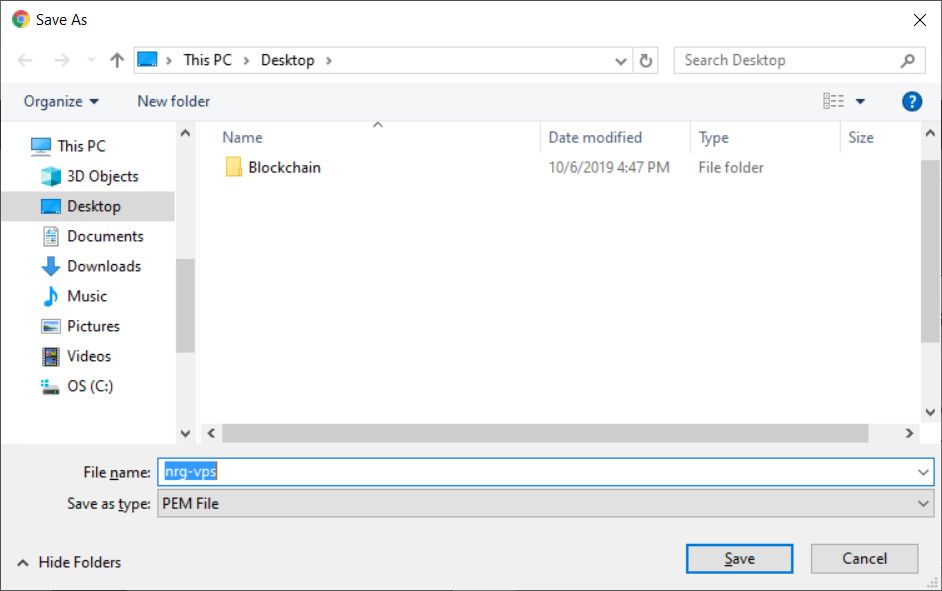
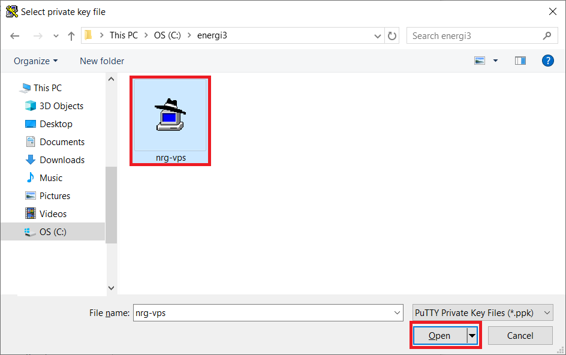

import Tabs from '@theme/Tabs';
import TabItem from '@theme/TabItem';

The following table lists the specifications for a VPS to run a Energi Gen 3 Masternode:

<center>
<table>
    <tr>
        <th>Hardware</th>
        <th>Minimum</th>
        <th>Recommended</th>
    </tr>
    <tr>
        <td>CPU (Core)</td>
        <td>1 x 1 GHz</td>
        <td>2 x 2 GHz</td>
    </tr>
    <tr>
        <td>RAM (Memory)</td>
        <td>2 GB</td>
        <td>4 GB</td>
    </tr>
    <tr>
        <td>Storage</td>
        <td>150 GB</td>
        <td>200 GB</td>
    </tr>
    <tr>
        <td>SWAP</td>
        <td>2 GB</td>
        <td>0 GB</td>
    </tr>
    <tr>
        <td>Operating System</td>
        <td>Ubuntu 20.04 x64</td>
        <td>Ubuntu 20.04 x64</td>
    </tr>
</table>
</center>

:::tip
Use the **Recommended** configuration for best results
:::

```mdx-code-block
<Tabs groupId="author-front-matter">
<TabItem value="aws" label="Amazon Web Services">
```

## 1.1. Select Location


## 1.2. Setup VPS

### 1.2.1. Services


### 1.2.2. EC2


### 1.2.3. Instances


### 1.2.4. Launch Instances


### 1.2.5. Choose AMI


### 1.2.6. Choose Instance Type


### 1.2.7. Edit Security Group


### 1.2.8. Custom TCP for Core Node


### 1.2.9. Launch VPS Instance


### 1.2.10. Download Key Pair





### 1.2.11. View Instance


### 1.2.12. Select Public DNS


## 2. PuTTY Key Generator


## 3. Setup PuTTY





## 4. Login as root

```
sudo su -
```

## 5. Run Provisioning Script

Follow the instructions in [Install Energi Core Node on Linux VPS](https://wiki.energi.world/en/3-1/advanced/scripted-linux-installation) to install and setup Energi Core Node on the VPS.

```mdx-code-block
</TabItem>
<TabItem value="vultr" label="Vultr">
```

Vultr VPS

```mdx-code-block
</TabItem>
<TabItem value="gcp" label="Google Cloud Platform">
```

Google Cloud Platform (GCP) VPS

```mdx-code-block
</TabItem>
<TabItem value="digital" label="Digital Ocean">
```

Digital Ocean VPS

```mdx-code-block
</TabItem>
<TabItem value="contabo" label="Contabo">
```

Contabo VPS


```mdx-code-block
</TabItem>

</Tabs>
```

