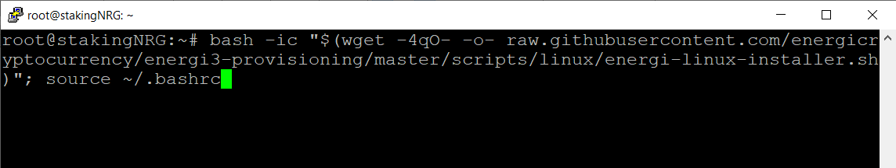
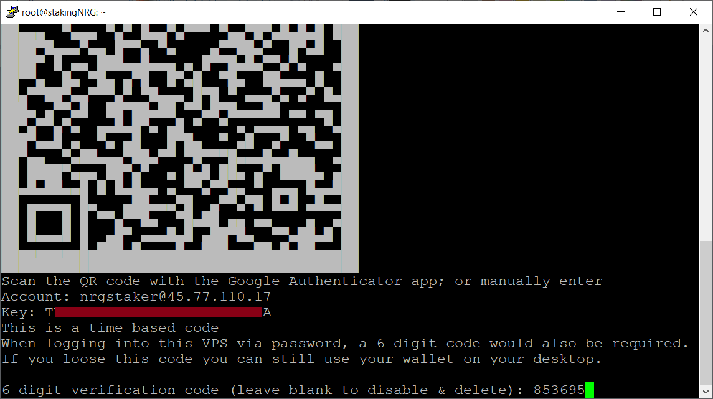
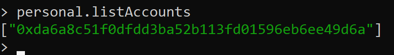

## 1 - Setup a VPS Server

::info
There are many cloud services available to setup a Virtual Private Server (VPS). [Microsoft Azure](https://azure.microsoft.com/), [Google Cloud Platform (GCP)](https://cloud.google.com/), [Amazon Web Services (AWS)](https://aws.amazon.com/) and [Alibaba Cloud](https://www.alibabacloud.com/) are few examples of where you can acquire a VPS.
:::

If you have not already, check out one of the [Set up Linux VPS](linux-vps) on how to set up a Linux VPS at Amazon Web Services (AWS), Vultr, Google Cloud Platform (GCP), Digital Ocean or Contabo.

## 2 - Login to your VPS

:::info
> You can either open the console within Vultr or use any SSH (secure shell) software to connect to the VPS. If you’re using Windows, we recommend [PuTTY](https://www.chiark.greenend.org.uk/~sgtatham/putty/latest.html).
:::

**2.1.1 -** For Mac & Linux

Both `ssh` and `sftp` already come with the system to login and securely transfer files respectively. Open a Terminal and run this command:

```
ssh user@[server ip address]
```

**Example:**

```
ssh root@144.202.73.194
```

**2.1.2 -** For Windows

In Putty, enter your server’s IP address, make sure `SSH` and Port `22` are selected and then click on <kbd>Open</kbd>.


**2.2 -** You may get a security alert about the server’s rsa2 key fingerprint. Just click <kbd>Yes</kbd> to trust the 
server and connect via SSH.


**2.3 -** You will be prompted to enter your username and password. See the informations on your Vultr dashboard.


:::tip Success
**You are now connected to your VPS!**
:::

**2.4 -** We **HIGHLY** recommend you to change your password by running the command:

```
passwd
```


## 3 - Installation {#provisioning-script}

:::info
Before starting the installation, make sure you are logged in as the `root` user, else the installation will fail. If during your VPS creation you had to create a standard user to access the Linux system (such as `ubuntu` or an username of your choice), make sure to switch to the `root` user first by issuing the following command: `sudo su -`.
:::

**3.1 -** Once you are logged as `root` into the VPS, run the command below to start the installation or upgrade on Energi Core Node:

```
sudo bash -ic "$(wget -4qO- -o- raw.githubusercontent.com/energicryptocurrency/energi3-provisioning/master/scripts/linux/energi-linux-installer.sh)" ; source ~/.bashrc
```



:::info
This command can also be used to upgrade your Core Node if a newer version is available.
:::


**3.2 -** You will be given a username and password to log into the VPS. They will be similar to what is shown below. Note down the information and then type y and ENTER to continue.


**3.3 -** Type a and press ENTER for a new installation.


**3.4 -** You will then be prompted with the 2-Factor Authentication (2FA) option. We **HIGHLY** recommend you use it, as it adds an additional security layer to your VPS.

Type `y` and press `ENTER`.


**3.5 -** Scan the QR code using the Google Authenticator App. Type the 6-digit code to continue.



**3.6 -** Write down your emergency codes and store them in a safe place. The emergency codes can be used in case you do not have access to your mobile device.

Type `y` and press `ENTER` once you are ready.


The installation script will download and begin installing Energi Core Node. Once it finishes, it will ask you to import your wallet file.

## 4. Import your wallet file

:::info
> In this section, we will import the wallet previously created in MyEnergiWallet.
:::

**4.1 -** On your computer, find the keystore account file. It normally starts with UTC. Using a text editor, open the file. Copy the contents of the file.

**4.2** - In the VPS, type `y` and then `ENTER` to import the keystore file.


**4.3** - Paste the contents of the keystore file.


**4.4** - Press ENTER to confirm, and then ENTER once again. It will create the keystore file in the VPS and proceed with the installation.


:::tip Success
**Congratulations! You have successfully installed Energi Core Node on your VPS and it will start synchronizing with the blockchain!**
:::

:::info
> You can follow the synchronization progress by using the <kbd>nrg.syncing</kbd> command after attaching to your Core Node console.
> **Keep in mind that for new installations, it can take an average of 48 hours to completely synchronize your node to the latest block**.
:::

## 5. Useful commands

:::info
Energi Core Node will automatically start, even after a VPS reboot.
:::

**5.1 -** The script will provide you the enode information of your Core Node. You will need this information to set up your Masternode. We recommend you copy the enode information into a text editor.


**5.2 -** Here are some useful commands for your VPS :

### 5.2.1 - Status checking

```
systemctl status energi3
```

`CTRL + C` to exit the status.

### 5.2.2 - Manual start

```
systemctl start energi3
```

### 5.2.3 - Manual stop

```
systemctl stop energi3
```

**5.3 -** You are still connected as root. Type `exit` to log out and close the terminal session.

**5.4 -** Log back into the VPS. This time login as `nrgstaker`.

**5.5** - Accessing the Core Node

* Run the following command to enter the console :

```
energi3 attach
```

* Make sure that you are running on the latest version. Our latest version can be found [here](https://wiki.energi.world/en/downloads/core-node#windows)


* Check if your wallet was properly imported by running:

```
personal.listAccounts
```



* Exit Energi Core Node by running the following command :

```
exit
```

:::tip Success
**Congratulations! You are now all set!**
:::

## Next Step - Staking & Masternode

Now that you are all set with Energi Core Node, you can either follow the Staking or the Masternode Guide :

> [Staking Guide](staking-guide)

> [Masternode Guide](https://wiki.energi.world/masternode-guide)

## Need help?

**-** Get technical assistance :

> [Help me!](https://wiki.energi.world/support/help-me) *Get technical assistance by the Energi team*

