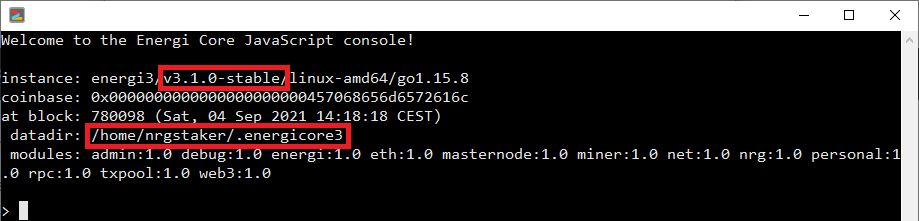
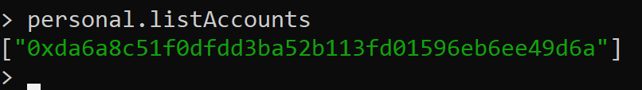

## 1. Upgrade Ubuntu 18.04 to Ubuntu 20.04

This guide provides guidance on how to upgrade from `Ubuntu 18.04 LTS` to `Ubuntu 20.04 LTS` without creating a new VPS. You can run your core node without shutting it down during the upgrade. It is, however, recommended to shut down the core node and nodemon during the upgrade. The upgrade should take about 30 minutes.

:::warning
> Check to make sure you have at least **150 GB** of storage on your VPS. If not, you will need to upgrade your VPS to a larger one. Some VPS providers allow you to upgrade your VPS to the next tier.
:::

**1.1. -** Login to the VPS as <kbd>root</kbd> or <kbd>nrgstaker</kbd>. Either of the accounts can be used for the upgrade.

**1.2. -** Update `apt` packages.

```
sudo apt update && sudo apt dist-upgrade -y
sudo reboot
```

**1.3. -** Log back into the VPS and run the following to purge old packages.

```
sudo apt --purge autoremove -y
```

**1.4. -** Intall `Update Manager`.

```
sudo apt install update-manager-core -y
```

**1.5. -** Perform the upgrade to Ubuntu 20.04 LTS. The software will check for required disk space and other things before upgrading. If it meets the requirements, you can continue with the upgrade. Accept all the defaults during the upgrade.

```
sudo do-release-upgrade
```

**1.6. -** The VPS will reboot after the upgrade is completed. If it does not reboot, run the following command to restart the VPS:

```
sudo reboot
```

## 2. Update nodemon Configuration (if you run nodemon)

**2.1. -** Edit `Rootkit Hunter` configuration file

```
sudo nan
o /etc/rkhunter.conf
```
**2.2. -** Change the following three lines:

**2.2.1. -** Scroll down and find the following 2 lines

```
SCRIPTWHITELIST=/usr/bin/egrep
SCRIPTWHITELIST=/usr/bin/fgrep
```

and change them to...

```
SCRIPTWHITELIST=/bin/egrep
SCRIPTWHITELIST=/bin/fgrep
```

**2.2.1. -** Add the following line after the above to lines:

```
SCRIPTWHITELIST=/bin/which
```

**2.3. -** Re-build Rootkit Hunter Database

```
sudo rkhunter --propupd
```

## 3. Verify Upgrade

**3.1. -** Run the following command to check the version:

```
lsb_release -a
```

**3.2. -** The output should be similar to below:

:::info
> No LSB modules are available.
> Distributor ID: Ubuntu
> Description: Ubuntu 20.04.3 LTS
> Release: 20.04
> Codename: focal
:::

:::tip Success
Congratulations! You have upgraded your VPS to Ubuntu 20.04 LTS.
:::

## 4. Useful commands

:::info
> Energi Core Node will automatically start, even after a VPS reboot.
:::

**4.1 -** Here are some useful commands for your VPS :

**4.1.1 -** Status checking

```
systemctl status energi3
```

`CTRL + C` to exit the status.

**4.1.2 -** Manual start

```
systemctl start energi3
```

**4.1.3 -** Manual stop

```
systemctl stop energi3
```

**4.2. -** Accessing the Core Node

* Run the following command to enter the console:

```
energi3 attach
```

* Make sure that you are running on the latest version. Our latest version can be found [here](/docs/downloads/core-node#Windows)



* Check if your wallet was properly imported by running:

```
personal.listAccounts
```



* Exit Energi Core Node by running the following command :

```
exit
```

:::tip Success
**Congratulations! You are now all set!**
:::

# Need help?

**-** Get technical assistance:

> [Help me!](/support/help-me) *Get technical assistance by the Energi team*
