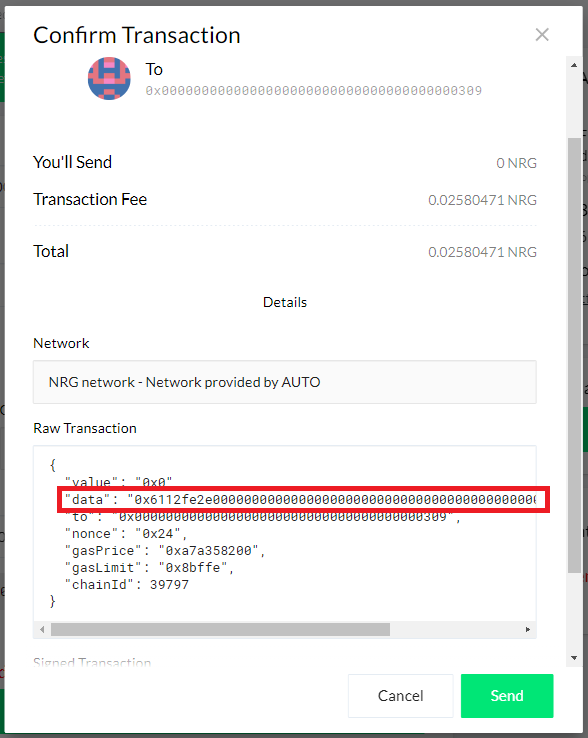

## 1 - Requirements

**-** You need to create a <kbd>MyEnergiWallet</kbd> for Masternode-related operations:

> [MyEnergiWallet Guide *using Web or Desktop app*](/docs/guides/myenergiwallet)

**-** You need to have <kbd>Energi Core Node</kbd> installed & running 24/7 for your Masternode:

> [Core Node on VPS *for Ubuntu 20.04 x64*](/docs/guides/scripted-linux-installation)

:::warning
**We HIGHLY recommend to run Energi Core Node on a VPS, as your machine's IP will be displayed publicly in our Masternodes list.**
:::

:::info
In order to run a Masternode you need to have **at least 1001 NRG**:
**1000 NRG** which will be allocated as the Masternode Collateral;
**1 NRG** which will be partially used to cover the transaction fees required to deposit collateral and announce the Masternode.
You can add in multiples of 1000 NRG to a **maximum of 100000 NRG**, at which point it will be needed to deploy another Masternode for any additional collateral.
:::

## 2 - Deposit Collateral

**2.1 -** Head over to Energi Nexus:

> [Energi Nexus *our All-in-one platform*](https://nexus.energi.network/)

Select the <kbd>Masternodes</kbd> section in Nexus. As soon as you enter your wallet address, it will show information.

**2.2 -** Once you've entered your address, click on <kbd>Deposit Collateral</kbd>.


**2.3 -** Now select the amount of NRG you want to put as collateral, and confirm by clicking on <kbd>Deposit Collateral</kbd>.


:::tip Success
**1,000 NRG is the new minimum collateral**.

You are able to increment the collateral **when you want, up to 100,000 NRG per instance.**
:::

**2.4 -** You will be redirected to MyEnergiWallet. Once you've accessed your wallet, you will be prompted with a transaction. Verify the amount and click on the <kbd>Advanced</kbd> button. You **MUST** click on the <kbd>Advanced</kbd> button for the `Data` field to be populated, else your transaction **will fail**.


**2.5 -** Once you click the <kbd>Advanced</kbd> button, you should see the `Data` field populated like the image below (the actual content might vary):


**2.6 -** Click the <kbd>Send Transaction</kbd> button. Another popup will appear with the Transaction Details. Click the <kbd>Details</kbd> button and you should see the information for the <kbd>Data</kbd> the same as before. After confirming, click <kbd>Send</kbd> and wait for your transaction to be settled.



**2.7 -** Head over to our Blockchain Explorer to confirm the transaction by clicking on <kbd>Verify</kbd>:


**2.8 -** Confirm that the Transaction is `Successful` and that there is at least one `Block Confirmations`:


**2.9 -** If we go back to Nexus, we can now see that the collateral transfer was successful!


:::tip Success
**You just successfully deposited the collateral!**

Now, you need to announce your Masternode.
:::

## 3 - Announcing the Masternode

:::info
**We're using <kbd>Energi Core Node</kbd> to run the Masternode 24/7.

We HIGHLY recommend to have it installed on a VPS.**
:::

**3.1 -** Start <kbd>Energi Core Node</kbd> :

```
energi3 attach
```

**3.2 -** Next, run the following command to get your enode information:

```
admin.nodeInfo.enode
```

This will return your `Masternode enode URL`. You will need enode information to announce your Masternode.


:::info
**Make sure that the IP (blank zone above) is different from `127.0.0.1`**

**If you see this IP,** replace it by your VPS IP or head over a service like [Ipify](https://api.ipify.org/).
:::

**3.3 -** Go back to Nexus, and paste it in the `Masternode enode URL` field.

Verify the informations, then click <kbd>Announce Masternode</kbd>.


**3.4 -** Again, you will be redirected to <kbd>MyEnergiWallet</kbd> to confirm the transaction. Once you are logged in, click on the <kbd>Advanced</kbd> button. You **MUST** click on the <kbd>Advanced</kbd> button for the <kbd>Data</kbd> field to be populated, else your transaction **will fail**.


**3.5 -** Once you click the <kbd>Advanced</kbd> button, you should see the `Data` field populated like the image below (the actual content might vary):


**3.6 -** Click the <kbd>Send Transaction</kbd> button. Another popup will appear with the Transaction Details. Click the <kbd>Details</kbd> button and you should see the information for the `Data` the same as before. After confirming, click <kbd>Send</kbd> and wait for your transaction to be settled.


**3.7 -** If you now go back to Nexus, you will see your masternode status updated to `ACTIVE`.


:::info
Take note that collateral deposit/withdrawal **won't affect the state of your Masternode.**
:::

:::tip Success
**You just successfuly announced your Masternode!**

Now, let's see how to check your rewards.
:::

## 4 - Checking Your Rewards

**4.1 -** Head over to Energi Block Explorer:

> [Energi Block Explorer](https://explorer.energi.network/) *View Blockchain data*

**4.2 -** Enter your wallet address in the top-right corner and press <kbd>ENTER</kbd>


**4.3 -** Click on `Tokens` in the `Balance` box. It should match the amount of NRG you sent as `Masternode Collateral`.


**4.4 -** Select <kbd>Internal Transactions</kbd>. You will see your Masternode Rewards in real-time!

The first reward may take a few days to appear.


## 5 - Staking Your Rewards

:::info
Staking your Masternode rewards can be done **in the same Energi Core Node instance.**
:::

**5.1 -** Head over our Staking Guide:

> [Staking Guide](/docs/guides/staking-guide) *using Energi Core Node*

:::tip Success
**Congratulations! You are now all set!**
:::

# Need help?

**-** Head over our Masternode FAQ :

> [FAQ](/docs/faq/masternode) *Masternode*

**-** Get technical assistance :

> [Help me!](https://wiki.energi.world/support/help-me) *Get technical assistance by the Energi team*

