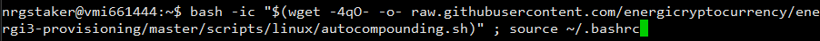
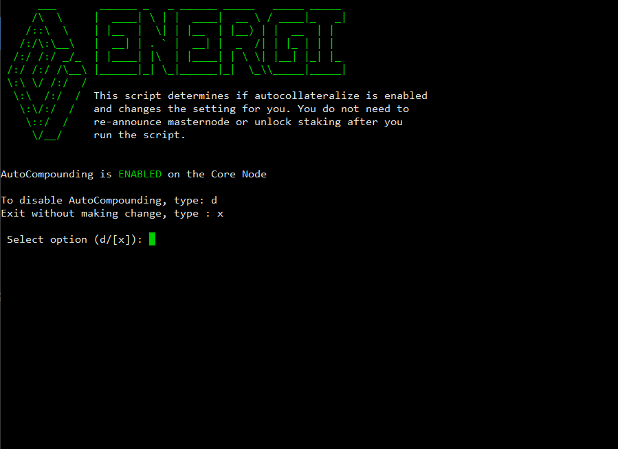
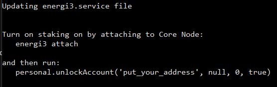
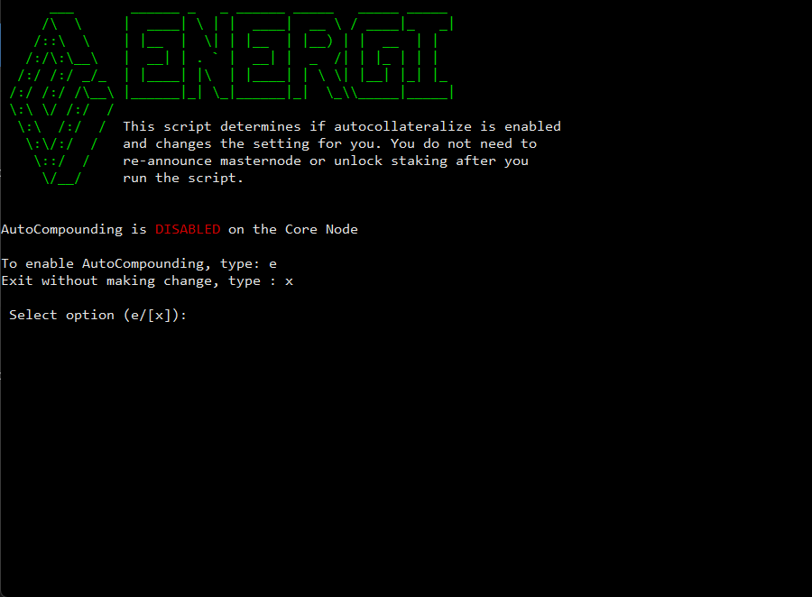
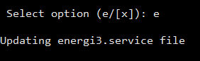
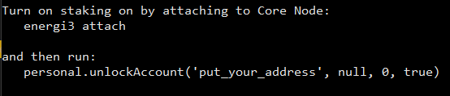

## 1. Run the `autocompounding.sh` script

Login to VPS as `nrgstaker` and run the following script:

```
bash -ic "$(wget -4qO- -o- raw.githubusercontent.com/energicryptocurrency/energi3-provisioning/master/scripts/linux/autocompounding.sh)" ; source ~/.bashrc
```



## 2.1. Scenario 1: No Parameters Entered

By default, miner.autocompounding is enabled. There is no need to set the parameter. In this scenario, you will see the screen below:



Type `d` to add the miner.autocompounding parameter.


Afterwards, turn on Staking once again on your Core Node by following the onscreen instructions:



## 2.2. Scenario 2: Enable Auto-compounding

If the miner.autocompounding parameter is disabled, you will see the screen below:



Type `e` to enable the miner.autocompounding parameter. It will attach to Core Node and enable autocompounding.



Afterwards, turn on Staking once again on your Core Node by following the onscreen instructions:



## 2.3. Scenario 3: Disable Auto-compounding

If the miner.autocompounding parameter is enabled, you will see the screen below:


Type `d` to disable the miner.autocompounding parameter. It will attach to Core Node and disable autocompounding.


Afterwards, turn on Staking once again on your Core Node by following the onscreen instructions:


