import Tabs from '@theme/Tabs';
import TabItem from '@theme/TabItem';

This step-by-step guide will cover how to add the Energi Token (NRG) that is available on the Ethereum Mainnet network to your  Crypto Wallet.

```mdx-code-block
<Tabs groupId="author-front-matter">
<TabItem value="chrome" label="MetaMask Extension">
```

## ​1. Connect to the Main Ethereum Network
Make sure you are connected to the Main Ethereum Network. If not, select it at the list of available networks. Then click the “Add Token” button at the main MetaMask screen:

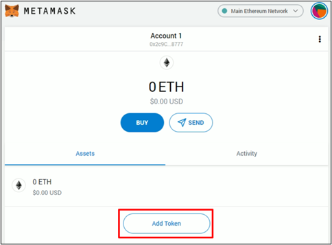

## 2. Add Token
At the “Add Token” screen, select the “Custom Token” tab.  Fill the “Token Address” field with the information from the table below. It will auto-populate the remaining fields. Make sure that the information matches the one presented in the table as well. After confirming that the information matches, click “Next” and then “Add Tokens”:

|                            |                                            |
| -------------------------- | ------------------------------------------ |
| **Token Address:**         | 0x1416946162b1c2c871a73b07e932d2fb6c932069 |
| **Token Symbol:**          | NRG                                        |
| **Decimals of Precision:** | 18                                         |

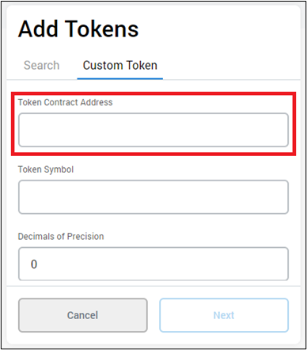

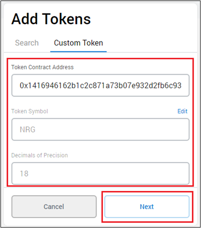


## 3. Complete Process

The NRG Token will be added to MetaMask. Click on “Account 1 / NRG” to return to your main MetaMask screen:

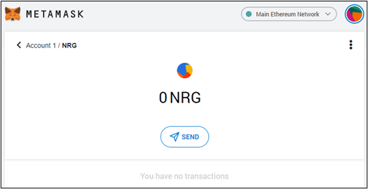

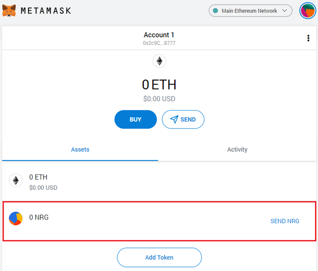


```mdx-code-block
</TabItem>
<TabItem value="mobile" label="Mobile App">
```

## 1. Connect to the Main Ethereum Network

Make sure you are connected to the Main Ethereum Network. If not, select it at the list of available networks. Then select the “+ADD TOKENS” option at the main MetaMask Mobile screen:

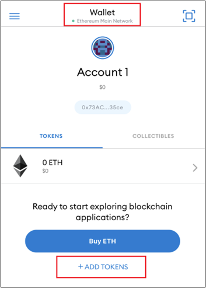

## 2. Add Token

At the “Add Asset” screen, select “CUSTOM TOKEN” tab. Fill the “Token Address” field with the information from the table below. It will auto-populate the remaining two fields. Make sure that the information matches the one presented in the table as well. After confirming that the information matches, click “Add Token”:

|                            |                                            |
| -------------------------- | ------------------------------------------ |
| **Token Address:**         | 0x1416946162b1c2c871a73b07e932d2fb6c932069 |
| **Token Symbol:**          | NRG                                        |
| **Decimals of Precision:** | 18                                         |

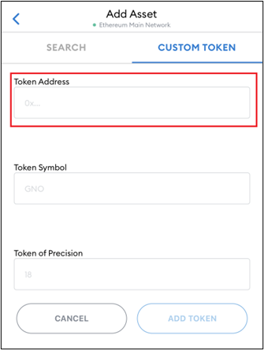

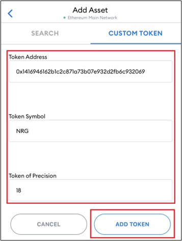

## 3. Complete Process

You will be taken back to the main MetaMask Mobile screen, where you will be able to see your recently added NRG token as well as any balances you have from it:

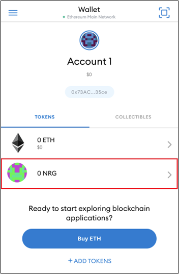


```mdx-code-block
</TabItem>
<TabItem value="brave" label="Brave Wallet">
```

:::warning Warning
NOTE: Currently the Energi Bridge does not support transactions made using Brave's Crypto Wallet. We recommend using MetaMask for any Energi Bridge related transactions.
:::

## ​1. Connect to the Main Ethereum Network

Make sure you are connected to the Main Ethereum Network. If not, select it at the list of available networks. Then click the “Add Token” button at the main MetaMask screen:

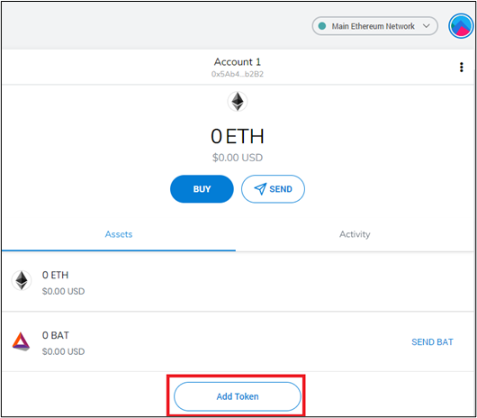

## 2. Add Token

At the “Add Token” screen, select “Custom Token”. Fill the “Token Address” field with the information from the table below. It will auto populate the remaining fields. Make sure that the information matches the one presented in the table as well. After confirming that the information matches, click “Next” and then “Add Tokens”:

|                            |                                            |
| -------------------------- | ------------------------------------------ |
| **Token Address:**         | 0x1416946162b1c2c871a73b07e932d2fb6c932069 |
| **Token Symbol:**          | NRG                                        |
| **Decimals of Precision:** | 18                                         |

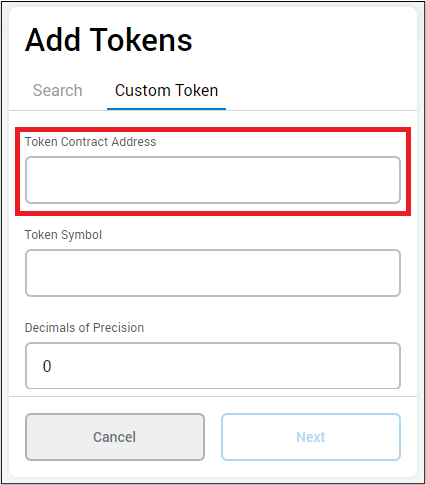


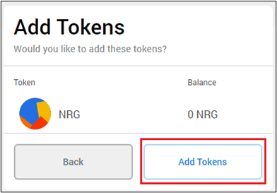

## 3. Complete the process

The NRG Token will be added to the wallet. Click on “Account 1 / NRG” to return to your main MetaMask screen:

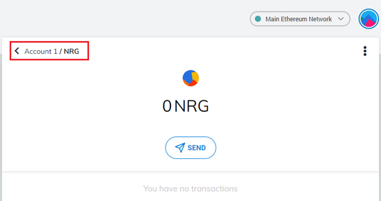

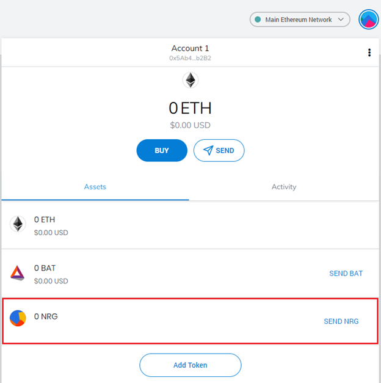

```mdx-code-block
</TabItem>

</Tabs>
```
