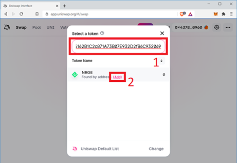
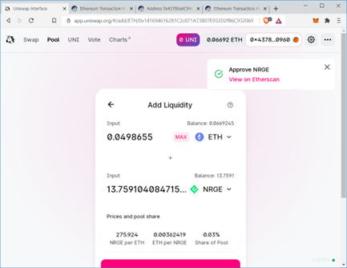

This step-by-step guide will show you how to swap ETH for NRG Token and add liquidity to the NRG-ETH pool. This guide is focused on Uniswap, but can be applied to any Decentralized Exchange (DEX).

NRG Token is an ERC-20 token representing NRG on the Ethereum blockchain in a 1:1 tokenization, managed via a smart contract and is backed by the NRG coin. Initially, users will need ETH to swap for NRG. Later, Energi will release web-based tools and smart contracts to automate the process. After users purchase NRG, they will be able to add it to the NRG-ETH liquidity pool and earn a portion of the trading fees.

## 1. Prerequisites

You will need a web3 wallet such as MetaMask on your browser to swap and/or provide liquidity to a pool. If you need assistance in setting up MetaMask and adding the NRG Token to it, look at the guides below:

MetaMask:

- [Getting Started with MetaMask](https://wiki.energi.world/guides/getting-started-with-metamask)
- [Add NRG to MetaMask](https://wiki.energi.world/en/guides/add-nrge-chrome)

Brave:

- [Getting Started with Brave Crypto Wallet](https://wiki.energi.world/en/guides/getting-started-brave-crypto-wallet)
- [Add NRG to Brave Crypto Wallet](https://wiki.energi.world//en/guides/add-nrge-brave-crypto-wallet)

Mobile:

- [Getting Started with MetaMask Mobile](https://wiki.energi.world/en/guides/getting-started-metamask-mobile)
- [Add NRG to MetaMask Mobile](https://wiki.energi.world/en/guides/add-nrge-metamask-mobile)

We are using MetaMask in this guide as an example. You can use any web3 wallet that is compatible with Uniswap.

## 2. Connect MetaMask to the Uniswap App

Open a web browser and go to [https://uniswap.exchange](https://uniswap.exchange).

### 2.1. Click "Connect to a wallet".

### 2.2. Select MetaMask:

You will need to log in to Metamask if you have not already done so.

### 2.3. Click Next:

### 2.4. Click Connect:

### 
2.5. Open MetaMask and verify that you can see ETH and NRG Tokens. If you do
not, go back to the prerequisites section above and add the NRG
token to MetaMask.

## ​3.​Swap ETH for NRG

### 3.1. Click on the “Select a token” drop-down.

### 3.2. Copy / Paste Smart Contract (if needed)

If this is the first time you are swapping NRG, copy and paste the smart contract address in the search box. It will show the NRG Token. Click “Add”. It is important that you copy the exact address provided here and do not search for NRG, as this opens you up to potential scams.

NRG Token Smart Contract Address: [0x1416946162b1c2c871a73b07e932d2fb6c932069](https://etherscan.io/token/0x1416946162b1c2c871a73b07e932d2fb6c932069)

### 3.2. Click on NRG:

### 3.4. Go Back

Once you select NRG, you will be back on the following screen:

### 3.5. Assets

The liquidity pool in Uniswap is split 50/50 between the tokens. In other words, each of the tokens in the pair will be equal in value when you are adding to the pool.

Enter the amount of NRG Token you would like to purchase. If you plan to add liquidity to the pool, reserve an equivalent amount of ETH to match the NRG Token value. You should also ensure that you have enough ETH remaining to pay for the ETH gas fee. Once you are satisfied with the amount, click Swap.

### 3.6. Click Confirm Swap:

### 3.7. Confirm Gas Fee

MetaMask will pop up. Click “Confirm” to accept the gas fee.

### 3.8. Check Transaction

If you want to check if the transaction finished, click on ETH as noted below:

### 3.9. Complete Transaction

You will also see “1 Pending” on the page until the transaction completes. Be patient. Do not resubmit the request. The time to complete a transaction in the Ethereum network can vary significantly based on the congestion. Resubmit only if it indicates clearly that the transaction has failed.

You can look at the [Ethereum Gas Tracker](https://etherscan.io/gastracker) to see how busy the network is currently.

### 3.10. MetaMask Notification

If you have MetaMask notifications turned on, you will see the following message pop-up indicating that the swap has completed.

### 
3.11. You can also confirm the completion of the transaction on MetaMask:

### 3.12. MetaMask Page

Go back to the MetaMask main page. It will display the updated balance for ETH and NRG Token on the account.

:::tip Congratulations!
You have swapped ETH for NRG Tokens.
:::

## 4. Add Liquidity

### 4.1. Select Pool

Go to [https://uniswap.exchange](https://uniswap.exchange) and select “Pool”. Click on “Add Liquidity”.

### 4.2. Select Token

We will add liquidity to the NRG-ETH Liquidity Pool. Click on “Select a token”.

### 4.3. Select Token by Name

Select NRG Token from the Token Name. If you do not see NRG, you may have to search for the token using the smart contract (see section above for details):

NRG Token Smart Contract Address: [0x1416946162b1c2c871a73b07e932d2fb6c932069](https://etherscan.io/token/0x1416946162b1c2c871a73b07e932d2fb6c932069)

### 4.4. Enter Liquidity Amount

:::info Note
The next task is a 2-step process: First, you have to approve the amount you want to add to the pool. Second, you add the approved amount to the pool. For both steps, you will pay a gas fee in ETH.
:::

Enter the amount of liquidity you want to add to the NRG-ETH pool. In our example, we clicked on the MAX button besides NRG Token to include all available amounts. It will calculate the amount of ETH that will be added to the pair. The amount of ETH to be added to the pool should be slightly less than the amount you have in the wallet. You will need some extra ETH to pay the gas fees.

### 4.5. When satisfied, click Approve NRG:

### 4.6. MetaMask will pop-up. Click "Confirm".

### 4.7. Check Pending Transaction

On the Uniswap app page, you will see “1 Pending” transaction. Click on “1 Pending” to see details.

### 4.8. Click “View on Etherscan” to look at the status of the approval transaction.

### 4.9. Click on the pending transaction from the list:

### 4.10. A new tab will open. It will show the status of the transaction

### 4.11. If you have MetaMask notification turned on, the following “Confirmed transaction” screen will appear.

### 4.12. “Approve NRG” will also pop-up on the Uniswap app page.

### 4.13. Now add the approved amount to the liquidity pool. Click “Supply”.

### 4.14. Click “Confirm Supply”.

### 4.15. MetaMask will pop-up. Click “Confirm” to accept the gas fee.

### 4.16. “1 Pending” will appear while the transaction is being processed.

### 4.17. If you have MetaMask notification turned on, the following “Confirmed transaction”
screen will appear.

### 4.18. Your position on the liquidity pool will appear on the Uniswap app page. Click on the 🡨 symbol next to “Add Liquidity” to go back to the previous screen.

### 4.19. On the Uniswap app page, the NRG/ETH liquidity pair will appear.

<strong>Congratulations! You added tokens to the NRG-ETH Liquidity Pool on Uniswap.</strong>

<strong>NOTE: Do not sell your liquidity pool tokens. If you sell them, you will not be able to remove your liquidity from the pool.</strong>

## 5. Confirmation

### 5.1. Click “Account analytics and accrued fees” to see details. 

NOTE: The analytics are often several blocks behind and may take up to 30 minutes to display in the liquidity pool analytics page.

### 5.2. Scroll down to see additional details of your position in the liquidity pool. Click on NRG-WETH to go to the statistics page.

NOTE: Originally the name of the token was listed as “NRG Token” (NRGT). Prior to going live, the name was changed to “NRG on Ethereum” (NRG). In the “Positions” section, the name change has not yet taken effect. Uniswap is working on it. The name change will be reflected once the work is completed. NRG Token is the same token as NRGT. We recommend you validate the token by its contract address (0x1416946162b1c2c871a73b07e932d2fb6c932069).

### 5.3. The following page shows statistics of the NRG-ETH liquidity pair.

