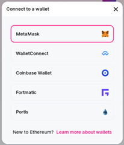
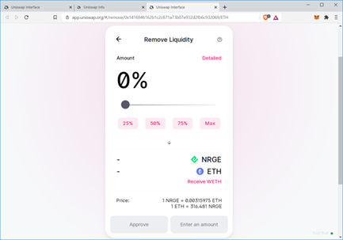

This step-by-step guide will show you how to remove liquidity from an existing NRG-ETH pool. This guide is focused on Uniswap, but can be applied to any Decentralized Exchange (DEX).

NRG is an ERC-20 token representing NRG on the Ethereum blockchain in a 1:1 tokenization, managed via a smart contract and is backed by the NRG coin.

## 1. Prerequisites

You will need a web3 wallet such as MetaMask on your browser or mobile phone to remove liquidity from the NRG-ETH liquidity pool. If you need assistance in setting up MetaMask and adding the NRG token to it, look at the guides below:

**General:**

- [How to add liquidity to the NRG-ETH pool in Uniswap](https://wiki.energi.world/docs/guides/add-NRG-liquidity-uniswap)

**MetaMask:**

- [Getting Started with MetaMask](https://wiki.energi.world/docs/guides/getting-started-with-metamask)

- [Add NRG to MetaMask](https://wiki.energi.world/docs/guides/add-NRG-chrome)

**Brave:**

- [Getting Started with Brave Crypto Wallet](https://wiki.energi.world/docs/guides/getting-started-brave-crypto-wallet)

- [Add NRG to Brave Crypto Wallet](https://wiki.energi.world/docs/guides/add-NRG-brave-crypto-wallet)

**Mobile:**

- [Getting Started with MetaMask Mobile](https://wiki.energi.world/docs/guides/getting-started-metamask-mobile)

- [Add NRG to MetaMask Mobile](https://wiki.energi.world/docs/guides/add-NRG-metamask-mobile)

We are using MetaMask on a web browser in this guide as an example. You can use any web3 wallet that is compatible with Uniswap.

## 2. Connect MetaMask to the Uniswap App

Open a web browser and go to [https://app.uniswap.org/#/pool](https://app.uniswap.org/#/pool).

### 2.1. Click "Connect to a wallet".

### 2.2. Select MetaMask:

You will need to log in to MetaMask if you have not already done so.

### 2.3. Click Next:

### 2.4. Click Connect:

### 2.5. Open MetaMask and verify that you can see ETH and NRG tokens. If you do not, you will need to go back to the prerequisites section above and add the NRG token to MetaMask.

### 2.6. You will see your NRG/ETH liquidity pool on the browser.

**Note:** If you do not see the liquidity pool you joined, import it.

## 3. Remove Liquidity

### 3.1. On the “Pool” tab, select “Account analytics and accrued fees”.

### 3.2. It will open the <em>Uniswap Info</em> tab and redirect you to the [https://info.uniswap.org](https://info.uniswap.org) site. Check Accounts. The account number should match your NRG ERC-20 account.

**Note:** If you do not see the screen below, click “Manage” in the section 3.1 and then select "view accrued fees and analytics".

### 3.3. Scroll down to “Positions”. Click on “Remove” to remove liquidity from the pool

### 3.4. A new tab (<em>Uniswap Interface</em>) will appear.

### 3.5. Select the amount you want to remove from the pool. In our example, we selected the “Max” amount to remove everything from the pool. Click “Approve”.

**Note:** Check your MetaMask account to ensure you have sufficient ETH to pay the gas fees.

### 3.6. MetaMask will pop-up. Select SIGN.

### 3.7. Click “REMOVE”.

### 3.8. Click “Confirm”.

### 3.9. A MetaMask window will pop open. Click “Confirm” to accept the ETH gas fee for the transaction.

You can look at the [Ethereum Gas Tracker](https://etherscan.io/gastracker) to see how busy the network is currently. You can adjust your gas fee based on the information in the Ethereum Gas Tracker to increase the speed that your transaction is added to the Ethereum blockchain.

### 3.10. Click “Close”.

### 3.11. Click on the 🡨 symbol next to “Remove Liquidity” to go back to the previous screen.

### 3.12. “1 Pending” will appear while the transaction is being processed.

### 3.13. If you have MetaMask notifications turned on, the following “Confirmed transaction” screen will appear.

### 3.14. A notice will also appear for a few seconds on the browser page.

:::tip Success
Congratulations! You have removed the liquidity from the NRG-ETH Pool on Uniswap.
:::

## 4. Validate

### 4.1. Open MetaMask. You will have ETH and NRG added to your wallet.

