This guide provides step-by-step instructions on how to add liquidity to the ETH-GMI pair at the SushiSwap DEX liquidity pool.

You will need a supported Web3 wallet in order to do so. The platform provides support for multiple wallet services such as MetaMask, Portis and Coinbase Wallet. For the purpose of this guide, we will be using MetaMask.

Should you need assistance in creating a new wallet using MetaMask, kindly refer to the following guide:

- [MetaMask Quick Start Guide](/docs/guides/guide-metamask)

Additionally, we have a quicker version of this guide, on how to acquire GMI token and manage liquidity positions to the ETH-GMI pair on the SushiSwap platform. The guide can be found at:

- [GMI on SushiSwap Quick Start Guide](/docs/guides/guide-sushiswap)

Keep in mind that in order to perform any activity on the SushiSwap platform, you will need to have enough ETH in your wallet to cover the transaction fees.

**1.1.** Navigate to SushiSwap and click on the **“Connect to a wallet”** button at the top-right of the screen.

| Network                    | URL                               |
| -------------------------- | --------------------------------- |
| Ethereum Mainnet           | https://app.sushi.com/en/swap     |

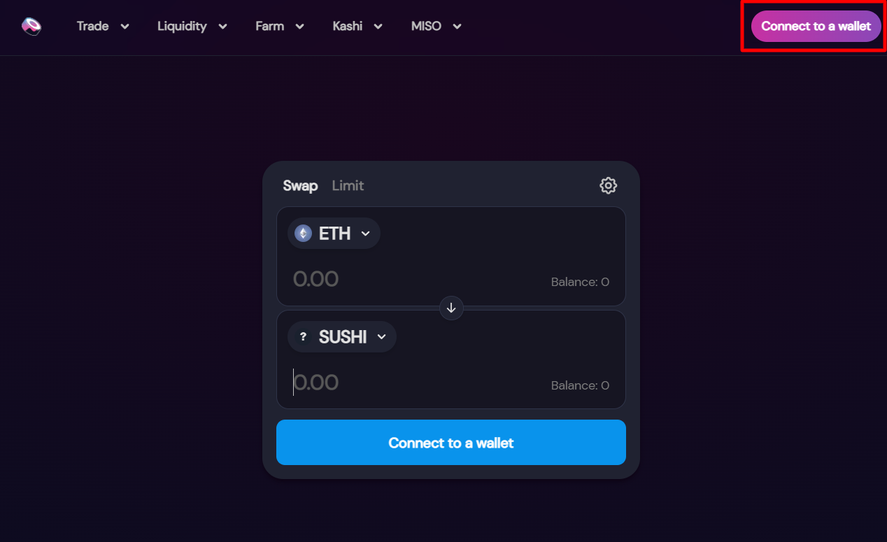

**1.2.** Select the **“MetaMask”** option and a MetaMask prompt will appear, allowing you to unlock the wallet address which you wish to use.

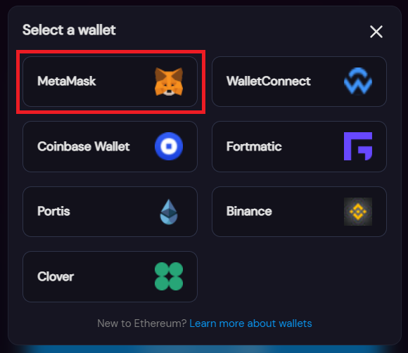

**1.3.** Hover over the **“Liquidity”** option in the bar at the top of the screen, then click on the **“Add”** option after the menu expands.

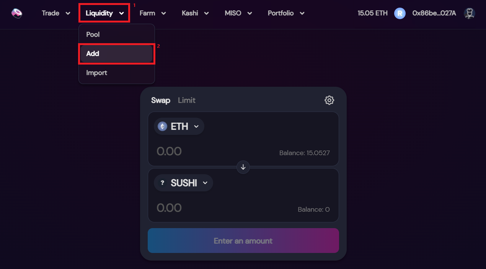

**1.4.** Select the token pair you wish to add liquidity to. For the purpose of this guide, we will be adding liquidity to the ETH and GMI token pair.

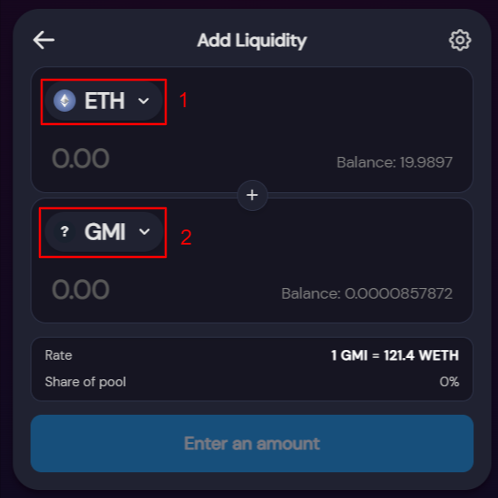

**1.5.** Enter the amount of tokens you wish to add liquidity for both ETH and GMI. Keep in mind that the quantities need to have about the same value. For example, if you add $100 worth of ETH liquidity, you will also need to add $100 worth of GMI liquidity. Once you enter the amount of any one of the tokens you wish to provide as liquidity, the amount of the other will be automatically completed with the necessary amount to match the one you have added. As an example, for this guide we will be providing **0.005 ETH**, and the platform automatically completed the amount of GMI required to provide the same value - **0.0000411719 GMI** tokens.

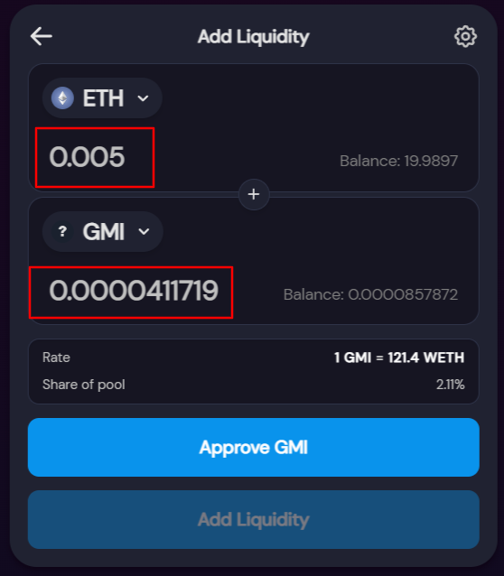

**1.6.** Once satisfied with your selection, click on the **“Approve GMI”** button. Confirm the operation on the newly opened MetaMask pop-up.

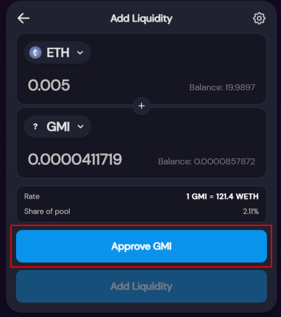

**1.7.** Once the transaction has completed, click on the **“Add Liquidity”** button.

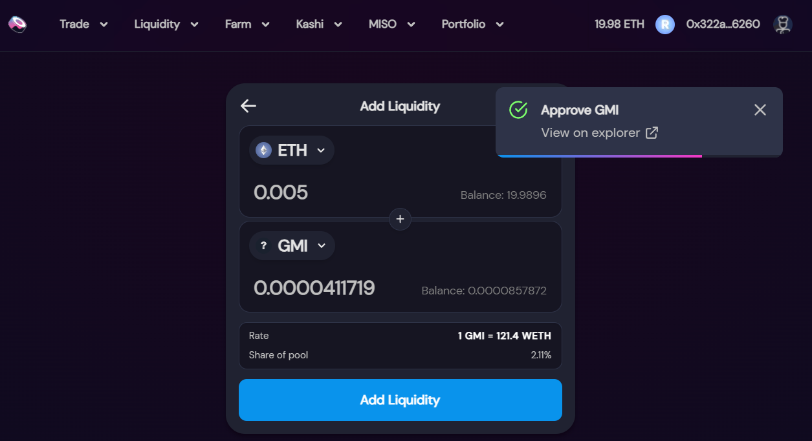

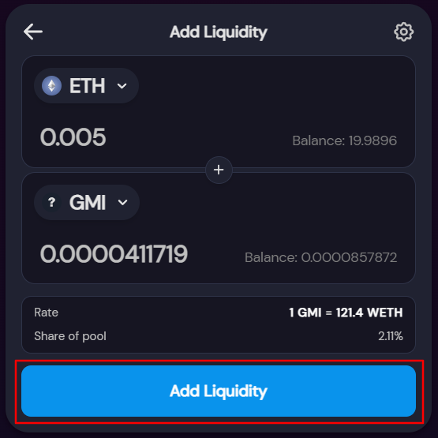

**1.8.** A confirmation window will appear with the amount of ETH/GMI Liquidity Provider (LP) tokens you will receive, their rates and pool share your position represents. Click on the **“Confirm Supply”** button to proceed.

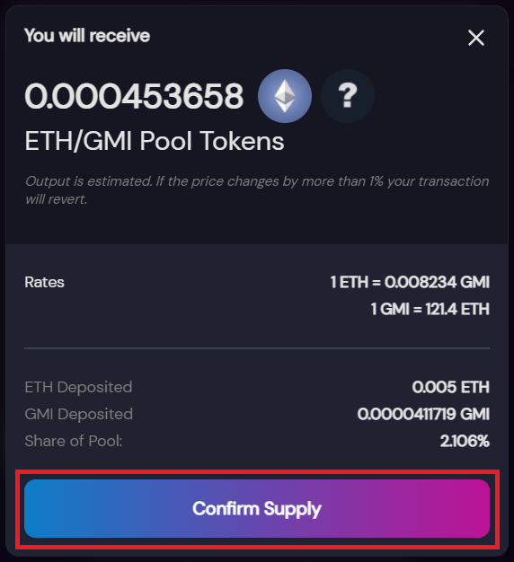

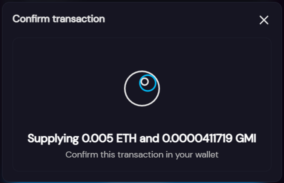

**1.9.** A MetaMask pop-up will appear to confirm the liquidity supply transaction. Click on the **“Confirm”** button to proceed. Once the transaction has been completed, your liquidity will be added to the ETH-GMI pool and you will receive the ETH/GMI LP Tokens in return.

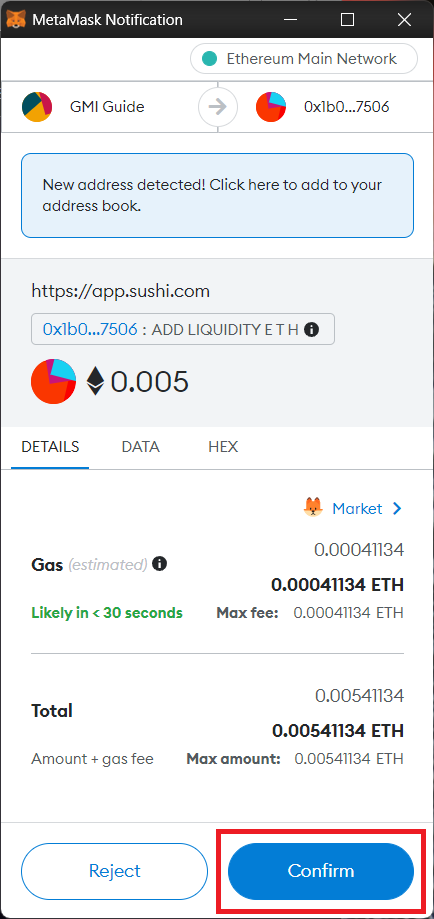

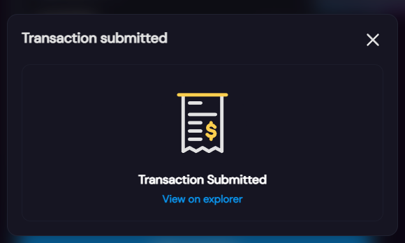

**1.10.** If you wish to check your Liquidity Position, you can navigate to the **“Liquidity”** option and click on the **“Pool”** option.

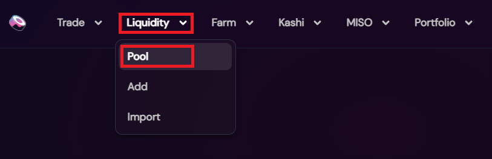

**1.11.** Click on the ETH-GMI pair under Position Overview

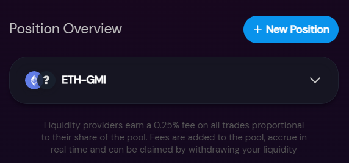

**1.12.** You will see the detail of tokens held on the pair.

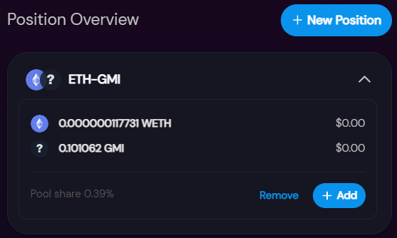
