## 1 - Installation

:::info
> **It is recommended to have 100GB of storage available.** This is necessary for the Blockchain data.
:::

**1.1 -** Download Energi Core Node by going on our Download page below

- [Download Energi Core Node *for MacOS*](../03-downloads/core-node.md#MacOS)

**1.2 -** Open the file, it should start extracting and creates a folder of the same name

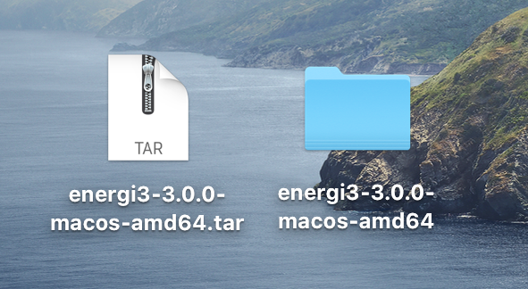

**1.3 -** Rename the folder to `energi3`

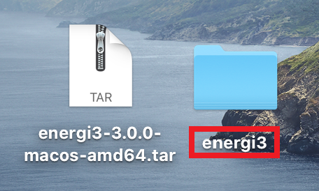

**1.4 -** Let's open the installation folder in <kbd>Go</kbd> then <kbd>Home</kbd>

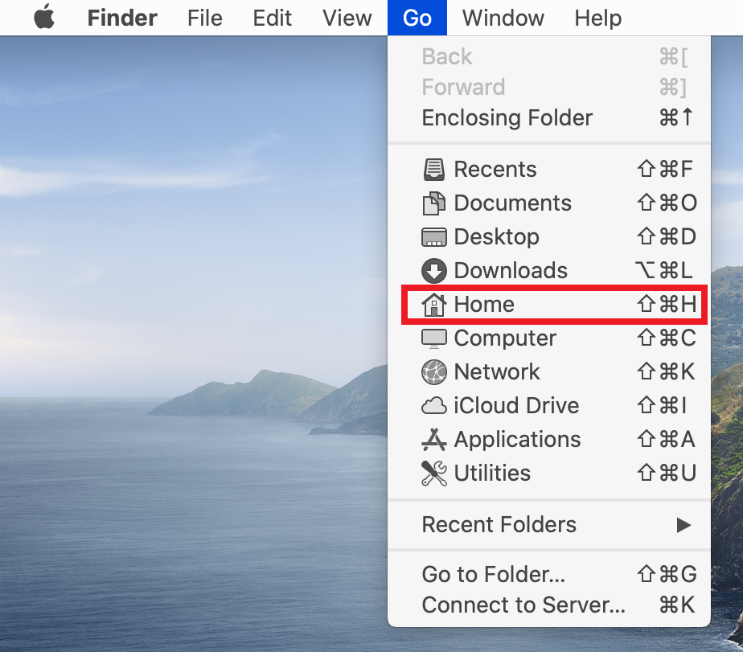

**1.5 -** Drag & Drop the `energi3` folder inside the `Home` folder

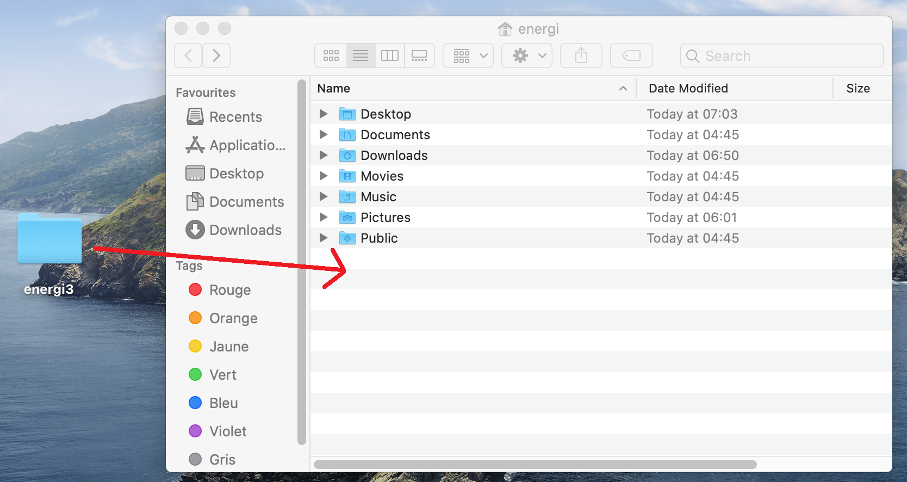

**1.6 -** You can now close the window and delete the downloaded build.

Let's open a new Terminal in <kbd>Go</kbd> then <kbd>Utilities</kbd>

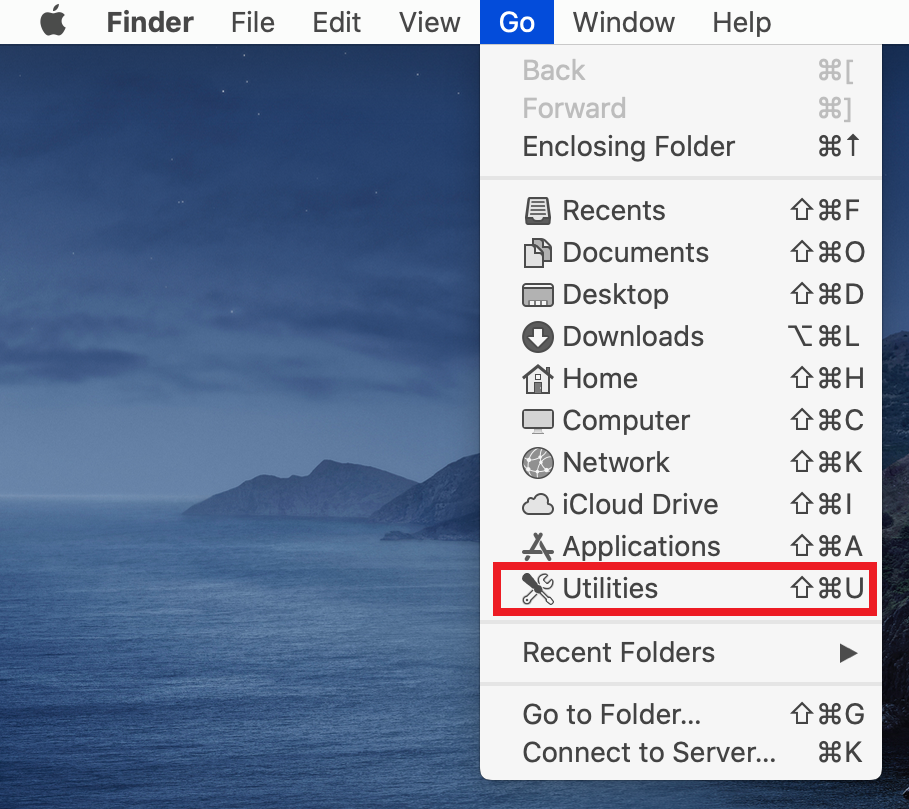

**1.7 -** In your Terminal, run the following command :

```
$HOME/energi3/bin/energi3 console
```

**You may get a pop up alert like the following.** If so, follow the steps below :

- Select <kbd>Cancel</kbd>

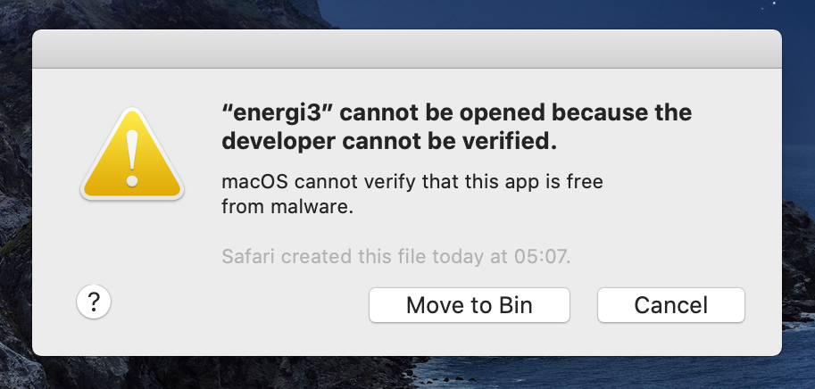

- Head over your <kbd>System Preferences</kbd> and in the General tab, we can see the error message for `energi3`.

- Select <kbd>Allow Anyway</kbd> to continue

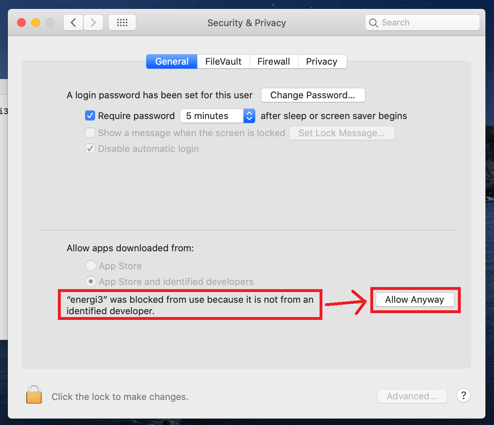

- Run the above command again and select <kbd>Open</kbd>

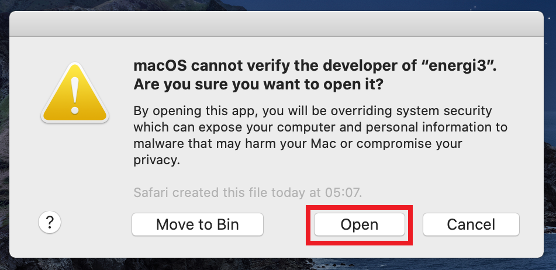

**1.8 -** <kbd>Energi Core Node</kbd> will now start synchronizing with the Blockchain!

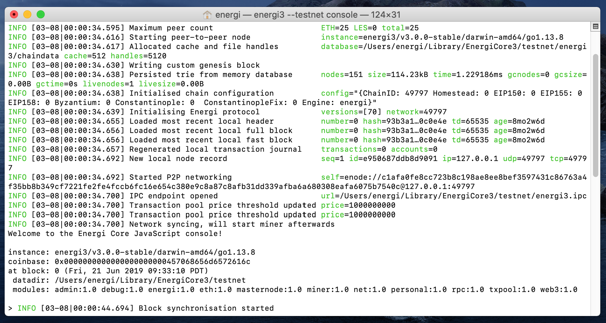

> You can follow the synchronization progress by using the <kbd>nrg.syncing</kbd> command.

:::info
**Keep in mind that for new installations, it can take an average of 48 hours to completely synchronize your node to the latest block**.
:::

:::warning
> **You will need to keep the console open all the time.
If you close it, the application will stop. You can minimize the Terminal window to keep the node running.**
:::

:::tip **Congratulations!**
> **You have successfully installed Energi Core Node on MacOS!**
:::

## 2 - Import your wallet file

:::info
> **We are going to import the wallet previously created in MyEnergiWallet.**
:::

**2.1 -** Close <kbd>Energi Core Node</kbd> before going through the next steps

**2.2 -** With a Finder window opened, select <kbd>View</kbd> and <kbd>Show View Options</kbd>

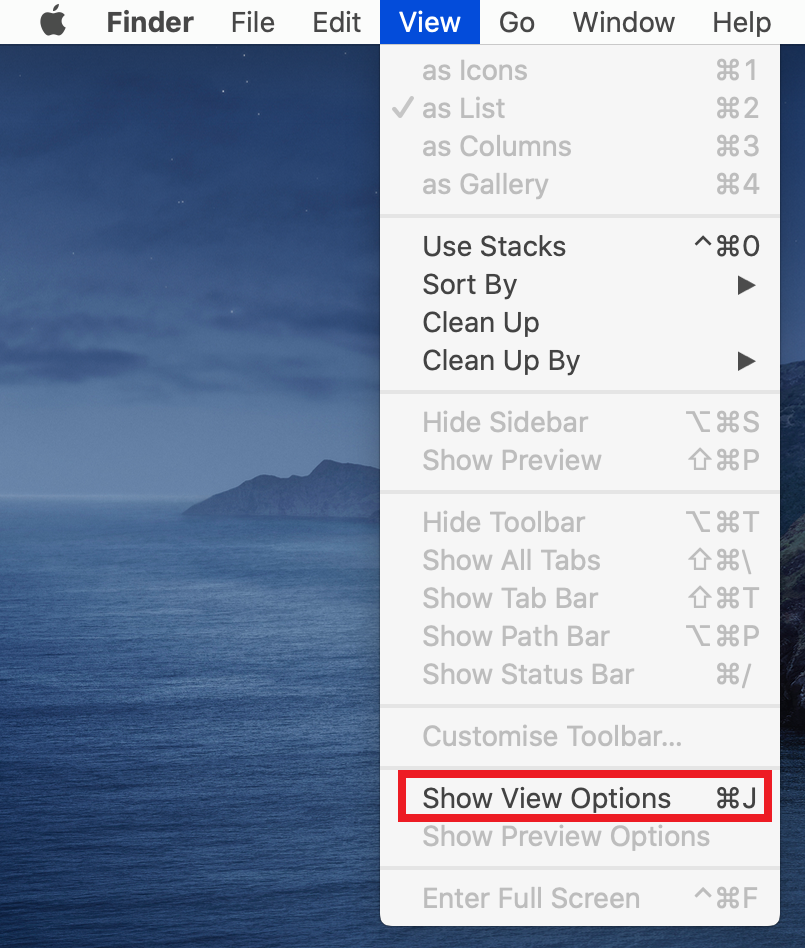

**2.3 -** Select <kbd>Show Library Folder</kbd>. You should now see it popping up in your Home folder

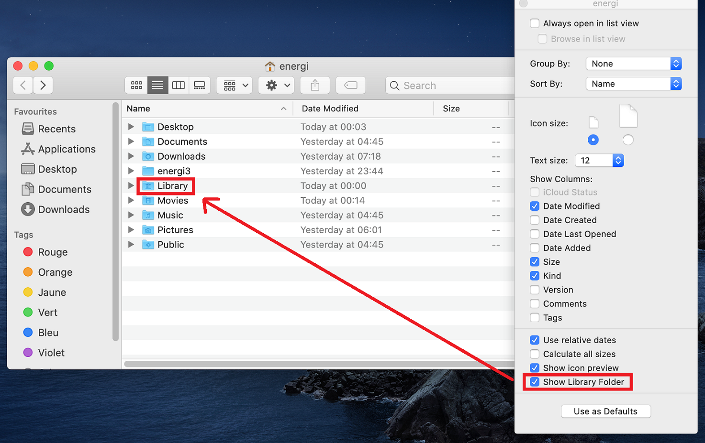

:::tip
> If you cannot access the keystore folder as mentioned above, go to Finder -> Menubar (top of screen) -> Go -> Utilities, open Terminal. Now type/paste in:
> **open "${HOME}/Library/EnergiCore3"**
:::

**2.4 -** Go to the directory where <kbd>Energi Core Node</kbd> files are located :

```
$HOME/Library/EnergiCore3/keystore
```

**2.5 -** Simply drag & drop your wallet file in the folder

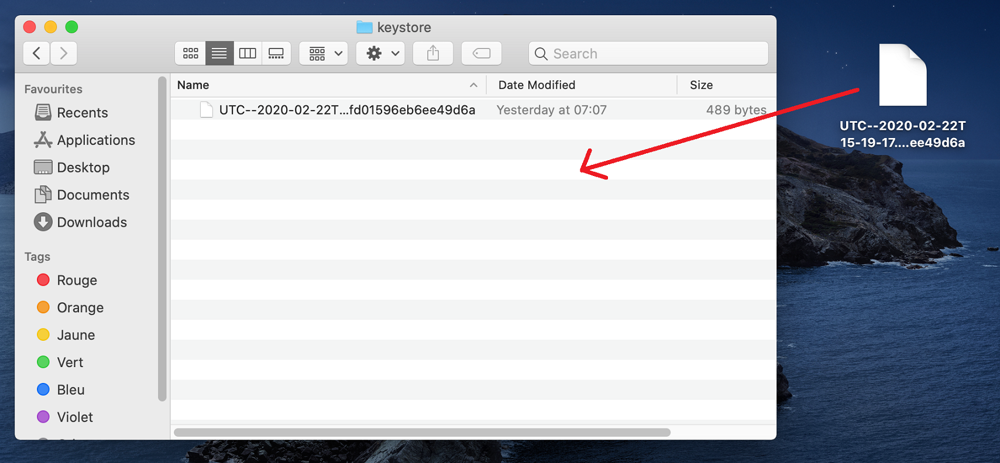

**2.6 -** Restart <kbd>Energi Core Node</kbd>, and check your accounts with the command below :

```
personal.listAccounts
```

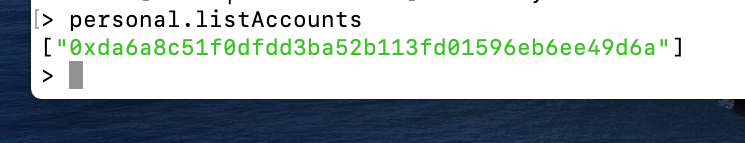

:::tip **Congratulations!**
> **You have successfully imported your wallet!**
**You are now all set!**
:::

## Next step - Staking

Now that you completed the Energi Core Node installation, you can follow the Staking Guide :

- Staking Guide

[Staking Guide](#)

## Need help?
**-** Get technical assistance :

:::info
- [Help me! *Get technical assistance by the Energi team*](#)
:::
