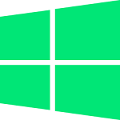
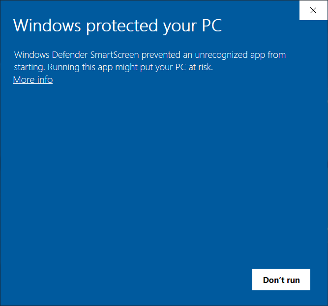
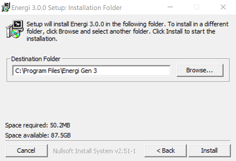
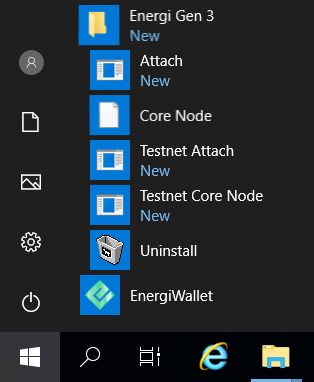
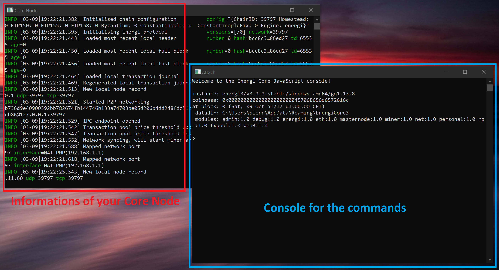
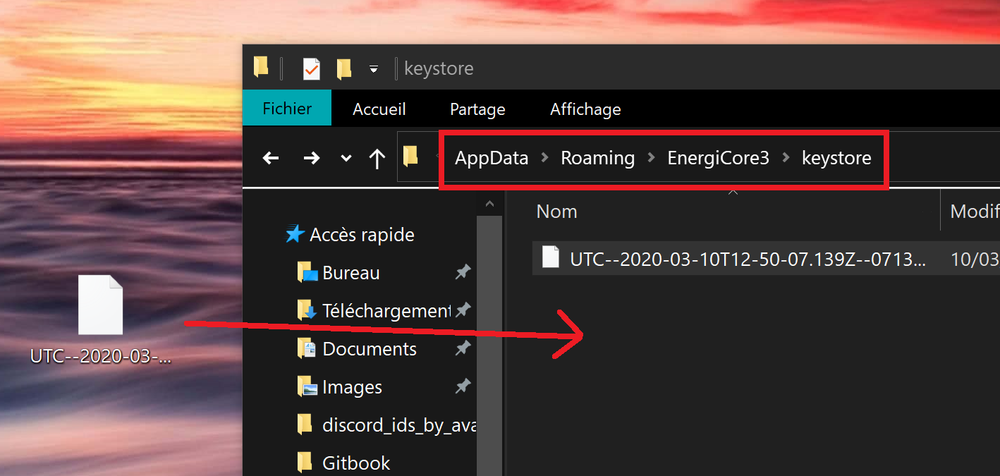
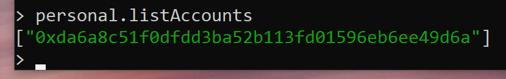

## 1 - Installation

:::info
> **It is recommended to have 100GB of storage available.** This is necessary for the Blockchain data.
:::

**1.1 -** Download the Windows installer for <kbd>Energi Core Node</kbd> by going on the Download page below:

- [Download Energi Core Node *for Windows*](../03-downloads/core-node.md#Windows)


**1.2 -** After downloading the installer, double click to start installation.

**1.3 -** You may see a warning, click <kbd>More info</kbd> and <kbd>Run anyway</kbd>.



**1.4 -** The setup will begin. Follow the procedure and change the destination folder if needed.

Click <kbd>Install</kbd> when you're ready.



## 2 - Start Core Node & Attach

**2.1 -** Head over the Start Menu where all the shortcuts for <kbd>Energi Core Node</kbd> are:



**2.2 -** Right click on the following two applications to add to your Desktop shortcut for an easier access and then start them:

:::info
> <kbd>Core Node</kbd> is the Energi Core Node. Always run it first.
> <kbd>Attach</kbd> is the console where you will be able to run commands.
:::



**2.3 -** <kbd>Energi Core Node</kbd> will now start synchronizing with the Blockchain!

:::info
> You can follow the synchronization progress by using the <kbd>nrg.syncing</kbd> command on your <kbd>Attach</kbd> terminal.
**Keep in mind that for new installations, it can take an average of 48 hours to completely synchronize your node to the latest block**.
:::

:::warning
> **You will need to keep <kbd>Core Node</kbd> opened all the time if you want to stake.**
If you close it, the application will stop. You can minimize the Terminal window to keep the node running.
:::

:::tip **Congratulations!**
> **You have successfully installed Energi Core Node on Windows!**
:::

## 3 - Import your wallet file

:::info
> **We are going to import the wallet previously created in MyEnergiWallet.**
:::

**3.1 -** Close <kbd>Energi Core Node</kbd> before going through the next steps.

**3.2 -** Open File Explorer and go to the directory where <kbd>Energi Core Node</kbd> files are located:

```
%APPDATA%\EnergiCore3\keystore
```

**3.3 -** Simply drag & drop your wallet file in the folder.



**3.4 -** Restart <kbd>Energi Core Node</kbd>, and check your accounts with the command below:

```
personal.listAccounts
```



:::tip **Congratulations!**
> **You have successfully imported your wallet!**
**You are now all set!**
:::

## Next step - Staking

Now that you completed the Energi Core Node installation, you can follow the Staking Guide :

- Staking Guide

[Staking Guide](#)

## Need help?
**-** Get technical assistance :

:::info
- [Help me! *Get technical assistance by the Energi team*](#)
:::
