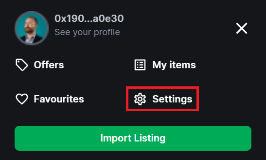
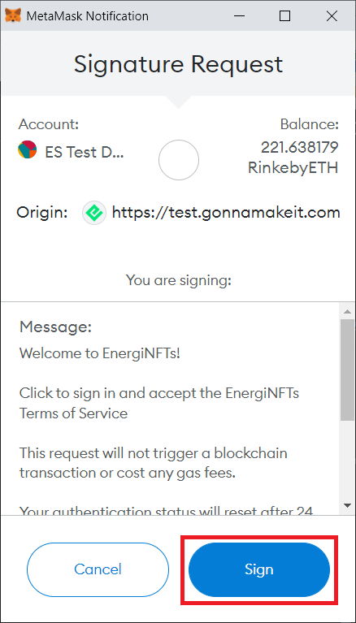
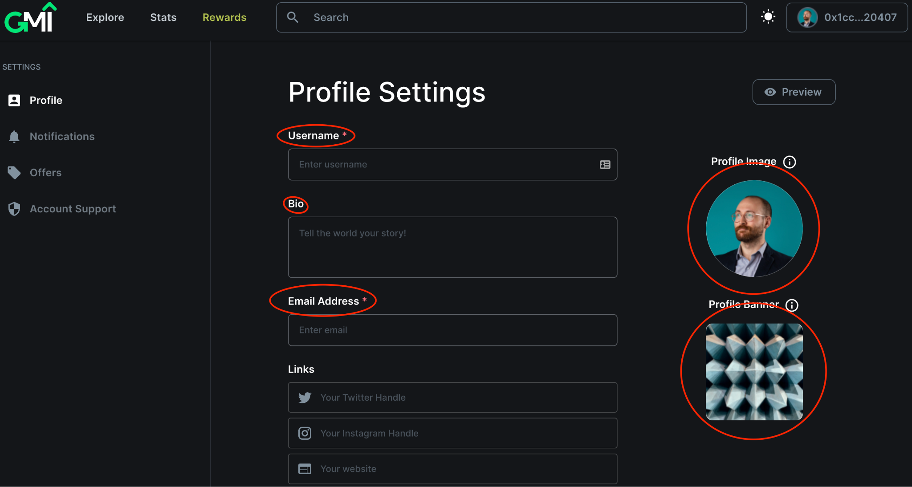

You need an Ethereum address to use the [GMI Marketplace](https://gonnamakeit.com). It can be an existing address or you can create a new one. We currently support MetaMask as the web3 wallet. Additional wallets will be added in the future.

Navigate to the [MetaMask Download Page](https://metamask.io/download) on any supported device and click the Install button. Depending on the device that is used to install MetaMask, you will have either the Browser extension (desktop) or app (mobile). Follow the initial instructions to either create or import an existing (Ethereum) account.

Go to the GMI Marketplace and click on “Connect to Metamask” on the top right corner of the page.

You will be asked to sign-on to MetaMask if you have not already. Once connected, you will see your Ethereum address.

Click on your Ethereum address.

 

Select “Settings” from the drop-down menu.

A pop-up screen will appear. Sign the request. This message will not appear on your return visit to make any updates to your settings.

Once you sign in, you will see various fields that you can personalize in your profile.

**Profile Picture:** Upload a profile image of yourself. The size of the image should be small. You can set the profile picture to an NFT that you own. The profile image should be erased if you sell, trade, or transfer your NFT to some other wallet.

**Username:** You could create a username with up to 20 characters. It has to be unique and not used by anyone on the GMI Marketplace.

**Bio:** Inform everyone about yourself in your bio.

**Links:** Put your social site here if you want to share with potential buyers.

