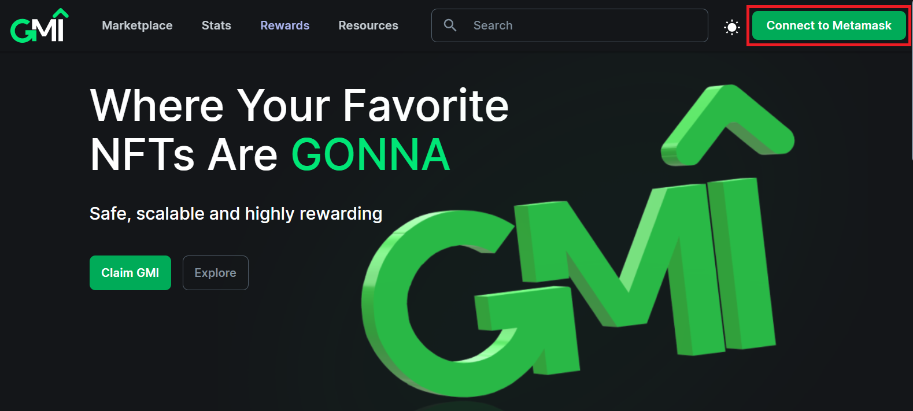
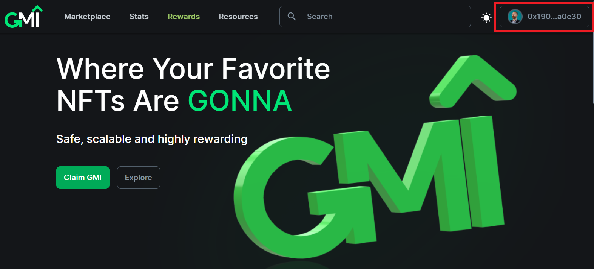

You need an Ethereum address to use the GMI Marketplace. It can be an existing address or you can create a new one. We currently support MetaMask as the web3 wallet. Additional wallets will be added in the future.

Navigate to the [MetaMask Download Page](https://metamask.io/download) on any supported device and click the Install button. Depending on the device that is used to install MetaMask, you will have either the Browser extension (desktop) or app (mobile). Follow the initial instructions to either create or import an existing (Ethereum) account.

Go to the [GMI Marketplace](https://gonnamakeit.com) and click on **Connect to Metamask** on the top right corner of the page.

Link the address to the site which contains the smart contract for your collection by clicking the wallet on the top right corner of the screen.

## 1. Edit Price

1.1. Navigate to the NFT you want to edit and click on **Edit Price** in the top-right corner. If you don't see the Edit Price button, make sure you're connected to the correct wallet.

1.2. On the pop-up, enter the new price and click Set New Price.

1.3. If the set price is lower than previously set, it will automatically cancel the previous listing.

1.4. You will get a confirmation once the price is changed.

## 2. Cancel Listing

2.1. Navigate to the NFT you want to edit and click on Cancel Listing in the top-right corner. If you don't see the Cancel Listing button, make sure you're connected to the correct wallet.

2.2. Confirm by clicking Cancel listing.

2.3. Confirm to sign a message.

2.4. Sign the MetaMask pop-up. The system will process the cancellation request.

2.5. Close the screen once the listing is successfully canceled.

