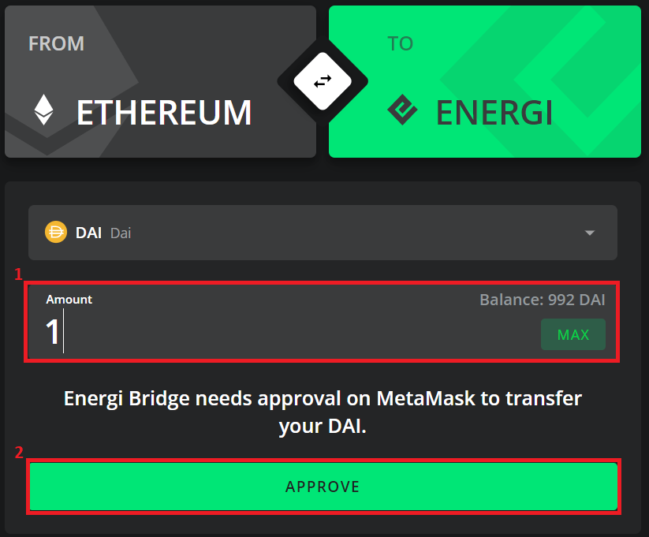

:::warning
> **DISCLAIMER: All assets traded on Energiswap are tokenized versions of the underlying asset that exist only on the Energi blockchain. The tokens cannot be directly sent to an Exchange. You have to transfer the tokens from the Energi network to the Ethereum network using the [Energi Bridge](https://bridge.energi.network/) before sending them to an Exchange.**
***

Energi Bridge is a decentralized application (dApp) that connects two blockchains so that users can securely transfer ERC-20 tokens between the two networks. At this time, Energi Bridge connects the Ethereum and Energi blockchains. This connection allows users to move their ERC-20 assets from the Ethereum network to the Energi network and vice versa. The process of transferring assets from one network to another is called **Bridging**. Once assets are bridged to Ethereum to Energi, those can be traded on **[Energiswap](https://app.energiswap.exchange/)**

During bridge transfers, the source tokens are stored and locked in a TokenSafe smart contract on the source network. At the same time, an identical amount of the same token is minted on the destination network. The user gives up their ownership of the token on the source network in exchange for the newly minted tokens, allowing them to use and trade their tokens on the new network.

To access Energi Bridge, navigate to [https://bridge.energi.network](https://bridge.energi.network).

This guide has detailed instructions on the following topics:

* [Installing MetaMask](#metamask)
* [Transfering ERC-20 Tokens from Ethereum to Energi blockchain](#bridge_eth_nrg)
* [Transfering ERC-20 Tokens from Energi to Ethereum blockchain](#bridge_nrg_eth)
* [Supported Token Contract Addresses](#supported_tokens)

## 1. Installing MetaMask{#metamask}
Before using Energi Bridge, you need to install and set up MetaMask in order to access your account address on the source and destination blockchains. Do also keep in mind that when bridging assets over both networks, you are required to use the same account address on both blockchains.
If you do not have the Energi Mainnet network set up on your MetaMask yet, follow the steps below for more information on how to do so:

1. Navigate to your MetaMask **Settings** menu and select the **Networks** option.
2. Click the **Add Network** button. You will be required to enter the details of a **New RPC Network**. Fill in the details with the information below, then click **Add**:

<table>
    <tr>
        <td align="right"><strong>Network Name:</strong></td>
        <td align="middle">Energi Mainnet</td>
    </tr>
    <tr>
        <td align="right"><strong>New RPC URL:</strong></td>
        <td align="middle">https://nodeapi.energi.network/v1/jsonrpc</td>
    </tr>
    <tr>
        <td align="right"><strong>Chain ID:</strong></td>
        <td align="middle">39797</td>
    </tr>
    <tr>
        <td align="right"><strong>Symbol:</strong></td>
        <td align="middle">NRG</td>
    </tr>
    <tr>
        <td align="right"><strong>Block Explorer URL:</strong></td>
        <td align="middle">https://explorer.energi.network/</td>
    </tr>
</table>

3. After adding the **Energi Mainnet** network, you can freely switch back and forth from it using the list of available networks.

After setting up the connection to the Energi Network, you will be ready to use the **Energi Bridge**.

## 2. Transferring ERC-20 Tokens from Ethereum to the Energi blockchain{#bridge_eth_nrg}

:::info
> **NOTE:** To transfer any assets from the Ethereum network to Energi, the account from which you are transferring the tokens will need to have some ETH to pay for the transaction gas fee.
:::

### 2.1. Connect the wallet to the Energi Bridge dApp

2.1.1 Navigate to [https://bridge.energi.network](https://bridge.energi.network) and click “**Connect to MetaMask**”. A pop-up will appear. Click “**Connect to MetaMask**” to connect your MetaMask wallet.

2.1.2 If no window pops up, click the MetaMask icon manually:

2.1.3 Make sure you have selected **Ethereum Mainnet**. If not, click on the MetaMask network dropdown list and select it:

2.1.4 Enter your password and click “**Unlock**”:

2.1.5 In MetaMask, select the account you want to transfer tokens from:

2.1.6 If you do not see the Energi Bridge dApp after connecting and unlocking your wallet, press F5 to refresh the browser.

### 2.2. Confirm that Ethereum is the “FROM” blockchain on the left. If not, click the double arrow button marked below. This will set Ethereum as the source blockchain for the transfer.

### 2.3. From the dropdown, select the ERC-20 token you want to transfer from Ethereum to the Energi blockchain. For the purposes of this guide, we will move DAI from Ethereum to Energi:

### 2.4. Approve the amount of the source token that you want to transfer

2.4.1 Enter the amount of the token that you want to transfer from the Ethereum blockchain.
2.4.2 Click “**Approve**”.
2.4.3 The MetaMask approval screen will pop up after a few seconds. “Confirm” the amount to transfer. You cannot change the amount approved for transfer at this stage.

:::info
> **NOTE:** ETH is a native token on the Ethereum blockchain. There is no approval required to transfer ETH from the Ethereum blockchain.
:::

### 2.5. Transfer the tokens

2.5.1 Once approved, read the disclaimer detailing the terms of the transfer and check the box.
2.5.2 Click "**Transfer &lt;token> to Energi blockchain**". In the example below, we selected DAI as the token:

### 2.6. Confirm the gas fee for the transaction in MetaMask.

A pop-up window will appear showing the status of the transaction and any other pending transactions.

The following notification will pop up if you have MetaMask notifications enabled.

After the transaction is confirmed on the Ethereum blockchain, your ERC-20 tokens will be stored and locked in the TokenSafe smart contract. You will not have custody of those tokens on the Ethereum blockchain after that. The same amount of the token will be issued to your wallet on the Energi blockchain.

**Congratulations! You just transferred tokens from Ethereum to the Energi blockchain.**

### 2.9. Check the destination wallet on the Energi blockchain

2.9.1 Switch to the “Energi Mainnet” on MetaMask:

You will see the same amount of transferred tokens in your Energi Mainnet wallet.

The transfer can also be verified at the Energi Block Explorer. Navigate to the [block explorer page](https://explorer.energi.network/) and search for your wallet address at the search box.

Navigate to the “**Token Transfers**” tab and check the transaction for the token associated with your transfer:

## 3. Transferring ERC-20 Tokens from Energi to the Ethereum blockchain{#bridge_nrg_eth}

Energi Bridge also allows you to transfer native NRG or an ERC-20 token (example: WNRG, ETH) from Energi to the Ethereum blockchain.

When transferring NRG or WNRG, the coins are stored and locked in a TokenSafe smart contract on the Energi blockchain. The same amount of NRGE is then minted and credited to your address on the Ethereum blockchain.

When an ERC-20 token is transferred, it is burned on the Energi blockchain and the same amount is released from the TokenSafe smart contract to your account on the Ethereum blockchain. This operation maintains the total circulating supply across all blockchains.

:::info
> Just like the transfer from the Ethereum blockchain to the Energi blockchain, you will also need to pay for transaction gas fees when sending your tokens from the Energi blockchain to Ethereum. **Make sure to have NRG balance when transferring assets from the Energi network to the Ethereum network**.
***

### 3.1. Open and connect your wallet to the Energi Bridge dApp

3.1.1 Navigate to [https://bridge.energi.network](https://bridge.energi.network) and click “**Connect to MetaMask**”. A pop-up will appear. Click “**Connect to MetaMask**” to connect your MetaMask wallet.

3.1.2 If no window pops up, click the MetaMask icon manually:

3.1.3 On MetaMask, select the “**Energi Mainnet**” from the dropdown menu.

3.1.4 Enter your password and click “**Unlock**”.

3.1.5 In MetaMask, select the account you want to transfer tokens from:

### 3.2. Confirm that Energi is the “FROM” blockchain on the left. If it is not, click the double arrow button marked below. This will set Energi as the source blockchain for the transfer.

### 3.3. From the dropdown, select the ERC-20 token you want to transfer from Energi to the Ethereum blockchain.

### 3.4. Approve the amount of the source token that you want to transfer.

3.4.1 Enter the amount of the token that you want to transfer to the Ethereum blockchain.

3.4.2 Click “**Approve**”.

3.4.3 The MetaMask approval screen will pop up after a few seconds. “**Confirm**” the amount to transfer. You cannot change the amount approved for the transfer at this stage.

:::info
> **NOTE**: NRG is a native token on the Energi blockchain. There is no approval required to transfer NRG.
:::

### 3.5. Transfer the tokens

3.5.1 Once approved, read the disclaimer detailing the terms of the transfer and check the box.
3.5.2 Click **"Transfer &lt;token> to Ethereum blockchain**". In the example below, we selected DAI as the token:

**NOTE**: The pop-up from MetaMask may take some time to appear. Once it appears, go to the next step.

### 3.6. Confirm the gas fee for the transaction in MetaMask.

A pop-up window will appear showing the status of the transaction and any other pending transactions.

The following notification will pop up if you have MetaMask notifications enabled.

After the transaction is confirmed on the Energi blockchain, your ERC-20 tokens will be stored and locked in the TokenSafe smart contract. You will not have custody of those tokens on the Energi blockchain after that. The same amount of the token will be issued to your wallet on the Ethereum blockchain.

:::info
> **NOTE:** Keep in mind that there is a 5000 confirmation waiting period required before tokens transferred away from the Energi blockchain will be available to use on the Ethereum blockchain. **This is in place to protect Energi users from fraud and theft**.
:::

**Congratulations! You just transferred tokens from Energi to the Ethereum blockchain.**

### 3.7. Check the destination wallet on the Ethereum blockchain

3.7.1. On MetaMask, select “Ethereum Mainnet”:

3.7.2 You will see the same amount of transferred tokens in your Ethereum Mainnet Network wallet.

3.7.3. You can also verify the transaction on [Etherscan](http://etherscan.io/) by searching for your address:

Select the “Erc20 Token Txns” tab to see the transaction information.

## 4. Supported Token Contract Addresses{#supported_tokens}

The list of assets which can be bridged from Energi to Ethereum and vice-versa can be found at the following page:

- [Supported Tokens on Energi Bridge](https://wiki.energi.world/en/faq/energiswap-tokens-mainnet#bridgeable_tokens)
