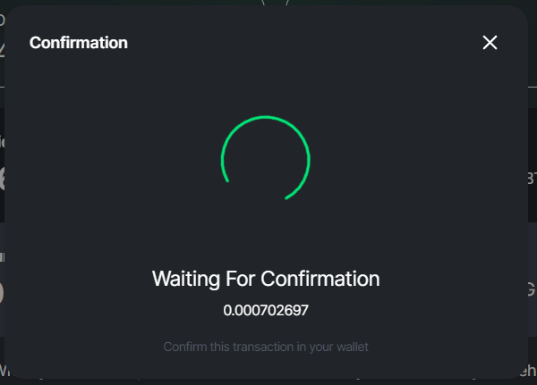

This guide has detailed instructions on the following topics:

* [Prerequisites](#prereq)
* [Staking LP Tokens](#stake_lp)
* [Managing Rewards and Staked LP Tokens](#manage_stake)

:::info **NOTE**
> While staking LP tokens through Energi Yield Farming provides passive earnings like [Staking](https://wiki.energi.world/en/staking-guide) and [Masternodes](https://wiki.energi.world/en/masternode-guide), one should always consider the risk of **Impermanent Loss** when providing liquidity to automated market makers (AMM) platforms like Energiswap.
:::

## 1. Prerequisites{#prereq}

### 1.1 Connect to Energi

**1.1.1 -** Make sure that your MetaMask wallet is connected to the Energi mainnet network. To do so, you can follow the instructions in this [guide](./energiswap-quickstart.md).

### 1.2 Provide Liquidity

**1.2.1 -** You must be a Liquidity Provider to gain access to LP tokens and benefit from Energi Yield Farming on the Energiswap Farming. To do so, you can follow the instructions in this [guide](./energiswap-mainnet#33-add-liquidity).

**1.2.2 -** You will also have the option to provide liquidity to the required token pair after selecting a Farm on Energiswap. Keep in mind that this option will not always be available - it will be present only if there is no liquidity allocated to the respective Farm pool.

## 2. Staking LP Tokens{#stake_lp}

**2.1 -** Navigate to the [Farming](https://app.energiswap.exchange/#/farming) page on Energiswap, search for the desired pool where you wish to stake your LP tokens, and click **Deposit**. For instance, you could deposit your LP tokens in the **BTC-NRG** Farming Pool.

**2.2 -** A new window showing details of the chosen Farming Pair/Pool will open, where you will have to click **Deposit** once again.

**2.3 -** A new window will pop up where you will have to input the amount of LP tokens you wish to stake. You can click on the **MAX** button to stake the entire amount of LP Tokens you currently hold. Once you allocate the desired amount, click **Deposit**.

**2.4 -** A MetaMask confirmation screen will pop up. Here, you can verify the transaction details and click **Confirm,** if you agree.

**2.5 -** Once the transaction is confirmed on MetaMask, a “_Transaction Submitted_” pop-up will be displayed with a link to the transaction details at our [Block Explorer](https://explorer.energi.network/). Click **Close** and wait for your deposit to be confirmed so you can see the amount of LP Tokens you have staked and your unclaimed rewards.

**2.6 -** You have the option to stake more LP tokens at any time. Just click **Deposit** and repeat some of the steps mentioned above.

## 3. Managing Rewards and Staked LP Tokens{#manage_stake}

### 3.1 Show My Pools

Navigate to the [Farming](https://app.energiswap.exchange/#/farming) page and click **Manage** on the farming pool, where you have staked your LP tokens. You can use the “**Show Only My Pools**” feature to filter out the farms where you have staked your LP tokens.

### 3.2 Manage Pools

On this page, you will have the option to **Deposit** more LP tokens, **Claim** any unclaimed NRG rewards, or **Withdraw** your position. When you withdraw your position, your Unclaimed NRG will be automatically claimed, and your Staked LP Tokens will be removed from the Farming Pool.

### 3.3 Deposit More LP Tokens

**3.3.1 -** Click **Deposit** to increase the number of LP tokens you have staked on any given pool and follow the steps previously mentioned in the [Staking LP Tokens](#stake_lp) section.

### 3.4 Claim NRG Rewards

**3.4.1 -** Click **Claim** to claim your NRG rewards.

**3.4.2 -** A new window showing details about your NRG rewards will open, where you will have to click **Claim** once again.

**3.4.3 -** A MetaMask confirmation screen will pop up. Here, you can verify the transaction details and click **Confirm** if you agree.

**3.4.4 -** You will be redirected to the Energiswap transaction confirmation window. Click **Close** and wait for your transaction to be confirmed. Your Unclaimed NRG balance will be updated to 0 (zero) on the Liquidity Farming page as your NRG rewards have now been transferred to your Energi wallet in MetaMask.

### 3.5 Withdraw Position

**3.5.1 -** Click **Withdraw** and a new pop-up will appear. Click on the **Withdraw & Claim** button to unstake all the LP tokens you have deposited on any given Farming Pool. Please keep in mind that you will automatically claim any unclaimed NRG rewards by withdrawing your staked LP tokens.

**3.5.2 -** A MetaMask confirmation screen will pop up. Here, you can verify the transaction details and click **Confirm** if you agree.

**3.5.3 -** You will be redirected to the Energiswap transaction confirmation window. Click **Close** and wait for your transaction to be confirmed. Your Liquidity Deposits and Unclaimed NRG balance will be updated to 0 (zero) on Energiswap as your LP tokens, and NRG rewards have now been transferred to your Energi wallet in MetaMask.

