import Tabs from '@theme/Tabs';
import TabItem from '@theme/TabItem';

Energiswap is a web-based Decentralized Finance (DeFi) application based on the Uniswap codebase. You need MetaMask on Chrome or Crypto Wallets on Brave to swap or provide equity on Energiswap. You can also use the MetaMask app on your mobile device. The application uses the Energi blockchain network for all the transactions and NRG coins are used to pay transaction and gas fees.

## 1. Set Up Environment
If you have not yet installed the MetaMask extension or mobile app, or set up the Crypto Wallets feature on your browser, please follow the instructions below.

```mdx-code-block
<Tabs groupId="author-front-matter">
<TabItem value="chrome" label="Chrome Browser">
```

### 1.1. Set up Chrome Browser

#### 1.1.1.​ Add MetaMask Extension to Chrome Browser

**​1.1.1.1.** Open Chrome browser and then click on the three dots at the top right corner of the browser. Select “More tools → Extensions”

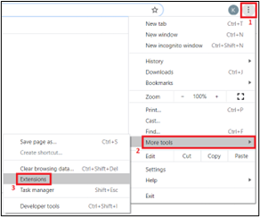

**​1.1.1.2.**​ Click on the 3 horizontal bars to see the drop-down menu.

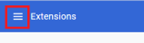

**​1.1.1.3.**​ Click “Open Chrome Web Store”

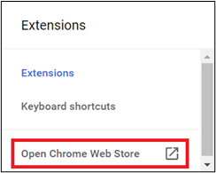

**​1.1.1.4.**​ In the “Search the store” field, type “MetaMask” and hit enter.

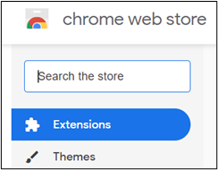

**1.1.1.5.**​ Select the MetaMask extension.

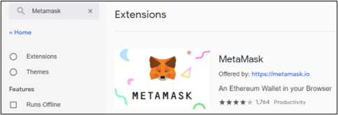

**1.1.1.6.**​ Click “Add to Chrome” to add the MetaMask Extension.

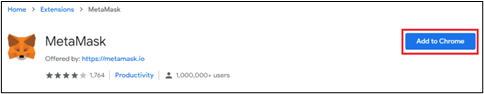

**1.1.1.7.**​ Select “Add extension”

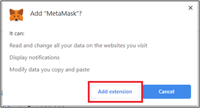

**1.1.1.8.**​ Wait till Chrome finishes “Checking…”

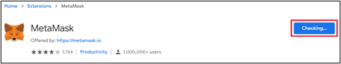

**1.1.1.9.**​ Click “Get Started”

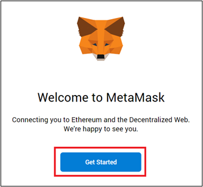

**1.1.1.10.**​ Select “Create a Wallet”

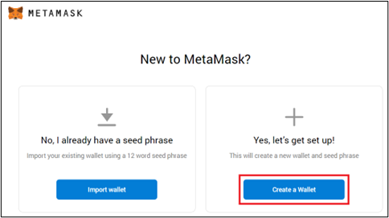

**1.1.1.11.**​ After reviewing the disclaimer, click  “I agree”.

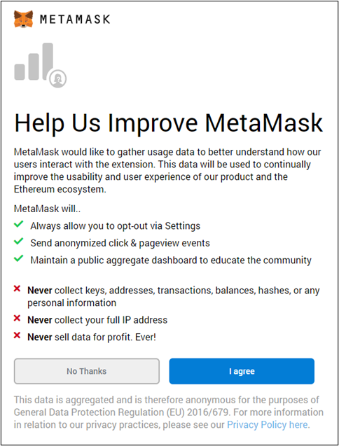

**1.1.1.12.**​ Enter a new password, check the agreement and then click “Create”:

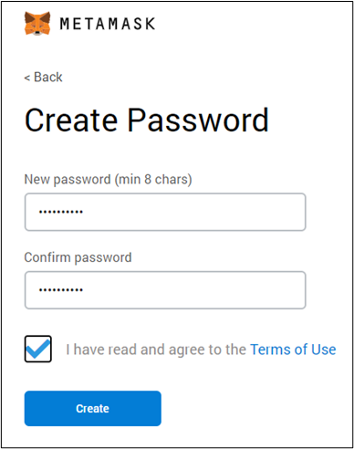

**1.1.1.13.**​ Click on the padlock to reveal the secret password.

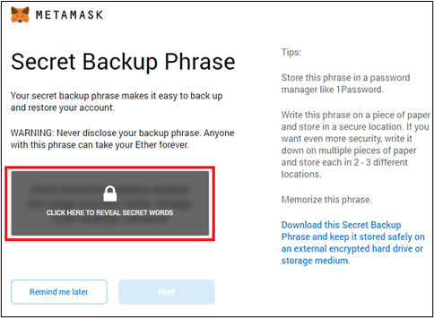

**1.1.1.14.**​ Copy the secret words on to a text editor and safely store it.  Click “Next”

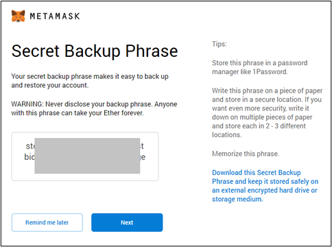

**1.1.1.15.**​ Pick all the secret words in the order and then click “Confirm” to continue.

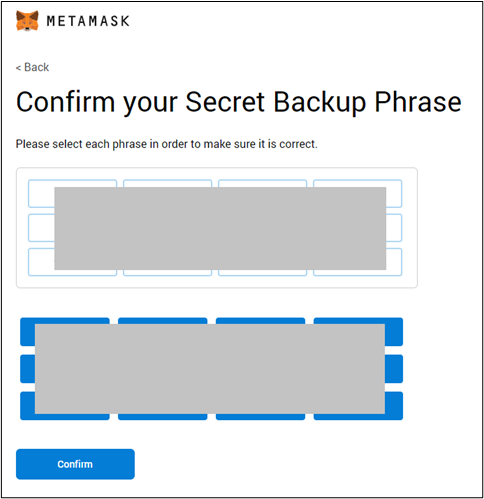

:::tip Congratulations!
You have added the MetaMask extension to Chrome.  Click “All Done” to continue.
:::

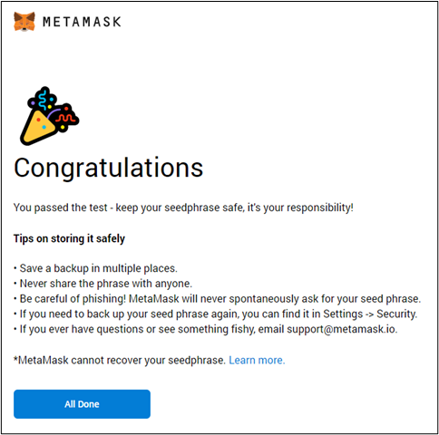
 

#### 1.1.2.​ Back up your Private Key

**1.1.2.1.**​ On MetaMask’s main screen, click the three dots to the right of your current Account’s address to expand the menu, then click “Account details”:

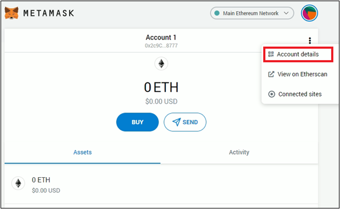

**1.1.2.2.** On the Account details screen, click the “Export Private Key” button:

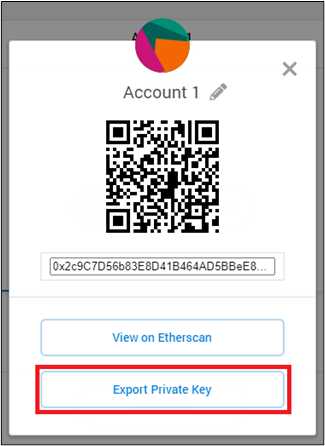

**1.1.2.3.** You will be presented an option to input your MetaMask password. Do so and click “Confirm”:

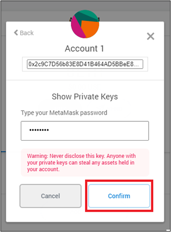

**1.1.2.4.** Your private key will be displayed. Notate it and store it in a safe place.  It can be used to restore your wallet in the future. You can also select the “Copy to clipboard” option to copy the contents of the private key box:

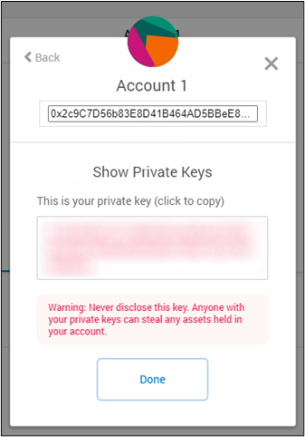

:::Warning ALERT!!
The private key should be handled with utmost care and safety.  If anyone gets hold of it, they can access your funds associated with it.  Backup the key to a secure location.
:::
 
**1.1.2.5.**​ The backed up private key can be used to generate a keystore file using the [MyEnergiWallet](./myenergiwallet.md) application:

#### 1.1.3. Import an Existing Private Key

:::note
ERC-20 tokens (including ETH) and NRG share the same private key for an account address. You can import the private key of your NRG account to create the same account address in the Ethereum Main Network. We suggest you import the private key of your NRG account so that you have the same address on Ethereum Mainnet. This is not a requirement. Just a suggestion!
:::

**1.1.3.1.**​ On MetaMask, click the circle beside “Main Ethereum Network”, then click “Import Account”:

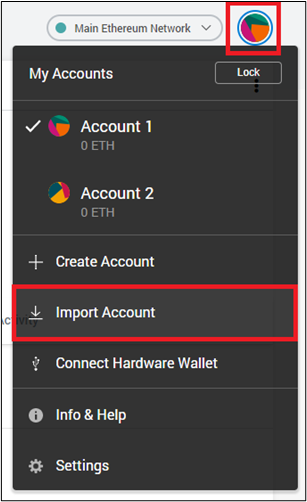

**1.1.3.2.**​ Paste / Type your desired Private Key in the private key box, then click “Import”:

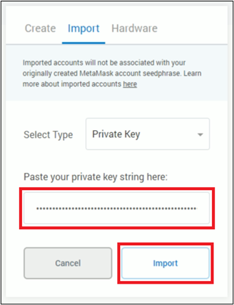

**1.1.3.3.**​ Once imported, you will be taken back to the initial MetaMask screen to your newly imported wallet:

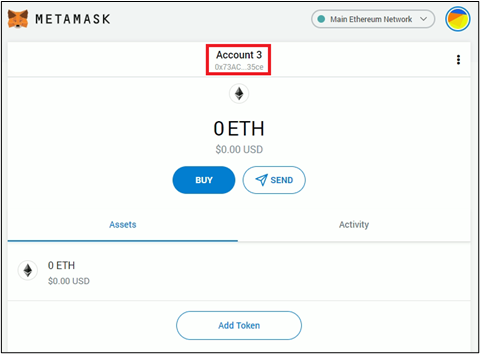

#### 1.1.4.​ Add Energi Mainnet on Chrome

This section will guide you through adding the Energi Mainnet network.to your MetaMask Chrome Extension.

**​1.1.4.1.**​ On MetaMask, click the circle beside “Main Ethereum Network”

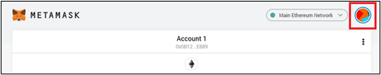

**​1.1.4.2.**​ On the drop-down, select “Settings”

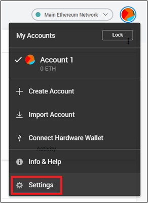

**​1.1.4.3.**​ In the Settings page, select “Networks” and then click on “Add Network”

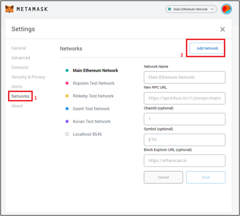

**​1.1.4.4.**​ Copy and Paste the following at the New Network screen.  Click “Save” when done to create the Energi Mainnet network.

<table>
    <tr>
        <td align="right"><strong>Network Name:</strong></td>
        <td align="middle">Energi Mainnet</td>
    </tr>
    <tr>
        <td align="right"><strong>New RPC URL:</strong></td>
        <td align="middle">https://nodeapi.energi.network/v1/jsonrpc</td>
    </tr>
    <tr>
        <td align="right"><strong>Chain ID:</strong></td>
        <td align="middle">39797</td>
    </tr>
    <tr>
        <td align="right"><strong>Symbol:</strong></td>
        <td align="middle">NRG</td>
    </tr>
    <tr>
        <td align="right"><strong>Block Explorer URL:</strong></td>
        <td align="middle">https://explorer.energi.network/</td>
    </tr>
</table>

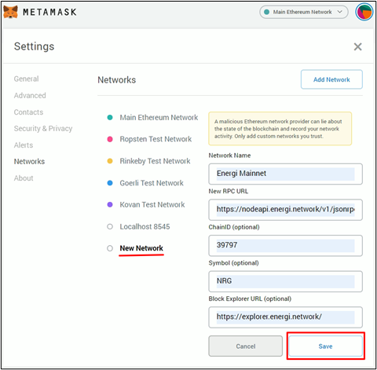

**​1.1.4.4.1.**​ Validate that the “Energi Mainnet” has been created.  You will see the network as indicated in the screenshot below.

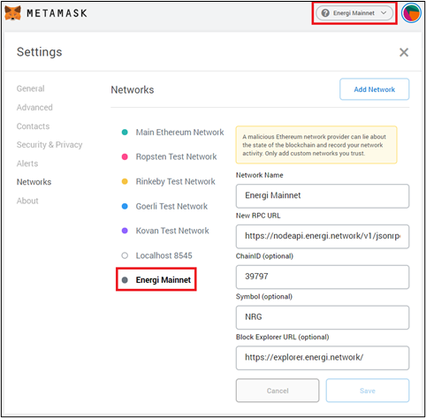

```mdx-code-block
</TabItem>
<TabItem value="brave" label="Brave Browser">
```

### 1.2. Set up Brave Browser

Brave has a Crypto Wallets feature built into the browser.  For testing we recommend you use the default wallet.

:::note
Currently the Energi Bridge does not support transactions made using Brave's Crypto Wallet. We recommend using MetaMask for any Energi Bridge related transactions.
:::

#### 1.2.1.​ Select “Crypto Wallets” in the Brave Browser.

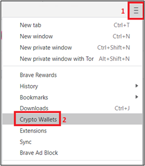

**1.2.1.1.**​ Click “I understand” to continue.


 
**1.2.1.2.**​ Click “Create” under New Local Wallet.

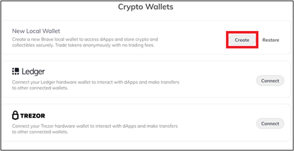

**1.2.1.3.**​ Enter a new password, check the agreement and then click “Create”

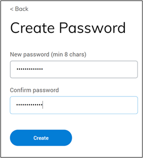

**1.2.1.4.**​ Click on the padlock to reveal the secret password.

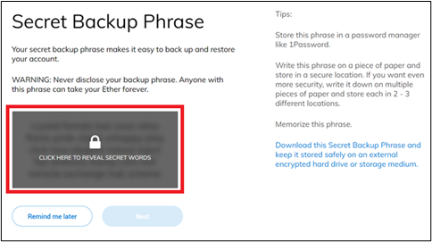

**1.2.1.5.**​ Copy the secret words on to a text editor and safely store it.  Click “Next”

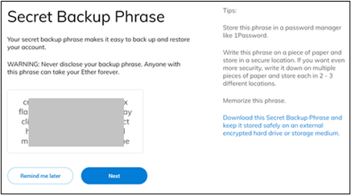

**1.2.1.6.**​ Pick all the secret words in the order and then click “Confirm” to continue.

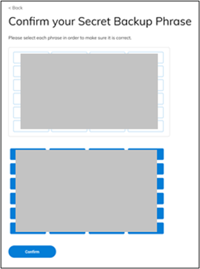

:::tip Congratulations!
You have added the Crypto Wallets component to your Brave browser.  Click “All Done” to continue.
:::

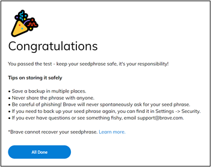

#### 1.2.2.​ Back up your Private Key

**1.2.2.1.**​ On Brave’s Crypto Wallets main screen, click the three dots to the right of your current Account’s address to expand the menu, then click “Account details”:

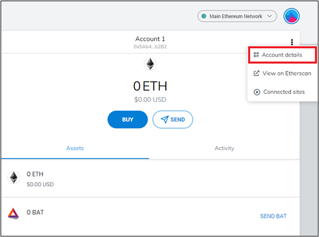

**1.2.2.2.** On the Account details screen, click the “Export Private Key” button:

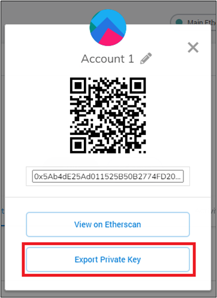

**1.2.2.3.** You will be presented an option to input your MetaMask password. Do so and click “Confirm”:

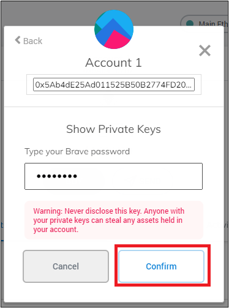

**1.2.2.4.** Your private key will be displayed. Notate it and store it in a safe place - it can be used to restore your wallet in the future. You can also select the “Copy to clipboard” option to copy the contents of the private key box:

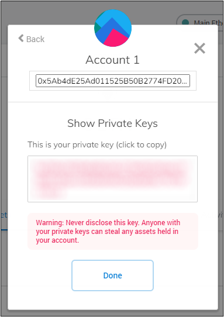

:::warning ALERT!
The private key should be handled with utmost care and safety.  If anyone gets hold of it, they can access your funds associated with it. Backup the key to a secure location.
:::

**1.2.2.5.**​ The backed up private key can be used to generate a keystore file using the [MyEnergiWallet](./myenergiwallet.md) application. 

#### 1.2.3. Import an Existing Private Key

:::note
ERC-20 tokens (including ETH) and NRG share the same private key for an account address. You can import the private key of your NRG account to create the same account address in the Ethereum Main Network. We suggest you import the private key of your NRG account so that you have the same address on Ethereum Mainnet.  This is not a requirement.  Just a suggestion!
:::

**1.2.3.1.**​ On MetaMask, click the circle beside “Main Ethereum Network”, then click “Import Account”:


**1.2.3.2.**​ Paste / Type your desired Private Key at the private key box, then click “Import”:

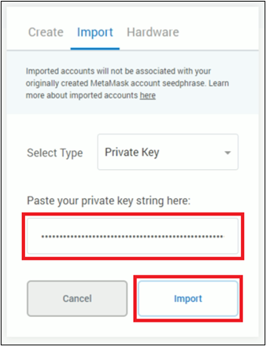

**1.2.3.3.**​ Once imported, you will be taken back to the initial MetaMask screen at your newly imported wallet:

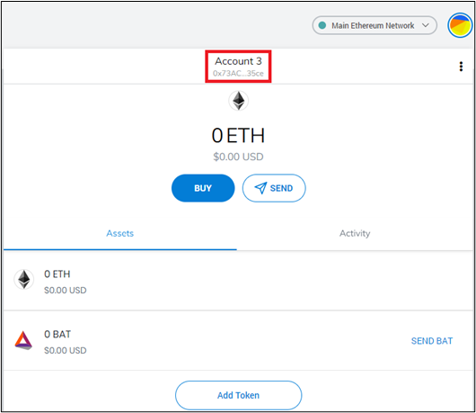

#### 1.2.4.​ Adding the Energi Mainnet to Brave Crypto Wallets

This section will guide you through adding the Energi Mainnet network.to your Brave Crypto Wallets.

**​1.2.4.1.**​ Click the circle beside “Main Ethernet Network”

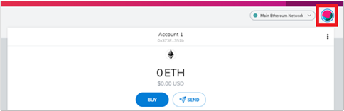

**​1.2.4.2.**​ Select “Settings” in the drop-down menu.

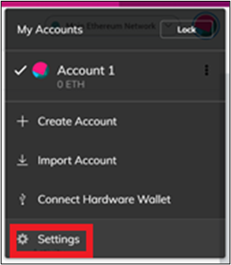

**​1.2.4.3.**​ In the Settings page, select “Networks” and then click on “Add Network”.

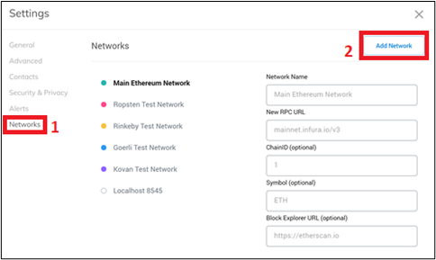

**​1.2.4.4.**​ Copy and Paste the following at the New Network screen.  Click “Save” when done to create the Energi Mainnet network.

<table>
    <tr>
        <td align="right"><strong>Network Name:</strong></td>
        <td align="middle">Energi Mainnet</td>
    </tr>
    <tr>
        <td align="right"><strong>New RPC URL:</strong></td>
        <td align="middle">https://nodeapi.energi.network/v1/jsonrpc</td>
    </tr>
    <tr>
        <td align="right"><strong>Chain ID:</strong></td>
        <td align="middle">39797</td>
    </tr>
    <tr>
        <td align="right"><strong>Symbol:</strong></td>
        <td align="middle">NRG</td>
    </tr>
    <tr>
        <td align="right"><strong>Block Explorer URL:</strong></td>
        <td align="middle">https://explorer.energi.network/</td>
    </tr>
</table>


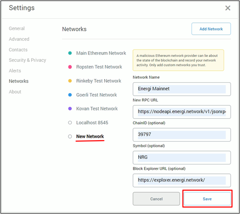

**​1.2.4.4.1.**​ Validate that the “Energi Mainnet” has been created.  You will see the network as indicated in the screenshot below.

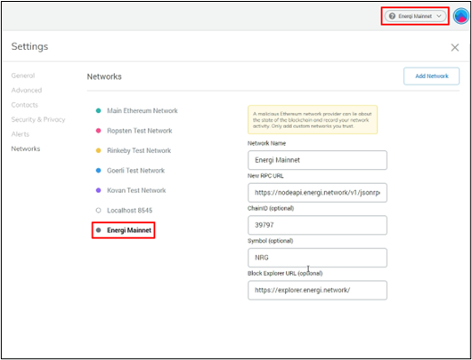

```mdx-code-block
</TabItem>
<TabItem value="mobile" label="Mobile Device">
```

### 1.3.​ Install MetaMask app on your mobile device

MetaMask Mobile is available for download in both the Android Play Store and iOS App Store. Download the application from one of the links below, according to your mobile OS, and then follow the instructions below:

iOS: [https://metamask.app.link/skAH3BaF99](https://metamask.app.link/skAH3BaF99)

Android: [https://metamask.app.link/bxwkE8oF99](https://metamask.app.link/bxwkE8oF99)

#### 1.3.1.​ Create a new wallet

Select “Create a new wallet”:


**​1.3.1.1.**​ Create a password

Enter a new and secure password, check the agreement box to confirm you understand that Metamask cannot recover your password, and click “Create Password”:


**​1.3.1.2.**​ Secure your wallet

Start the procedure to secure your Wallet, and confirm its secret words:


**1.3.1.3.**​ Review instructions

Review the instructions to secure your wallet, and select “Start”:


**​1.3.1.4.**​ Confirm your password

Confirm your password, and select “Confirm”:


**​1.3.1.5.**​ Write down your seed phrase

Click “View” to confirm your secret words. Take note of them, as well as the order in which they are presented, and keep them safe - you will need to confirm your secret words, and their order, at the next step. Once ready, select “Continue”:

​

**1.3.1.6.**​ Confirm seed phrase

Select each of the secret words according to the order in which they were presented previously. Once you have selected the correct words in the correct order, the “Complete Backup” button will activate, allowing you to select it and finalize the creation of your wallet:


#### 1.3.2. Default Account Address

**1.3.2.1.** Account address

MetaMask by default will create an address. You can copy it by clicking on the address.


**1.3.2.2.** Backup your private keys

Make a backup of your private key and store it in a safe place. You can use the private key to recreate the wallet or generate a keystore file in MyEnergiWallet.


**1.3.2.2.1.** On MetaMask’s initial screen, navigate to the menu located in the upper left corner and expand it:


**1.3.2.2.2.**​ In the expanded menu, select “Settings”:


**1.3.2.2.3.**​ In the Settings page, select “Networks”, then select “Security & Privacy”:


**1.3.2.2.4.**​ At the “Security & Privacy” Screen, scroll down to the end of the page and select “Show private key”:


**1.3.2.2.5.**​ You will be prompted to confirm your MetaMask password. Fill the box with the password you have set for your MetaMask application, then select “Next”:


**1.3.2.2.6.**​ Your private key will be displayed. Notate it and store it in a safe place - it can be used to restore your wallet in the future. You can also select the “Copy to clipboard” option to copy the contents of the private key box:


 
:::warning ALERT!
The private key should be handled with utmost care and safety. If anyone gets hold of it, they can access your funds associated with it. Backup the key to a secure location.
:::
 

**1.3.2.2.7.**​ The backed up private key can be used to generate a keystore file using the [MyEnergiWallet](./myenergiwallet.md) application.  Look at the MyEnergiWallet Guide for details.


#### 1.3.3. Import an Existing Private Key

:::note
ERC-20 tokens (including ETH) and NRG share the same private key for an account address. You can import the private key of your NRG account to create the same account address in the Ethereum Main Network. We suggest you import the private key of your NRG account so that you have the same address on Ethereum Mainnet.  This is not a requirement.  Just a suggestion!
:::


**1.3.3.1.**​ Open MetaMask

On MetaMask’s initial screen, navigate to the menu located in the upper left corner and expand it:

​

**1.3.3.2.**​ Select account

In the expanded menu, click on “Account 1”:


**1.3.3.3.**​ Import account

At the account list screen, select the “Import an Account” option:

**1.3.3.4.** ​ Enter your private key

You will be taken to the Import Account screen. Paste / Type your private key in the private key box, then select “Import”:


**1.3.3.5.** ​ Complete import

After importing the private key, you will be back at the main MetaMask Mobile screen for the account you have just imported. You can switch between accounts on the same “Account List” screen from the previous steps:


#### 1.3.4. Adding the Energi Mainnet network to Mobile App

This section will guide you through adding the Energi Mainnet network to your MetaMask Mobile app.


**​1.3.4.1.**​ On MetaMask’s initial screen, navigate to the menu located in the upper left corner and expand it:


**1.3.4.2.**​ In the expanded menu, select “Settings”:


**1.3.4.3.**​ In the Settings page, select “Networks”, then select “Add Network”:


**1.3.4.4.**​ Copy and Paste the following information into each field in the “New RPC Network” page, then select “Add” to create an entry for the Energi Mainnet network:

<table>
    <tr>
        <td align="right"><strong>Network Name:</strong></td>
        <td align="middle">Energi Mainnet</td>
    </tr>
    <tr>
        <td align="right"><strong>New RPC URL:</strong></td>
        <td align="middle">https://nodeapi.energi.network/v1/jsonrpc</td>
    </tr>
    <tr>
        <td align="right"><strong>Chain ID:</strong></td>
        <td align="middle">39797</td>
    </tr>
    <tr>
        <td align="right"><strong>Symbol:</strong></td>
        <td align="middle">NRG</td>
    </tr>
    <tr>
        <td align="right"><strong>Block Explorer URL:</strong></td>
        <td align="middle">https://explorer.energi.network/</td>
    </tr>
</table>


**1.3.4.4.1.**​ Validate that the “Energi Mainnet” has been created.  You will see the network in the bar at the top of your screen as shown in the screenshot below. Click the “Wallet” button to expand the list of available networks as well.  You may need to scroll down on your mobile device to see the newly created Energi Mainnet Network:


:::tip Congratulations!
You have successfully integrated the Energi Mainnet network into your MetaMask mobile wallet.
:::

```mdx-code-block
</TabItem>

</Tabs>
```

## 2.​ Login to Wallet

```mdx-code-block
<Tabs groupId="author-front-matter">
<TabItem value="chrome" label="Chrome Browser">
```

### 2.1. Chrome Browser

#### ​2.1.1.​ If you do not see the MetaMask extension on Chrome browser, click the “extension” icon.

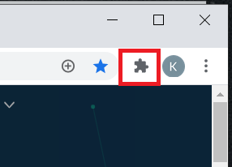

#### ​2.1.2.​ Click the pin icon (1) besides MetaMask to make the MetaMask icon visible on the browser extension toolbar (2).

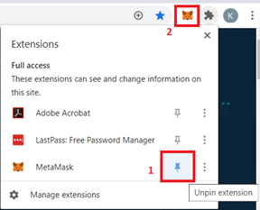

#### 2.1.3.​ Click the MetaMask icon. Make sure the dropdown is set to “Energi Mainnet”. Enter your password and click UNLOCK to login to MetaMask.

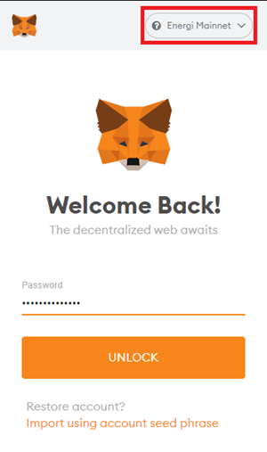

```mdx-code-block
</TabItem>
<TabItem value="brave" label="Brave Browser">
```
 

### ​2.2.​ Brave Browser

#### ​2.2.1.​ If you do not see the Crypto Wallet icon on the Brave browser extension toolbar, click the “extension” icon.

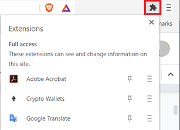

#### ​2.2.2.​ Click the “pin” icon (1) beside Crypto Wallets to make the Crypto Wallets icon visible on the browser (2).


#### ​2.2.3.​ Click the Crypto Wallets icon on the browser. Make sure the dropdown is set to “Energi Mainnet”. Enter your password and click UNLOCK to login to Crypto Wallets.


```mdx-code-block
</TabItem>
<TabItem value="mobile" label="Mobile Device">
```


### 2.3.​ Mobile Device

#### ​2.3.1.​ Open the MetaMask app on your mobile device and log in to the app.

```mdx-code-block
</TabItem>

</Tabs>
```

## ​3.​ Energiswap App

:::note
After adding the custom Energi Mainnet network, it’s possible that you might still see your fees being calculated in “ETH”, as well as the Ethereum Icon () instead of NRG (). The reason this happens is due to MetaMask automatically pulling data for Ethereum by default. You do not need to worry about spending any ETH you might have, as long as you make sure to be connected to the Energi Mainnet network as instructed by the previous steps. We have already reached out to MetaMask to include native support for NRG.
:::
 
### ​3.1.​ Access the Energiswap App & Connect to Wallet

#### ​3.1.1.​ In the browser (Chrome browser, Brave browser, or the MetaMask app browser), type the following URL and then press Enter:

[https://app.energiswap.exchange](https://app.energiswap.exchange)


#### ​3.1.2.​ Make sure your MetaMask is connected to the Energi Mainnet, then click the “Connect to a wallet” button.


#### ​3.1.3.​ Select MetaMask.


#### ​3.1.4.​ A screen like the example below will pop up. Select the account(s) you want to link to Energiswap and click “Next”.


#### ​3.1.5.​ Click “Connect” to allow Energiswap to access your wallet.


#### ​3.1.6.​ If the connection is successful, you will see your connected wallet as well as your current NRG balance.


### ​3.2.​ Swap Tokens

:::note
The token swap example in this guide is between NRG and ETH tokens.  You can use any tokens as long as you possess coins in those tokens.
:::

#### ​3.2.1.​ Click on the browser to access the Energiswap app (2.1.1). The NRG token will appear as the default “From” token. Do not change it for the initial swap. Click “Select a token”.


#### ​3.2.2.​ Select “ETH”.


#### ​3.2.3.​ Enter the amount of ETH you want to swap. The amount of NRG will be automatically calculated based on the market price. Click “Swap”.


Click “Confirm Swap” to continue.


#### ​3.2.4.​ Confirm the Gas Fee.


#### 3.2.5.​ After the transaction is confirmed on the blockchain, you will see a notice pop up. To view the transaction on the Energi Block Explorer, click “View on Block Explorer”.


#### ​3.2.6.​ Open your Wallet. You will see the amount of ETH you have exchanged for NRG, as well as the updated NRG balance after the amount swapped for ETH has been deducted in your wallet.


:::tip Congratulations!
You have successfully swapped NRG for ETH tokens!
:::

### ​3.3.​ Add Liquidity

:::note
The liquidity example in this guide is between NRG and ETH. You can use any pair of tokens as long as you possess coins in those tokens.
:::

#### ​3.3.1.​ To provide liquidity, select “Pool” and click “Add Liquidity”:


#### ​3.3.2.​ NRG will be the first token (1) and will appear by default. Click “Select a token” to select the second token. The two tokens will provide liquidity to the pair. You will need to have sufficient coins on both the tokens to provide liquidity.


#### ​3.3.3.​ Select ETH.


#### ​3.3.4.​ Enter the amount of NRG or ETH tokens you want to provide as liquidity, the amount of assets you provide must match the ratio of asset reserves already in the pool. When entering the amount of asset A, the amount of asset B will be automatically adjusted to match this ratio. Click “Approve ETH”.


 
:::note
Leave some NRG in your wallet to cover gas fees. You may need to create a new pair if the pair you want to add liquidity to does not exist yet. You can choose the amounts of assets you want to provide and this will determine the initial price of the pair.
:::

#### ​3.3.5.​ Confirm the transaction fee.


#### 3.3.6.​ After the transaction fee is accepted, click “Supply”.


#### ​3.3.7.​ Click “Confirm Supply” to create, or add to, the NRG-ETH liquidity pool.


​3.3.8.​ Click “Confirm” to accept the Gas Fee.


#### ​3.3.9.​ Click Close.


#### 3.3.10.​ Once the transaction is committed on the blockchain, a notice will appear to confirm that the liquidity has been accepted.  


#### 3.3.11.​ On the bottom of the “Add Liquidity” tab, you will see your liquidity position for the pair.


#### ​3.3.12.​ Click the ← icon.


#### ​3.3.13.​ Click on the V icon beside the ETH/NRG.


#### ​3.3.14.​ This will show the details of your liquidity.


:::tip Congratulations! 
You have successfully added liquidity for ETH/NRG token pairs!
:::


### 3.4.​ Remove Liquidity

You may now see all your liquidity positions in the main POOL screen. If your liquidity does not appear immediately, you can import it by clicking on the ‘import it’ button at the bottom of the main POOL screen and entering the tokens involved in the pair you added liquidity to.

By clicking on one of your liquidity positions, you should see the details of the position and the ‘Add’ and ‘Remove’ buttons. You should also see a link to the energiswap.info pair analytics page.


#### ​3.4.1. Adjust amount of liquidity to be removed

You can remove part or all of your liquidity by clicking the ‘Remove’ button to access the ‘Remove liquidity’ screen. On this screen, you can adjust the amount of liquidity you wish to remove (from 1 to 100% of the liquidity you provided).


#### ​3.4.2. Approve and remove liquidity

You will need to approve the transfer of your liquidity tokens for that pair. To do so, click on the ‘Approve’ button and validate the transaction with your wallet.

Once this is done and the transaction is confirmed, the ‘Remove’ button will appear lit. Click on this button.

 

You will be asked to confirm.


And finally, validate the transaction with your wallet.


Now that the transaction has been sent, you can click the Close button.


#### 3.4.3. View transaction on energiswap.info

You should now be able to see the details of your transaction listed on info.energiswap.exchange by clicking on "View pool information".


Scroll down to Transactions to confirm that your previous transaction has been recorded.


 
:::tip Congratulations!
You have successfully removed liquidity from the ETH/NRG token pairs!
:::
