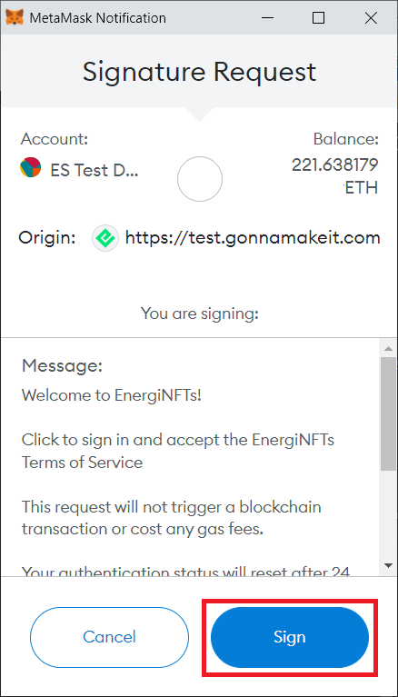
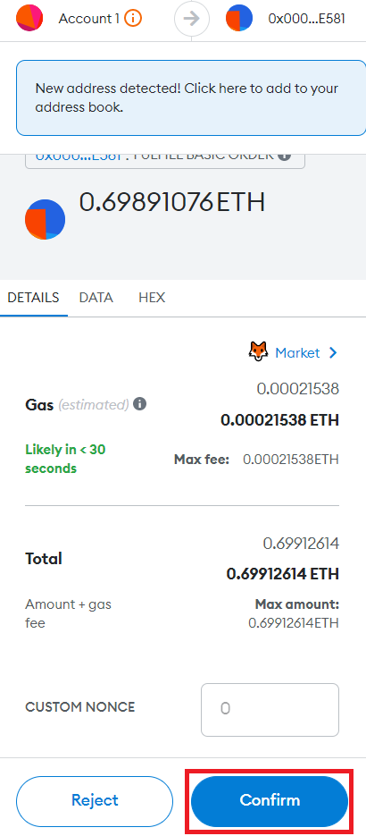

How to buy an NFT

In order to start using the marketplace, you will need to have an Ethereum address and use a supported wallet service. Currently, we only support MetaMask. You can find more information about installing and using MetaMask, as well as the required network parameters for the Energi network, in the following guide:

- [MetaMask Quick Start Guide](../guides/guide-metamask)

## 1. Connect to Wallet

**1.1.** Navigate to the main [GonnaMakeIt Marketplace](https://test.gonnamakeit.com) page and click “Connect to Metamask”. Enter your MetaMask password on the pop-up if you have not already logged into MetaMask.

**1.2.** The first time you connect your wallet address to GonnaMakeIt, you will be asked to sign the message. This is an off chain transaction. You will not have to pay gas.

**1.3.** First, you need to find the NFT you want to purchase. Go to the GonnaMakeIt dashboard and click on “Marketplace.”

**1.4.** There are two ways to buy NFTs on GonnaMakeIt:

- [Buy Now](#2-buy-now)
- [Make Offer](#3-make-offer)

## 2. Buy Now

**2.1.** Buy now allows you to buy an NFT at the listed price. Not all items are listed with the buy now option. 

**2.2.** Expand the sidebar by clicking on the arrow on the left.

**2.3.** On the sidebar, toggle the option to display items listed as “Buy Now”.

**2.4.** From the filtered list, click the NFT you want to “Buy Now”.

**2.5.** Click “Confirm Payment”.

**2.6.** “Confirm” to pay the gas and submit the transaction to the blockchain.

**2.7.** A message will appear on the bottom right of the screen to indicate the purchase has been written on the blockchain.

## 3. Make Offer

**3.1.** You can make an offer to buy an NFT that is listed on the GonnaMakeIt Marketplace. The owner has to accept your offer to initiate the transaction.

**3.2.** From the GonnaMakeIt Marketplace, click “Marketplace” from the navigation bar and scroll to the NFT you would like to buy. Click “Make Offer”.

**3.3.** A pop-up window will appear.

_**3.3.1.**_ Enter the amount you want to offer for the NFT.

_**3.3.2.**_ From the pull-down, select the expiration days for your offer.

_**3.3.3.**_ When you are satisfied, click “Make Offer”.

**3.4.** You will see an “Offer successful!” message pop-up on the bottom right of the web page once the offer is placed.

**3.5.** The owner of the NFT will be notified of the offer. If s/he accepts your offer, the transaction will be written to the blockchain and the NFT will be transferred to your account.

