This guide provides step-by-step instructions on how to remove Liquidity from the ETH-GMI pair at the SushiSwap DEX liquidity pools.

You will need a supported Web3 wallet in order to do so. The platform provides support for multiple wallet services such as MetaMask, Portis and Coinbase Wallet. For the purpose of this guide, we will be using MetaMask.

Should you need assistance in creating a new wallet using MetaMask, kindly refer to the following guide:

- [MetaMask Quick Start Guide](/docs/guides/guide-metamask)

Additionally, we have a quicker version of this guide, to acquire GMI and manage liquidity positions to the ETH-GMI pair at the SushiSwap platform. The guide can be found at:

- [GMI on SushiSwap Quick Start Guide](/docs/guides/guide-sushiswap)

Keep in mind that in order to perform any activity over the SushiSwap platform, you will need to have enough ETH in your wallet to cover the transaction fees.

**1.1.** Navigate to SushiSwap and click on the **“Connect to a wallet”** button at the top-right of the screen.

| Network                    | URL                               |
| -------------------------- | --------------------------------- |
| Ethereum Mainnet           | https://app.sushi.com/en/swap     |

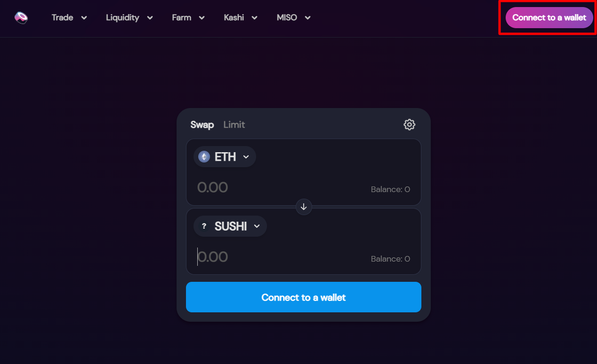

**1.2.** Select the **“MetaMask”** option and a MetaMask prompt will appear, allowing you to unlock the wallet address which you wish to use.

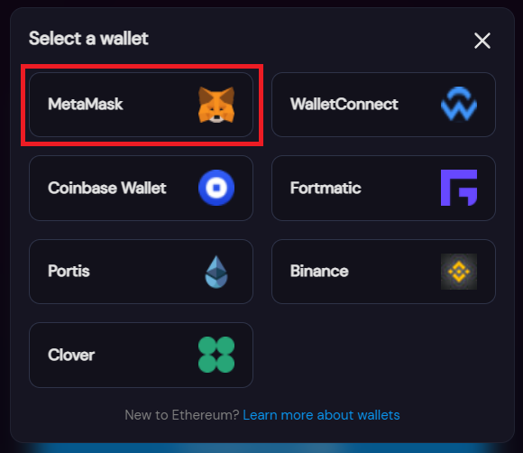

**1.3.** Hover over the **“Liquidity”** option in the bar at the top of the screen, then click on the **“Pool”** option after the menu expands.

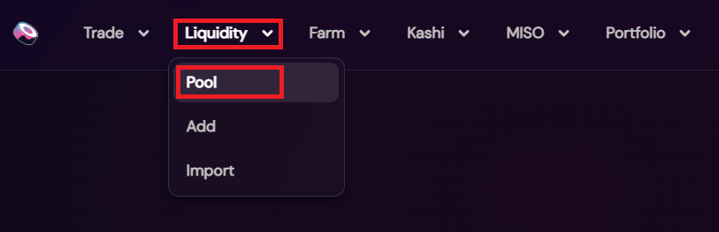

**1.4.** Click on the ETH-GMI pair from Position Overview to expand the position.

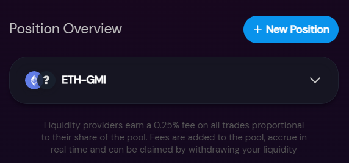

**1.5.** Select Remove

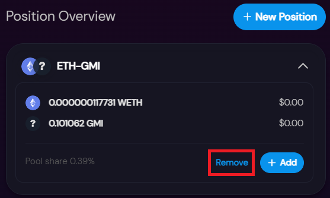

**1.6.** Enter the percentage of liquidity you want to remove from the pool and then click **"Approve"**.

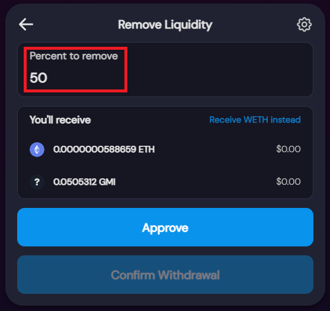

**1.7.** Sign the transaction

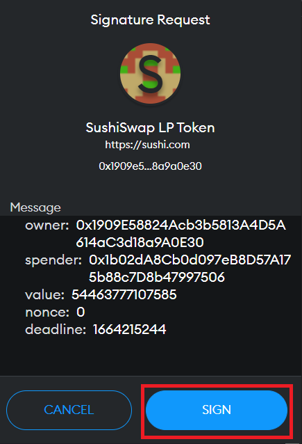

**1.8.** Click **"Confirm Withdrawal"**

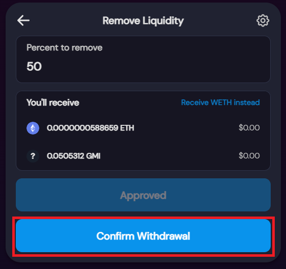

**1.9.** On the pop-up, click **“Confirm”**.

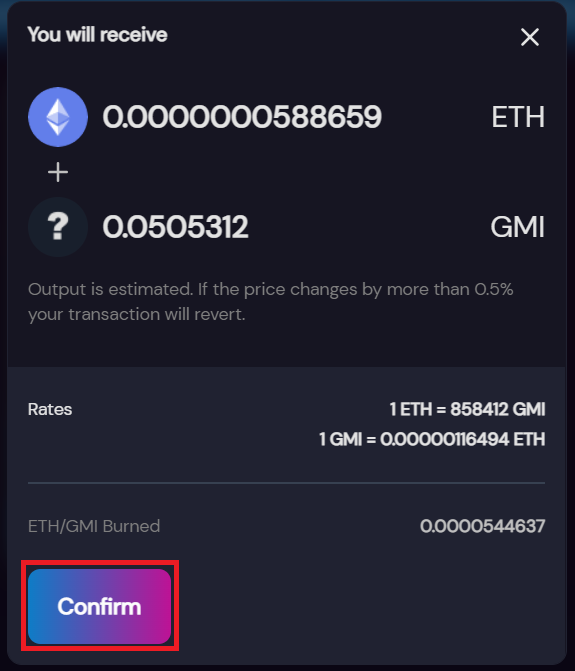

**1.10.** **"Confirm"** transaction fee on MetaMask pop-up.

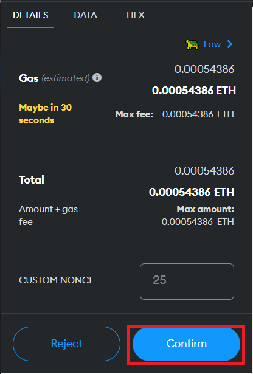

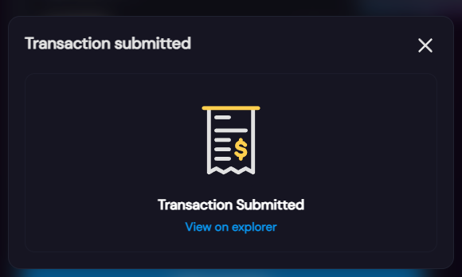

**1.11.** Once the transaction is confirmed, you will see a pop-up similar to the one below.

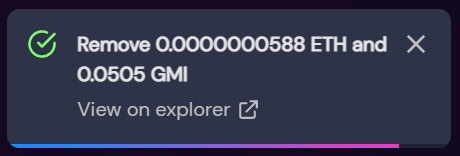

**1.12.** Verify Transaction

**1.12.1.** Open MetaMask and go to **Assets** to verify that the balance increased for both ETH and GMI tokens. 

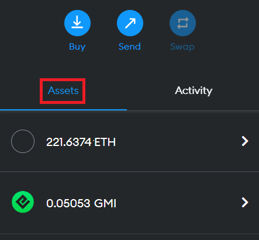

**1.12.2.** Click on the **Activity** tab to veiw the transaction.

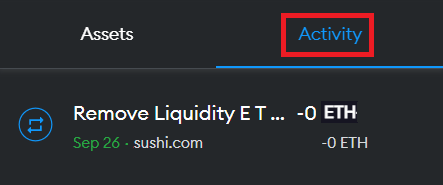
