The purpose of GMI Airdrop program to organically raise awareness for the highly anticipated release of the GonnaMakeIt Marketplace. Users can participate in the program early and reserve GMI tokens which they can claim after the Token Generation Event (TGE). A total of 1 billion GMI tokens will be distributed via the airdrop on the Ethereum blockchain. Go to [GMI Airdrop](/docs/about/gmi-airdrop) to learn about the different bonus programs, how they work and how you can earn a base amount of GMI as well as bonus GMI tokens.

## 1.0. Sign-in to MetaMask

**1.1.** Login to _Ethereum Mainnet_ on MetaMask.

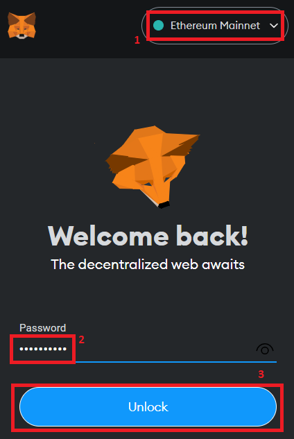

**1.2.** If you have multiple ERC20 accounts, you should check each of them. You never know what GMI tokens are waiting for you! Switch to the ERC20 account you would like to check. You can reserve a base GMI token for any of the following 7 criteria. For details, look at the [Base GMI Reservable](/docs/about/gmi-airdrop#1-base-gmi-reservable) of the GMI Airdrop document:

- OpenSea Volume
- NRG Diamond Hands
- ETH Stackers
- LooksRare Holding
- X2Y2 Holding
- Sushi Holding
- UNI Holding

**1.3.** To get started, go to the [GMI Airdrop](https://airdrop.gonnamakeit.com) website.

**1.4.** Click "Connect to Metamask".

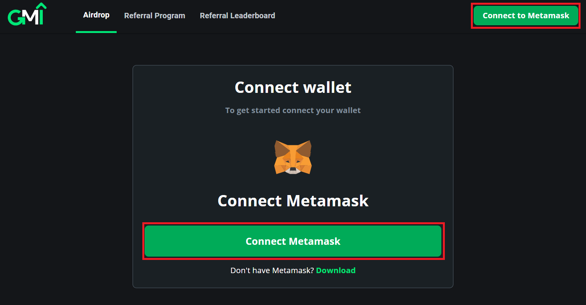

**1.5.** Select the account(s) you want to view and then click "Next".

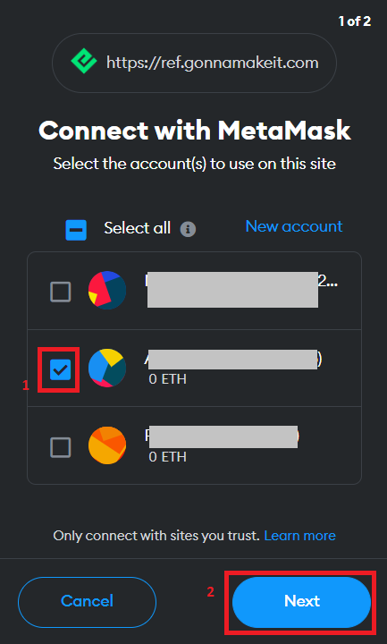

**1.6.** Click "Connect".

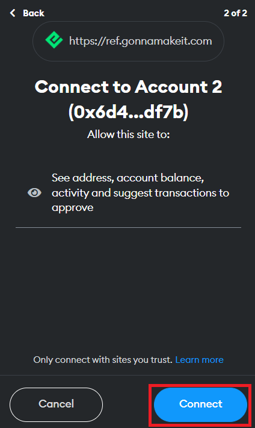

**1.7.** Click "Sign" to accept the GMI terms and sign the message.

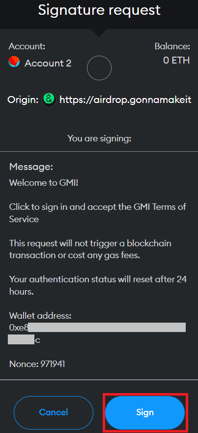

**1.8.** If the account you are viewing does not have any NRG tokens on either the Ethereum chain or the Energi chain, you will see the following message pop-up. You can buy NRG tokens by clicking on "Buy NRG". You can also continue, by clicking "Invite frens".

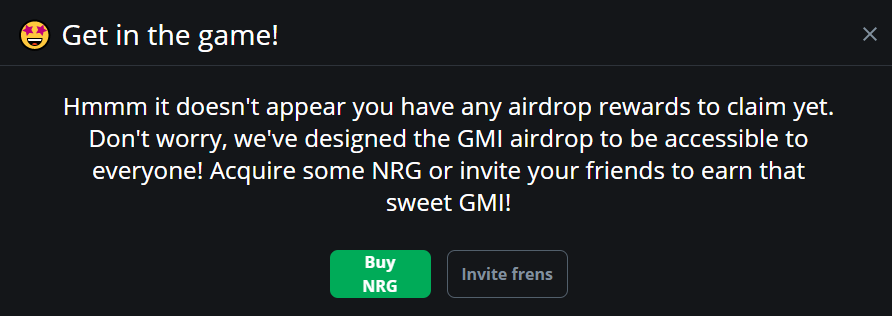

## 2.0. Complete Bonus Tasks

On the GMI Airdrop dashboard, click "Airdrop" to start working on the bonus tasks. On the left of the screen you will see the base rewards that are reservable for this account. You will also track how many tasks you have completed. The more tasks you complete, the more you earn. Try to complete all the tasks to maximize your rewards!

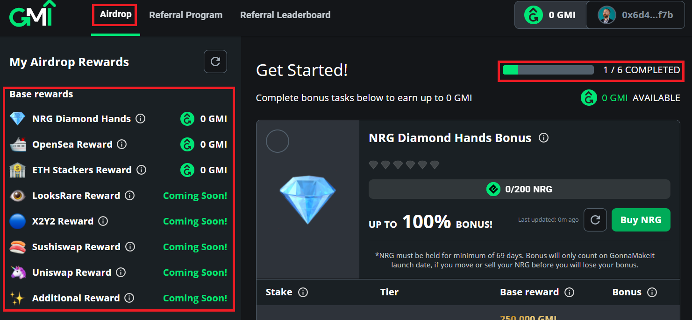

**2.1.** _Referral Bonus_: Paste your friend's address in the "Referral address" box and then click "Get Referral Bonus".

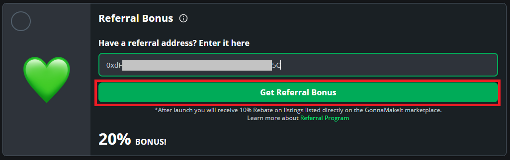

**2.2.** _Spread the Word Bonus_: Let's scrolling down to _Spread the Word Bonus_. Click "Invite friends".

There are three ways you can share your referral link with your friends:

1.  You can click the "Copy Link" rectangle and share the link with your friends.
2.  Click "Share you link". This will pop up some of the social media sites you can post your referral links to.
3.  Click "Post Tweet" to post your referral link on Twitter.

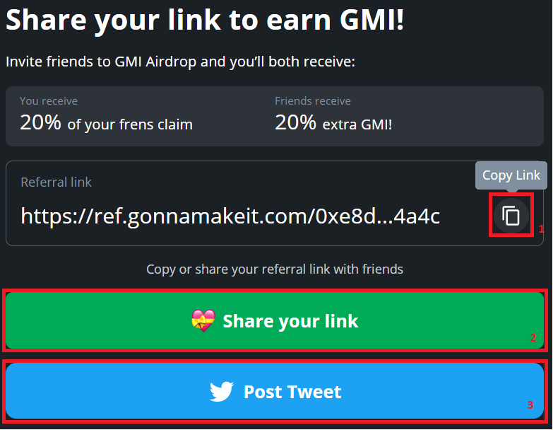

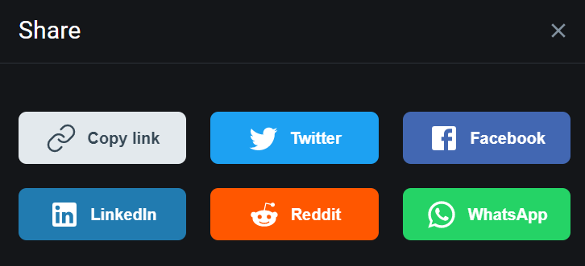

**2.3.** _NRG Diamond Hands Bonus_: You will receive a bonus for holding NRG tokens on the Ethereum blockchain and/or Energi blockchain. If you do not have NRG on the account or you want to add additional NRG, click on "Buy NRG".

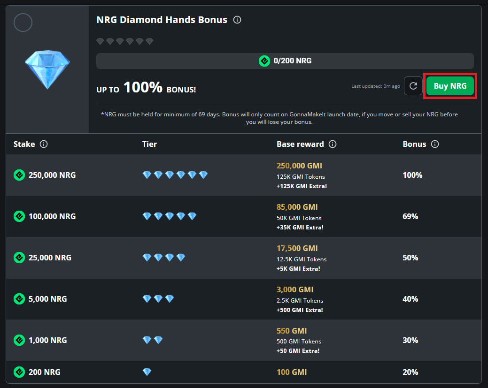

You can also directly go to one of the following exchanges to buy NRG:

- Ethereum Chain:

  - [Uniswap](https://app.uniswap.org/#/swap?inputCurrency=ETH&outputCurrency=0x1416946162b1c2c871a73b07e932d2fb6c932069)

- Energi Chain:

  - [Kucoin](https://trade.kucoin.com/trade/NRG-BTC)
  - [Energiswap](https://app.energiswap.exchange/)
  - [Indodax](https://indodax.com/market/NRGIDR)
  - [Changelly](https://changelly.com/exchange/btc/nrg)
  - [CoinEx](https://www.coinex.com/exchange?currency=btc&dest=nrg&tab=limit)
  - [HitBTC](https://hitbtc.com/nrg-to-btc)
  - [Mercatox](https://mercatox.com/exchange/NRG/BTC)

**2.4.** _Early Degen Bonus_: In this bonus you will provide your name and email address so we can keep you informed about GonnaMakeIt. Rest assured we will not sell your email address or spam you with unsolicited information. Once you have entered the data, click "Reserve now".

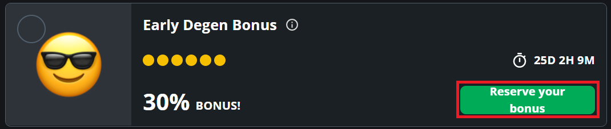

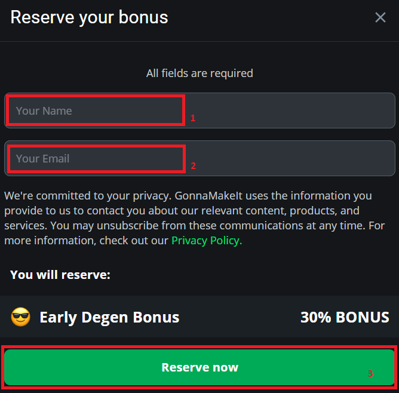

**2.5.** _Aped In Bonus_: Follow us in at least 2 of the social media sites to reserve your _Aped in Bonus_. Clicking on the down arrow will expand the block so you can enter your account information. Once you have entered the information, click "Reserve now".

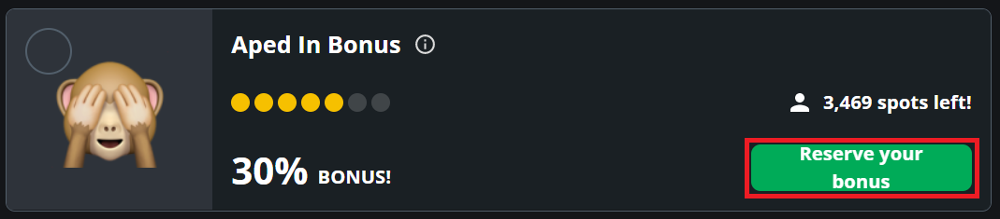

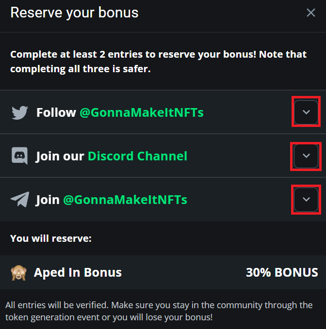

**2.6.** _Tweet Bonus_: We are working on this option. Come back and visit us soon to complete this task.
