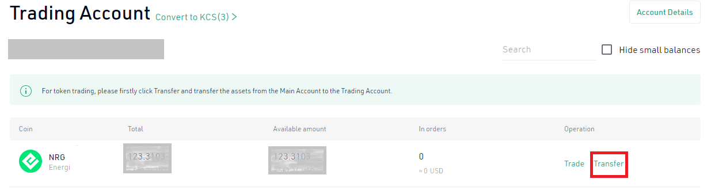

## 1.​ Sign up on KuCoin

If you do not have a KuCoin account go to [*https://kucoin.com*](https://kucoin.com) and click “Sign up”.

**1.1.** Select how you want to sign up to KuCoin. In our example, we are using email to sign up.

**1.2.** Enter your email address and click “Send Code”. It will pop up a captcha verification. Once you go through the verification process, a one time token will be sent to your email address.

**1.3.** Check your email and enter the code sent.

**1.4.** Enter a password that meets KuCoin’s password policy.

**1.5.** Read the agreement and check the radio button.

**1.6.** Once you are satisfied with all the information entered, click “Sign Up”.

## ​2.​ Login to KuCoin
=

Go to [*https://kucoin.com*](https://kucoin.com) and click “Login” on the top right of the web page

**2.1.** Enter your email address and

**2.2.** Password

**2.3.** Click ”Log In”.

Click on the captcha that pops up. If you have 2-Factor authentication set up, enter the one time code to complete the login.

## 3.​ Transfer BTC or ETH into KuCoin

KuCoin lists NRG/BTC and NRG/ETH pairs on their exchange. You will need BTC or ETH to purchase NRG at KuCoin. If you have BTC or ETH on an account, you will need to transfer it to KuCoin. In our example, we will transfer BTC to KuCoin.

**3.1.** Hover over the “Assets” \[1\] and then click on “Main Account (Deposit & Withdrawal)” \[2\].

**3.2.** Scroll down to BTC and click “Deposit”

**3.3.** Check you are on the “Cryptocurrency” \[1\] tab and have selected “BTC” \[2\]. Click on  \[3\] to copy the BTC address. You will need this address to send from your wallet.

**3.4.** Now go over to your wallet where you have BTC. Send the coins to KuCoin BTC address.

**3.5.** Once the BTC transfer is complete, you will see a pop up notification on KuCoin.

**3.6.** Hover over “Assets” \[1\] on the top right of the page and then click on “Trading Account” \[2\].

**3.7.** Scroll down to BTC and then click “Transfer”.

**3.8.** Transfer from Main Account to Trading Account

**3.8.1.** Select Direction to “Main Account” (1) to “Trading Account” (2).

**3.8.2.** From the dropdown select “BTC” (3) as the coin to transfer.

**3.8.3.** If you want to transfer the entire amount click on the number besides “Available Amount” (4). It will populate the amount of coins to transfer. So specify a specific amount, you can enter the amount of coins you want to transfer in the box.

**3.8.4.** Click “Confirm” (5).

**3.9.** Go to [*Trade BTC for NRG*](#trade-btc-for-nrg) section below for details on how to buy NRG.

## ​4.​ Buy BTC or ETH {#buy-btc-or-eth}

You will need to first purchase BTC or ETH to trade them for NRG. In our example, we are going to buy BTC.
Select “Buy Crypto” from the top left of your web page and then choose from one of the options from the drop-down. “Fast Buy” will allow you to buy the tokens using your Visa or Mastercard.

**4.1.1.** Select the coin you want to buy (example: BTC).

**4.1.2.** Enter the amount and the currency you want to buy with.

**4.1.3.** Click “Buy BTC”.

**4.2.1.** Verify the amount you want to spend.

**4.2.2.** Select your “Payment Method”

**4.2.3.** Check the box

**4.2.4.** Click “Buy BTC”

## ​5.​ Trade BTC for NRG {#trade-btc-for-nrg}

**5.1.1.** Click “Trade”.

**5.1.2.** From the drop down menu, click on “Spot Trading”.

From the top left, select the drop-down icon to select the token pair.

Click on the search box.

Type NRG and select NRG/BTC as the pair to trade.

Enter your 6-digit PIN to unlock trading. The box will appear on the bottom right of the page.

**5.2.1.** Select the type of spot trade you want to execute.

**5.2.2.** Enter the amount of BTC you want to trade.

**5.2.3.** Click “Buy NRG”
.

Once the order is filled, you will see the amount of NRG on your Trading Account.

## ​6.​ Transfer NRG to MetaMask

In order to transfer NRG from your KuCoin Trading Account, you will need to first transfer the coins to your Main Account.

**6.1.1.** From the top right-hand corner, select “Assets”.

**6.1.2.** From the drop down select “Trading Account”

Select “Transfer” to move your coins from the “Trading Account” to the “Main Account”.

Select “Withdraw”

On the Withdraw page:

**6.2.1.** Select NRG as the coin to withdraw.

**6.2.2.** Copy the address of your NRG account from MetaMask and paste it in the box.

**6.2.3.** Select NRG as the network.

**6.2.4.** Enter the amount of NRG you want to withdraw. You can also select the “Max” amount if you wish to withdraw all the NRG on your account.

**6.2.5.** Click “Confirm” to send the coins. It will take a few minutes for the token to appear on your MetaMask wallet account.

