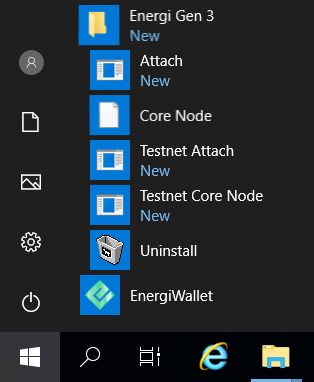
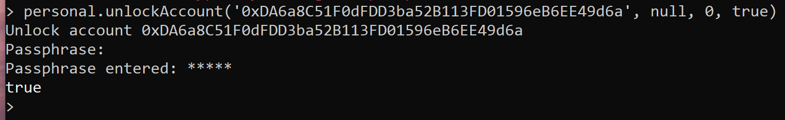
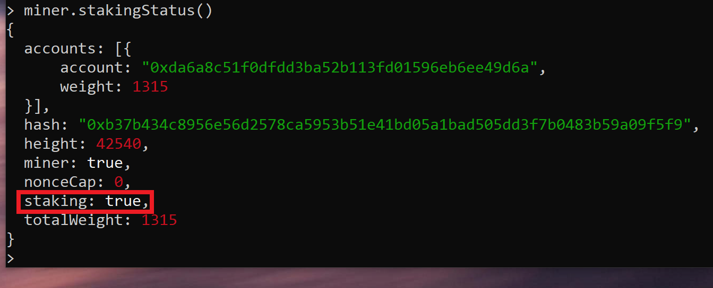
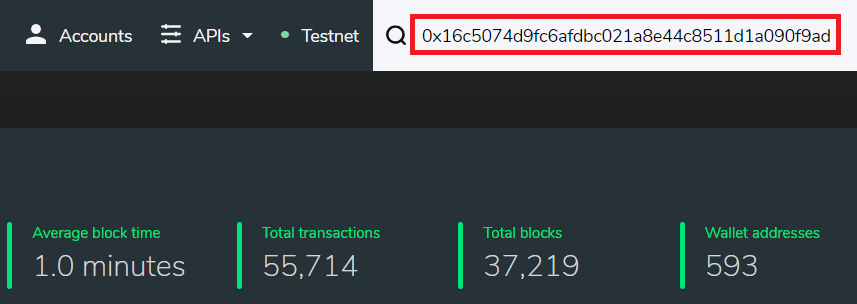
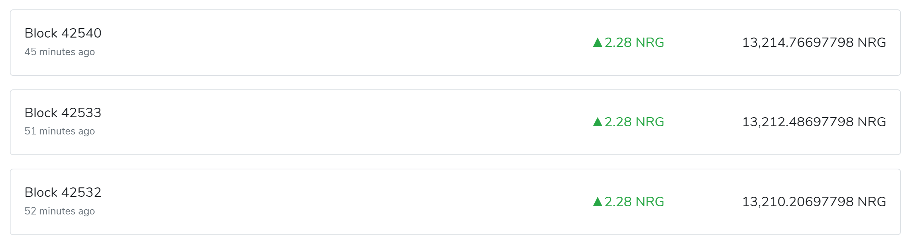

## Tutorial video

- [Staking Tutorial Video *Explained step-by-step*](https://www.youtube.com/watch?v=UGo4yiyM4Do&)

## 1 - Requirements

**-** You need to have <kbd>Energi Core Node</kbd> installed & running 24/7 for Staking 👇

- [Core Node on Desktop *for Windows*](./13-core-node-windows.mdx)
- [Core Node on Desktop *for MacOS*](./core-node-mac.mdx)
- [Core Node on VPS *for Ubuntu 20.04 x64*](https://wiki.energi.world/3-1/advanced/scripted-linux-installation)

:::info
> In order to start staking you need **a minimum of 1 NRG.**
:::

## 2 - Start Staking

**2.1 -** Attach to Energi Core Node:

- **2.1.1 -** Windows:

Go to Start Menu and select Attach:



- **2.1.2 -** MacOS:

You do not need to do anything on the MacOS. You are already on the Energi Core Node console.

- **2.1.3 -** Linux / VPS:

PuTTY into the VPS and run the following on the Terminal:

```
energi3 attach
```

**2.2 -** Run the following command in your console to unlock your account and start staking:

```
personal.unlockAccount('Gen3Address', null, 0, true)
```

### Example Parameters

```
Gen3Address Your wallet address
null Password parameter, always use null
0 Timeout paramater, always use 0
true True means unlocked for staking only
```

**2.3 -** You will be prompted to enter your passphrase. It's normal if nothing appears when you type, the passphrase is hidden.
It will return `true` if the wallet was successfully unlocked for staking.



## 3 - Check your Staking Status

**3.1 -** Run the following command to check your staking status.

It will return `true` if the wallet is currently staking.

```
miner.stakingStatus()
```



:::tip **Congratulations!**
> **You are now staking your NRG!**
:::

## 4 - Check your Rewards

**4.1 -** Head over to our Blockchain Explorer and enter your account address.

- [Energi Explorer *View Blockchain data*](https://explorer.energi.network/)



**4.2 -** Select the <kbd>Coin Balance History</kbd> tab to see your rewards!



:::tip **Congratulations!**
> **You are now all set!**
:::

# Need Help?

**-** Head over our Staking FAQ :
- [FAQ *Staking*](#)

:::info
**-** Get technical assistance :
- [Help me! *Get technical assistance by the Energi team*](#)
:::
