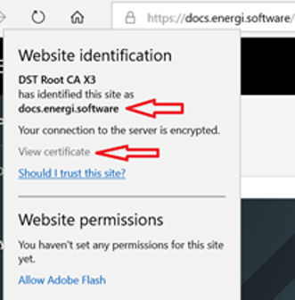

## Simple Rules to Follow

Here are the simple rules you should have in mind before starting the migration process in order to stay on the safe side against scammers:

**1.** Do not let anyone do the migration process on your behalf, only YOU should go through it. The migration process has been made very simple for anyone to understand it

**2.** Always use installer/external links provided from our official guide

**3.** Don’t share your private data (private keys, login,...) with anyone

**4.** Use only suggested support methods as listed in the official migration guide in case you need help. Don’t try to shortcut the queue by seeking unconventional support methods

**5.** Use a dedicated VPS or dedicated computer for the migration if possible. Otherwise, isolate your applications as much as possible

**6.** Ensure to have the latest patch installed on your computer/VPS to mitigate vulnerabilities

**7.** Never disable firewalls or other security measures during the migration

**8.** Always backup your sensitive data in a safe location, ideally offline

## Ensure Official Migraton Guides

Below are comprehensive steps to make sure you are using the official migration guide and ensure you always keep your computer secure in general.

Also, do not miss out on our new video made by the Energi Bureau of Investigations (EBI) relating the essential tips to protect yourself and keep your coin safe!

[https://www.youtube.com/watch?v=1HR-8v6ciII](https://www.youtube.com/watch?v=1HR-8v6ciII)

<u>How to ensure I am using the official Energi migration guide?</u>

Always ensure you are using the correct migration guide. You can do this by verifying the website address and SSL certificate:

**1.** Ensure that the website address corresponds to **wiki.energi.world**

**2.** Click on the padlock icon to view the Security details and ensure that the certificate name is **wiki.energi.world**

:::danger
> If either the website address or the certificate name is not correct, then please contact [Energi Support](mailto:support@energi.team?subject=[Wiki]%20Energi%20Seurity%20Support)! See how to contact Energi Support below in the FAQ.
:::

<u>Here are examples from 3 popular browsers</u>

:::info
> **Note:** This could look a bit different depending on your web browser.
:::

### Review the website address

*Inspect the website name and confirm that there is a security lock.*

|                        |                                                               |
| :--------------------- | :------------------------------------------------------------ |
| **Example 1: Chrome**  |    |
| **Example 2: Edge**    |        |
| **Example 3: Firefox** |  |

### Review the website certificate name

*Click on the security lock to view the Security details, including the certificate name.*

|                        |                                                     |
| ---------------------- | --------------------------------------------------- |
| **Example 1: Chrome**  |    |
| **Example 2: Edge**    |      |
| **Example 3: Firefox** |     |

## Where do I go for official Energi support?

Only use Energi official private support channels.

Go to the [Help me!](https://docs.energi.software/en/support/help-me) page on the Wiki site.

:::danger
> If anyone reaches out to you offering help, consider them a scammers. Even if they seem familiar, they could be impersonating a trust contact. **DO NOT ACCEPT their help!**
:::

Learn more about security on Discord:

[https://nrg.click/security_guide](https://nrg.click/security_guide)

## How do I ensure my computer is secure?

Securing your computer is an important step to protect your NRG coins. If malware is on your system, hackers could steal your NRG coins.

We know it takes extra effort, especially if you are not a computer tech pro. Consider this: in the offline world, the more money you have, the more security you apply, correct? The same is true online, as the amount and value of your NRG grows its worth increasing your level of protection.

**Here is a basic list of things to do:**

**1.** Upgrade to a Vendor supported version of your Operating system (Windows and MacOS)

**2.** Turn on the security automatic scanning built into your Operating System (Windows or MacOS; on Windows use built-in Defender)

**3.** Turn on other security features that are built into your Operating System (Windows or MacOS; on Windows use Security Center)

**4.** Use strong passwords and a password manager such as *lastpass*, *1password*, or *dashlane*, to mention a few of them

**5.** Use 2-factor authentication where possible (There are various Authenticators apps from Google, Microsoft, LastPass and Duo Mobile.)

**6.** Avoid jail-breaking your mobile device or side-loading apps

**7.** Avoid leaving your laptop and mobile unattended when outside your home

**8.** Always lock your screen before stepping away

:::info
> **Note:** If you are not sure how to do these steps, please refer to official documentation from the Vendor website.
:::

:::info
> **Additionally,** if you are computer technically savvy, you can also take an extra step by isolating the Energi Core in a virtual sandbox. Some examples of sandbox programs are [Sandboxie](https://www.sandboxie.com/), [VirtualBox](https://www.virtualbox.org/) and Windows 10 Pro Sandbox.
:::
