import Tabs from '@theme/Tabs';
import TabItem from '@theme/TabItem';

## Getting Started

The purpose of this guide is to get a developer started with programming in the Energi blockchain. After going through the guide, the developer will have basic knowledge regarding:

* How to write a simple smart contract
* How to build, deploy, and interact with smart contracts in the Energi Blockchain


### Skill requirements

* Basic understanding of JavaScript and Linux systems
* Knowledge of how blockchain works and experience of coding smart contracts for other blockchains are useful but not required

### Tools

* [npm](https://www.npmjs.com/package/install) - Package manager for nodejs
* [Node js](https://nodejs.org/) ( stable version )- Execution environment for JavaScript.
* [Truffle](https://www.trufflesuite.com/truffle) - IDE that is useful for compiling smart contracts.
* [Visual Studio Code](https://code.visualstudio.com/) - Text Editor code - with the [solidity extension](https://marketplace.visualstudio.com/items?itemName=juanblanco.solidity).
* [Web3](https://docs.google.com/document/d/12SvvrU0BxqrXBGTSTFE6PjuiITq79OuOEi0zAOR1P5I/edit#heading=h.dv3zeb6n61cv) - A collection of libraries that allow you to interact with a local or remote ethereum node using HTTP, IPC or WebSocket.
* [Energi Explorer](https://explorer.test.energi.network/) - For confirmation of the transactions.
* [MyEnergiWallet](https://wallet.test.energi.network/#/account) - To deploy the smart contract on the Energi blockchain.
* [React.js](https://reactjs.org/) - A JavaScript library for building user interfaces.
* [Metamask Browser Extension](https://docs.google.com/document/d/1SHJClzgSmZWgQnGAo7XaCxsj7JBzkEbhExkXstbGG5k/edit#heading=h.2gw6ycmzuewu) - Extension based in Web3 that will allow you to connect to the Energi blockchain from our graphic interface and to make transactions to add new parameters to our contract

```mdx-code-block
<Tabs groupId="author-front-matter">
<TabItem value="single" label="Linux">
```

## Creating the Smart Contract

Smart contracts are computer programs that are stored inside a blockchain. They enforce the negotiation or performance of a contract without relying on a third party. The purpose of smart contracts is to provide superior security and to reduce other transaction costs associated with traditional contracts. We will need to write the contract source code in solidity, compile it, then deploy it to the blockchain. After deployment, clients can send messages and exchange data with the contract.


### What contract will we create?

In this guide, we will create a smart contract called election. Any developer / person can set arbitrary values to the contract. However, it stores the last value only. Setting a new value overwrites the current one. Any developer can query for the current value of the contract. We will also make a simple web interface so we can interact with the contract.


### Installing Dependencies

Before continuing with the contract, we will need to configure the necessary tools to program, compile and deploy the contract, as well as to create the user interface for our Decentralized Application (dApp).

This project has been compiled in an image to be executed in Docker. ([Here is the repository](https://hub.docker.com/r/broje/dapp)). Go to the GitHub repository of this project for more information about how to execute it.


#### Start the project

At this point we will create our project with [truffle](https://www.trufflesuite.com/truffle). For this, we will need to install [npm](https://www.npmjs.com/package/install) which will allow us to handle these packages. Execute the following command to download the package manager from the terminal console.


```
sudo apt install npm -y
```

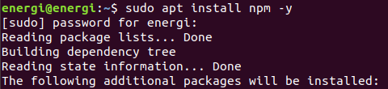


npm will install an old version of Node. Update Nodejs by running the following command:

```
sudo npm install -g n
```

And then: 

```
sudo n stable
```

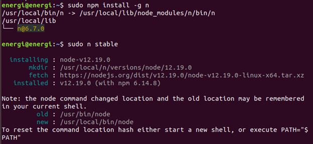


If this does not generate any error, it means that the packages have been updated correctly. Now we will be ready to install our [Truffle](https://www.trufflesuite.com/truffle) framework to compile our contract. Execute the following command[^1]:


```
sudo npm install truffle -g
```

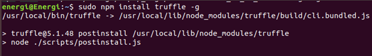


Execute the following command to verify that the installation has taken place successfully.


```
truffle version
```

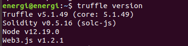


Let's head to Desktop and create an empty folder. In our case we will use the name of energi-dapp


```
cd Desktop
mkdir energi-dapp
```


Inside the energi-dapp directory, from the Linux console, execute the following command:


```
truffle init
```


This will create the directory’s / file: 

**Contracts/**: Directory where contracts are stored in Solidity. By default, there is a contract called Migrations.sol that is in charge of registering the migrations that have been carried out.

**Migrations/**: Directory in which the scripts that will deploy the contracts to the Energi network are saved (in the case of connecting an IDE to the Energi network).

**Test/**: Directory where the contract’s tests are stored.

Truffle-config.js: Truffle configuration file.


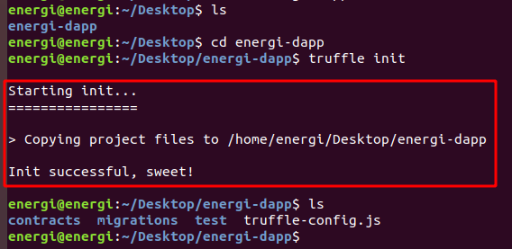


#### Text Editor

Once done, we can start our project with the VScode text editor. You need an editor with an extension for the Solidity language. We suggest:


* [Visual Studio Code](https://code.visualstudio.com/) — with the [solidity extension](https://marketplace.visualstudio.com/items?itemName=JuanBlanco.solidity)(this is what we use currently)
* [Atom](https://atom.io/) — with [language-ethereum](https://atom.io/packages/language-ethereum) extension

Of course, you can simply choose your favorite code editor — the most p opular have available packages for Solidity, for example:

* [Sublime text](https://www.sublimetext.com/) — with [Ethereum](https://packagecontrol.io/packages/Ethereum) extension.

From the energi-dapp directory on the Linux terminal, execute the following command:


```
code .
```


This will start Visual studio code with our project. You can also simply start VScode then drop the energi-dapp folder into the VScode interface. Next, you will see:


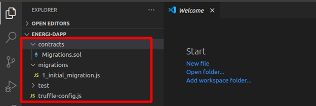


Create a .sol file with the name of our smart contract inside the contracts folder that was created at the initiation of the project. In the next section, we will program the simple contract named election.


### Starting the Smart Contract

* **Compilation version:** On the 1st line of our election.sol file we will need to establish the version of compilation for the contract. Each version may vary according to the needs of the developer.


```
pragma solidity >=0.4.2;
```


Hit the Enter key twice to position on the 3rd line. We will build some functions into the contract. This will be some very basic solidity smart contract code. This tutorial won't be focused on discussing solidity or smart contracts. To learn more, visit the [solidity](https://solidity.readthedocs.io/en/v0.7.1/) documentation.


* **current value of the contract:** will show the current value contained in the contract, is a variable of type string that will be public and will show a text, in this case the Candidate name we will set in the contract by signing a transaction

```
pragma solidity >=0.4.2;

contract election {
    string public candidateName;
```


* **modify values in the contract:** To modify the name of the candidate stored in the contract, a function will be used. It receives a string-type variable as an input parameter. The set functions require a signature to successfully modify some parameters in the contract.

```
pragma solidity >=0.4.2;

contract election {
    string public candidateName;

    function setCandidate (string memory _name) public {
        candidateName = _name;
    }
}
```

### Compiling and Deploying on the Energi network

Now we are ready to compile our contract and deploy it on the Energi Blockchain. We will use the web [MyEnergiWallet](https://wallet.test.energi.network/account) (MEW) as a graphic interface to deploy the contract. We can also interact with the contract for testing purposes. Another way to deploy the contract onto the Energi network is through Truffle. You can read more about it at ([How to deploy Smart Contracts on the Energi Blockchain](https://dev.to/ogwurujohnson/how-to-deploy-smart-contracts-on-the-energi-blockchain-1188)).


Make sure you have some tNRG in your account to sign the transaction.

Complete this [form](https://forms.gle/41dRFAFwL4fcgSu46) to get some tNRG.


#### Compile

Once our contract code has been created and debugged, we will have to compile our code. In the energi-dapp directory, from the command line, execute the following command:


```
truffle compile
```


This will compile our contract creating the:

**ABI:** ABI stands for Application Binary Interface. A smart contract is stored as bytecode (= binary data) in the blockchain under a specific address also known as contract address. The ABI is needed to access the bytecode and interact with the contract either from MyEnergiWallet or from our dApp’s graphic interface.

**Byte code:** The code of the contract that the blockchain understands which allows us to deploy the smart contract on the Energi Blockchain.

The next message will indicate that the contract has been compiled successfully. 


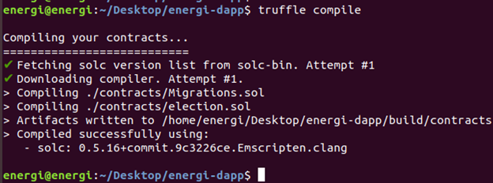


From the VScode interface, we will see that the build and contracts directories are created. Inside these directories you will see a .json file with the name of the contract. In our case it will be election.json.


In this .json file we will find the ABI and the byte code.


```
 //"abi": 

[
   {
     "constant": true,
     "inputs": [],
     "name": "candidateName",
     "outputs": [
       {
         "internalType": "string",
         "name": "",
         "type": "string"
       }
     ],
     "payable": false,
     "stateMutability": "view",
     "type": "function"
   },
   {
     "constant": false,
     "inputs": [
       {
         "internalType": "string",
         "name": "_name",
         "type": "string"
       }
     ],
     "name": "setCandidate",
     "outputs": [],
     "payable": false,
     "stateMutability": "nonpayable",
     "type": "function"
   }
 ],


//the .json file will be more bigger, this only will help us to differentiate the useful parameters of this file.

 //bytecode: 


"0x608060405234801561001057600080fd5b5061030b806100206000396000f3fe608060405234801561001057600080fd5b50600436106100365760003560e01c80635ee0541d1461003b578063822d3cf0146100be575b600080fd5b610043610179565b6040518080602001828103825283818151815260200191508051906020019080838360005b83811015610083578082015181840152602081019050610068565b50505050905090810190601f1680156100b05780820380516001836020036101000a031916815260200191505b509250505060405180910390f35b610177600480360360208110156100d457600080fd5b81019080803590602001906401000000008111156100f157600080fd5b82018360208201111561010357600080fd5b8035906020019184600183028401116401000000008311171561012557600080fd5b91908080601f016020809104026020016040519081016040528093929190818152602001838380828437600081840152601f19601f820116905080830192505050505050509192919290505050610217565b005b60008054600181600116156101000203166002900480601f01602080910402602001604051908101604052809291908181526020018280546001816001161561010002031660029004801561020f5780601f106101e45761010080835404028352916020019161020f565b820191906000526020600020905b8154815290600101906020018083116101f257829003601f168201915b505050505081565b806000908051906020019061022d929190610231565b5050565b828054600181600116156101000203166002900490600052602060002090601f016020900481019282601f1061027257805160ff19168380011785556102a0565b828001600101855582156102a0579182015b8281111561029f578251825591602001919060010190610284565b5b5090506102ad91906102b1565b5090565b6102d391905b808211156102cf5760008160009055506001016102b7565b5090565b9056fea265627a7a7231582041833e4fb33ebd12f0bd3e0e09781f04e3b26ac7216c44e3c778f1fee43ab52d64736f6c63430005100032",
```

#### Deploy

In the Tools section of MyEnergiWallet (web version), or the contracts section in the Desktop version, we will see options for Interact / Deploy the contract. To make the deployment on the main Blockchain, only use MyEnergiWallet under the [main network](https://wallet.energi.network/account).


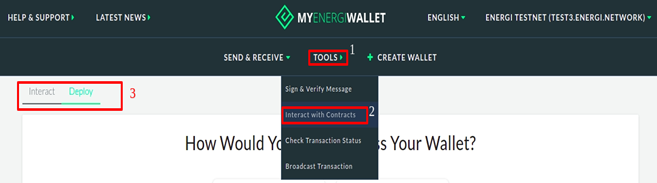


We will use the Deploy section to upload our contract to the Energi Blockchain. First we will have to log in to our Energi account. We will use same access method available in the MyEnergiWallet under the Deploy section


Once we access the account, an interface will be displayed where we will have to add the string of the Byte code and sign / confirm the transaction to Deploy the contract on the Energi Blockchain


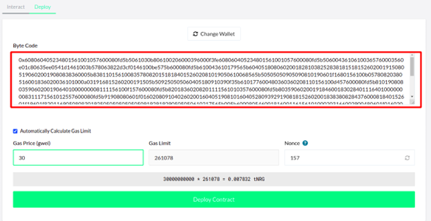


MyEnergiWallet shows us a transaction Hash once the transaction has at least 1 confirmation on the network. Check it on the [Explorer](https://explorer.test.energi.network/). You will see the [address of the contract](https://explorer.test.energi.network/tx/0x7de59b7d1ffc0b5ca00b22ae470777482232c07995d37d3539fa66c7f4fd76ba/internal_transactions) if it was deployed successfully. You will need this address to interact with the contract in the Blockchain


Contract address:

```
0x543b0502D0aaf4Fc305dfd0754C551a80763E576
```

## Client-Side Application

Now we will create a graphical user interface which will allow us to interact with our smart contract (which has already been deployed on the Energi network). For this we will use the [React.js](https://reactjs.org/) library.

We will create a new project with React called interface, in which we will compile our graphical user interface. From the Desktop directory in the Linux terminal execute this command[^2]:


```
npx create-react-app interface
```


This will create our project called interface with the necessary modules for our Web App.

We will start our interface project from VScode. You can do it graphically by dropping the interface folder into the VScode program or from the terminal by going to the project directory and running the `code .` command.

React.js includes some files as examples for developers that we will not need for our dApp and will have to remove them. In the following image you can see the files we will delete.


Be sure to delete only these files. Deleting any other files or folders may cause problems when compiling our user interface.

**Adding the Energi Web3js Extension:** The [Energi Web3 Extension](https://docs.google.com/document/d/12SvvrU0BxqrXBGTSTFE6PjuiITq79OuOEi0zAOR1P5I/edit#heading=h.ygoc74erk17b) is a library with modules that allow us to interact with the Energi Blockchain from the Ubuntu terminal. Inside the interface project directory, execute the following command[^3].


```
npm i web3 @energi/web3-ext
```

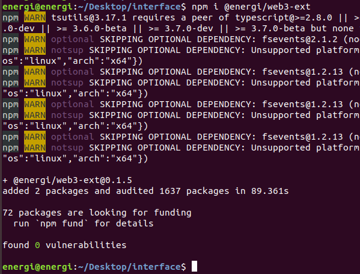


This will add the @energi/web3-ext module to our project:


### Compiling Code

Now we will start writing some of the code with which we will create our user interface and connect it to the Energi Blockchain.


#### index.html

In VScode, edit the index.html file on the public directory. This will be a basic HTML skeleton. We will only add a title to our browser tab, a Bootstrap CDN, replace the content in this file with the following:

```
<!DOCTYPE html>
<html lang="en">
  <head>
    <!-- compatibility of some characters with other browsers -->
    <meta chartset="UTF-8"/>

    <!-- title for our browser tab -->
    <title>Energi - dApp</title>

    <!-- this CDN will reduce our code and add some styles to our interface -->
    <link rel="stylesheet" href="https://stackpath.bootstrapcdn.com/bootstrap/4.5.2/css/bootstrap.min.css" integrity="sha384-JcKb8q3iqJ61gNV9KGb8thSsNjpSL0n8PARn9HuZOnIxN0hoP+VmmDGMN5t9UJ0Z" crossorigin="anonymous">

    <!-- 
    you can be creative and add an image to the browser tab according to your requirement, favicon is the default name that our browser will recognize for our image either a png or ico file.

    make sure the image you want to add to your project is in folder public of you proyect ( optional ) 
    -->

    <link rel="icon" href="favicon.ico">

  <header>
     
  </head>
  <body>
    <noscript>You need to enable JavaScript to run this app.</noscript>
  </header>
  
    <div id="root"></div>

  </body>
</html>
```


#### App.js

In this file we will compile our [JSX](https://reactjs.org/docs/introducing-jsx.html#why-jsx) code for our user interface, as well as compiling the components and functions for our final dApp.

We will need to import the modules and files we will work with:

```
import React, { Component } from 'react';
import './App.css';
import web3 from 'web3';
import { election_ABI, election_address } from './config';
```

We will create a class that will allow us to load the Energi Blockchain to access the information. Next, we will set the default state in the component with the constructor function:

```
class App extends Component {

  componentDidMount() {
  this.loadBlockchainData()
}


constructor(props) {
  super(props)
  this.state = {
    setCandidate: "",  
    candidateName: "",
    account:{} ,
    Contract:{}
  }

  this.handleChange = this.handleChange.bind(this);
  this.handleSetCandidate = this.handleSetCandidate.bind(this);
  this.handleLoadContract = this.handleLoadContract.bind(this);
}
```

We will create a function in which we will instantiate our Web3 extension that will allow us to interact with the network:


```
async loadBlockchainData() {
  const Web3 = require('web3')
  const web3Extension = require('@energi/web3-ext');
  const web3 = new Web3(Web3.givenProvider || "https://nodeapi.test.energi.network")

  web3Extension.extend(web3);
```


Then, we will instantiate our contract on the app. We will also make our interface allow us to connect a Metamask account which will allow us to sign transactions and add values  in the contract:


```
// instantiate the contract and the Metamask app

  const election = await new web3.eth.Contract(election_ABI, election_address)

  this.setState({Contract: election})

  const accounts = await web3.eth.getAccounts()

  this.setState({account: accounts[0]})
```


Next, we will instantiate the methods that our contract will use to interact with the Blockchain. In this case, we will add a value and this value will be read by our interface:


```
// instantiate the methods of the contract

  const getCandidate = await election.methods.candidateName().call()
  this.setState({candidateName: getCandidate})
}
```

Afterwards, we will create functions which will allow us to manage the methods of our contract and associate it to our components:


```
// handling of the smart contract methods


handleChange(e) {    
  this.setState({ setCandidate: e.target.value });
}

handleSetCandidate(e) {    
  this.state.Contract.methods.setCandidate(this.state.setCandidate).send({from: this.state.account});
}


handleLoadContract() {    
  this.loadBlockchainData();

}
```

At this point, we will start to create the components for our user interface that will be rendered in our dApp. In the next image we can understand it graphically


In the red box we see the navigation section. In this section we can add a link to the documentation on how to create our dApp which was created with the &lt;nav> tag.

The biggest section can be seen in the dark green box, which was sectioned with a &lt;div> tag. This section contains the whole body of our dApp.

The light green box allows us to set a value in our contract which has been created with an &lt;input> tag.

The **purple** box refers to 2 buttons that will help get the value that is in the contract and another that will allow to sign the transaction once Metamask is connected to the site. They were created with the &lt;button> tag.

The blue box only refers to an &lt;h4> text tag to which has been added a state. This state is associated with the Get function in our contract.

The yellow box refers to a variable called from the index.css file which contains an Energi logo.

Here is our code:

```
// dApp rendering

render() {
  return (
    <div className="App">
      <div>
        <nav className="navbar navbar-dark bg-dark">
          <a target="_blank" href="https://docs.google.com/document/d/13PmFk3SSZxQxjv8nkJVMKadLOfQg01kZEMaMSBFeH8o/edit#heading=h.bvup6pxrwk6b" className="text-white">
          <h3>Go to the documentation</h3>
          </a>
        </nav>
      </div>


<br/>
```

Now we will add an input tag which we will use to enter some value we wish to change in our contract. We will also use the button tag to create 2 buttons with which we can read the parameter that is already in the contract and sign a transaction to add a new value to the contract:

```
<div>
       <h4>set value:</h4> 
      <input type="text" className="form-control" onChange={this.handleChange} placeholder="set candidate..." />
     
      <br />
      <button type="submit" onClick={this.handleSetCandidate} value={this.state.setCandidate} formMethod="set" classname1='navbar-dark bg-dark' className='text-black'>
      press to set a candidate 

      </button>
      
<br/>
<br/>
      <button type="submit" onClick={this.handleLoadContract}  formMethod="get" classname1='navbar-dark bg-dark' className='text-black' id='getCandidate'> 
      Get Candidate name
      </button>
      <br />
      <br />
        <h4>current value: {this.state.candidateName} </h4>
</div>
```

This will be the end of our code for this file. We will add an Energi logo from the index.css file to add a bit of aesthetics to our dApp.

```
<div className="logo"> </div>

</div>
  );
}
}

export default App;
```

##### Full Code


From the src directory, replace the content in this file with the following


```
import React, { Component } from 'react';
import './App.css';
import web3 from 'web3';
import { election_ABI, election_address } from './config';

class App extends Component {

  componentDidMount() {
  this.loadBlockchainData()
}


constructor(props) {
  super(props)
  this.state = {
    setCandidate: "",  
    candidateName: "",
    account:{} ,
    Contract:{}
  }

  this.handleChange = this.handleChange.bind(this);
  this.handleSetCandidate = this.handleSetCandidate.bind(this);
  this.handleLoadContract = this.handleLoadContract.bind(this);
}

// load the Energi Blockchain 
// use the "https://nodeapi.energi.network" Endpoint to connect to the main network

async loadBlockchainData() {
  const Web3 = require('web3')
  const web3Extension = require('@energi/web3-ext');
  const web3 = new Web3(Web3.givenProvider || "https://nodeapi.test.energi.network")

  web3Extension.extend(web3);

// instantiate the contract and the Metamask app

  const election = await new web3.eth.Contract(election_ABI, election_address)

  this.setState({Contract: election})

  const accounts = await web3.eth.getAccounts()

  this.setState({account: accounts[0]})


// instantiate the methods of the contract

  const getCandidate = await election.methods.candidateName().call()
  this.setState({candidateName: getCandidate})

}

// handling of the smart contract functions


handleChange(e) {    
  this.setState({ setCandidate: e.target.value });
  console.log (e.target.value);

}

handleSetCandidate(e) {    
  this.state.Contract.methods.setCandidate(this.state.setCandidate).send({from: this.state.account});
}


handleLoadContract() {    
  this.loadBlockchainData();

}

// dApp rendering

render() {
  return (
    <div className="App">
      <div>
        <nav className="navbar navbar-dark bg-dark">
          <a target="_blank" href="https://docs.google.com/document/d/13PmFk3SSZxQxjv8nkJVMKadLOfQg01kZEMaMSBFeH8o/edit#heading=h.bvup6pxrwk6b" className="text-white">
          <h3>Go to the documentation</h3>
          </a>
        </nav>
      </div>

<br/>
<div>
       <h4>set value:</h4> 
      <input type="text" className="form-control" onChange={this.handleChange} placeholder="set candidate..." />
     
      <br />
      <button type="submit" onClick={this.handleSetCandidate} value={this.state.setCandidate} formMethod="set" classname1='navbar-dark bg-dark' className='text-black'>
      press to set a candidate
      </button>
      
<br/>
<br/>
      <button type="submit" onClick={this.handleLoadContract}  formMethod="get" classname1='navbar-dark bg-dark' className='text-black' id='getCandidate'> 
      Get Candidate name
      </button>
      <br />
      <br />
        <h4>current value: {this.state.candidateName} </h4>
</div>


      <div className="logo"> </div>

</div>
  );
}
}

export default App;
```


#### config.js

This javascript file will be created by us in the src directory. From this file, we will export the ABI and the address of our smart contract. If we go to the App.js file, you will notice at the beginning of the code that we imported a file called config.

You can use any name for this file at the moment of creation. Make sure it is being imported in the App.js file under the name it was created with.

```
export const election_address = '0x543b0502D0aaf4Fc305dfd0754C551a80763E576'

export const election_ABI = [
  {
      "constant": true,
      "inputs": [],
      "name": "candidateName",
      "outputs": [
        {
          "internalType": "string",
          "name": "",
          "type": "string"
        }
      ],
      "payable": false,
      "stateMutability": "view",
      "type": "function"
    },
    {
      "constant": false,
      "inputs": [
        {
          "internalType": "string",
          "name": "_name",
          "type": "string"
        }
      ],
      "name": "setCandidate",
      "outputs": [],
      "payable": false,
      "stateMutability": "nonpayable",
      "type": "function"
    }
]
```

#### index.css

The content of this file will give some styles to our components. Replace the content of this file with the following:


```
.App {
  text-align: center;
}

.logo {
height: 500px;
background-image: url('https://www.energi.world/static/energi-logo-52d829a7ec72ff666d82746188ca0d1f.png');
background-size: 205px 210px;
background-repeat: no-repeat;
background-position: center;
}

body {
  background: #abbaab;  
  background: -webkit-linear-gradient(to right, #ffffff, #abbaab);
  background: linear-gradient(to right, #ffffff, #abbaab); 
  ;
}
```


```mdx-code-block
</TabItem>
<TabItem value="windows" label="Windows">
```

## Creating the Smart Contract

Smart contracts are computer programs that are stored inside a blockchain. They enforce the negotiation or performance of a contract without relying on a third party. The purpose of smart contracts is to provide superior security and to reduce other transaction costs associated with traditional contracts. We will need to write the contract source code in solidity, compile it, then deploy it to the blockchain. After deployment, clients can send messages and exchange data with the contract.


### What contract will we create?

In this guide, we will create a smart contract called election. Any developer / person can set arbitrary values to the contract. However, it stores the last value only. Setting a new value overwrites the current one. Any developer can query for the current value of the contract. We will also make a simple web interface so we can interact with the contract.


### Installing Dependencies

Before continuing with the contract, we will need to configure the necessary tools to program, compile and deploy the contract, as well as to create the user interface for our Decentralized Application (Dapp).

This project has been compiled in an image to be executed in Docker. ([here is the repository](https://hub.docker.com/r/broje/dapp)) Go to the GitHub repository of this project for more information about how to execute it.


#### Start the project

At this point we will create our project with [truffle](https://www.trufflesuite.com/truffle). For this, we will need to install [npm](https://www.npmjs.com/package/install) and Nodejs which will allow us to handle these packages. From the browser tab go to the [Nodejs](https://nodejs.org/en/) website and download the package manager.


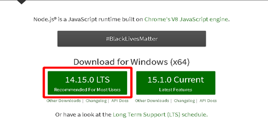


npm is installed with the Nodejs package. Run the executable and follow the installation process for Nodejs:


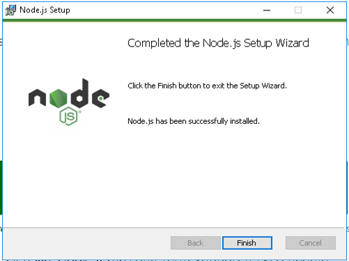


If this does not generate any error, it means that the packages have been updated correctly. 

Now we will be ready to install our [Truffle](https://www.trufflesuite.com/truffle) framework to compile our contract, open the PowerShell console:


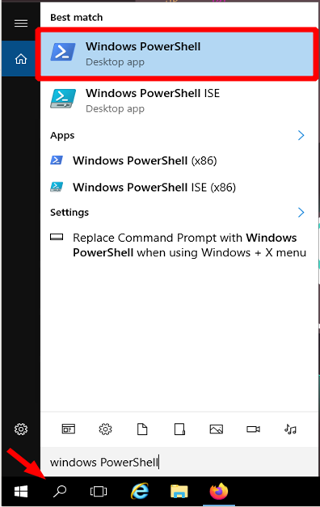


This will open a console in our system. Execute the following command to start the installation.


```
npm install truffle -g
```


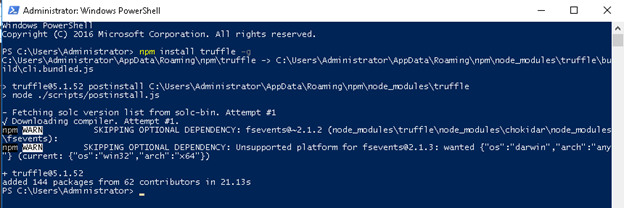
[^1]

Execute the following command to verify that the installation has taken place successfully.


```
truffle version
```


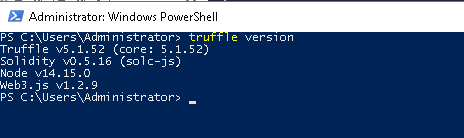


Let's head to Desktop and create an empty folder, in our case we will use the name of energi-dapp


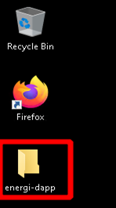


Inside the energi-dapp directory, from the PowerShell console, execute the following command:


```
truffle init
```


This will create the directory’s / file: 

Contracts/: Directory where contracts are stored in Solidity. By default, there is a contract called Migrations.sol that is in charge of registering the migrations that have been carried out.

Migrations/: Directory in which the scripts that will deploy the contracts to the Energi network are saved (in the case of connecting an IDE to the Energi network).

Test/: Directory where the contract’s tests are stored.

Truffle-config.js: Truffle configuration file.


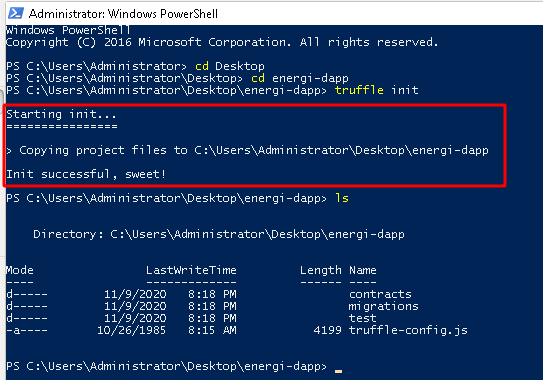


#### Text Editor

Once done, we can start our project with the VScode text editor. You need an editor with an extension for the Solidity language. We suggest:


* [Visual Studio Code](https://code.visualstudio.com/) — with the[ solidity extension ](https://marketplace.visualstudio.com/items?itemName=JuanBlanco.solidity)(this is what we use currently)
* [Atom ](https://atom.io/)— with [language-ethereum ](https://atom.io/packages/language-ethereum)extension

Of course, you can simply choose your favorite code editor — the most popular have available packages for Solidity, for example:


* [Sublime text](https://www.sublimetext.com/) — with [Ethereum ](https://packagecontrol.io/packages/Ethereum)extension.

From the energi-dapp directory from the PowerShell console, execute the next command:


```
code .
```


This will start Visual studio code with our project. You can also simply start VScode then drop the energi-dapp folder into the VScode interface. Next, you will see:


Create a .sol file with the name of our smart contract inside the contracts folder that was created at the initiation of the project. In the next section, we will program the simple contract named election.


### Starting the Smart Contract


* **Compilation version:** On the 1st line of our election.sol file we will need to establish the version of compilation for the contract. Each version may vary according to the needs of the developer.

```
pragma solidity >=0.4.2;
```

Hit the Enter key twice to position on the 3rd line. We will build some functions into the contract. This will be some very basic solidity smart contract code. This tutorial won't be focused on discussing solidity or smart contracts. To learn more, visit the [solidity](https://solidity.readthedocs.io/en/v0.7.1/) documentation.


* **current value of the contract: **will show the current value contained in the contract, is a variable of type string that will be public and will show a text, in this case the Candidate name we will set in the contract by signing a transaction

```
pragma solidity >=0.4.2;

contract election {
    string public candidateName;
```


* **modify values in the contract:** To modify the name of the candidate stored in the contract, a function will be used. It receives a string-type variable as an input parameter. The set functions require a signature to successfully modify some parameters in the contract.

```
pragma solidity >=0.4.2;

contract election {
    string public candidateName;

    function setCandidate (string memory _name) public {
        candidateName = _name;
    }
}
```

### Compiling and Deploying on the Energi network

Now we are ready to compile our contract and deploy it on the Energi Blockchain. We will use the web [MyEnergiWallet](https://wallet.test.energi.network/account) (MEW) as a graphic interface to deploy the contract. We can also interact with the contract for testing purposes. Another way to deploy the contract onto the Energi network is through Truffle. You can read more about it at ( [How to deploy Smart Contracts on the Energi Blockchain](https://dev.to/ogwurujohnson/how-to-deploy-smart-contracts-on-the-energi-blockchain-1188) ).

Make sure you have some tNRG in your account to sign the transaction.

Complete this [form](https://forms.gle/41dRFAFwL4fcgSu46) to get some tNRG.

#### Compile

Once our contract code has been created and debugged, we will have to compile our code. In the energi-dapp directory, from the PowerShell console, execute the following command:


```
truffle compile
```


This will compile our contract creating the:

**ABI:**  ABI stands for Application Binary Interface. A smart contract is stored as bytecode (= binary data) in the blockchain under a specific address also known as contract address. The ABI is needed to access the bytecode and interact with the contract either from MyEnergiWallet or from our Dapp’s graphic interface.

**Byte code:** The code of the contract that the blockchain understands which allows us to deploy the smart contract on the Energi Blockchain.

The next message will indicate that the contract has been compiled successfully.


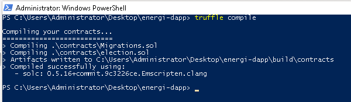


From the VScode interface, we will see that the build and contracts directories are created. Inside these directories you will see a .json file with the name of the contract. In our case it will be election.json.


In this .json file we will find the ABI and the byte code.


```
 //"abi": 

[
   {
     "constant": true,
     "inputs": [],
     "name": "candidateName",
     "outputs": [
       {
         "internalType": "string",
         "name": "",
         "type": "string"
       }
     ],
     "payable": false,
     "stateMutability": "view",
     "type": "function"
   },
   {
     "constant": false,
     "inputs": [
       {
         "internalType": "string",
         "name": "_name",
         "type": "string"
       }
     ],
     "name": "setCandidate",
     "outputs": [],
     "payable": false,
     "stateMutability": "nonpayable",
     "type": "function"
   }
 ],


//the .json file will be more bigger, this only will help us to differentiate the useful parameters of this file.

 //bytecode: 


"0x608060405234801561001057600080fd5b5061030b806100206000396000f3fe608060405234801561001057600080fd5b50600436106100365760003560e01c80635ee0541d1461003b578063822d3cf0146100be575b600080fd5b610043610179565b6040518080602001828103825283818151815260200191508051906020019080838360005b83811015610083578082015181840152602081019050610068565b50505050905090810190601f1680156100b05780820380516001836020036101000a031916815260200191505b509250505060405180910390f35b610177600480360360208110156100d457600080fd5b81019080803590602001906401000000008111156100f157600080fd5b82018360208201111561010357600080fd5b8035906020019184600183028401116401000000008311171561012557600080fd5b91908080601f016020809104026020016040519081016040528093929190818152602001838380828437600081840152601f19601f820116905080830192505050505050509192919290505050610217565b005b60008054600181600116156101000203166002900480601f01602080910402602001604051908101604052809291908181526020018280546001816001161561010002031660029004801561020f5780601f106101e45761010080835404028352916020019161020f565b820191906000526020600020905b8154815290600101906020018083116101f257829003601f168201915b505050505081565b806000908051906020019061022d929190610231565b5050565b828054600181600116156101000203166002900490600052602060002090601f016020900481019282601f1061027257805160ff19168380011785556102a0565b828001600101855582156102a0579182015b8281111561029f578251825591602001919060010190610284565b5b5090506102ad91906102b1565b5090565b6102d391905b808211156102cf5760008160009055506001016102b7565b5090565b9056fea265627a7a7231582041833e4fb33ebd12f0bd3e0e09781f04e3b26ac7216c44e3c778f1fee43ab52d64736f6c63430005100032",
```

#### Deploy

In the Tools section of MyEnergiWallet (web version), or the contracts section in the Desktop version, we will see options for Interact / Deploy the contract. To make the deployment on the main Blockchain, only use MyEnergiWallet under the [main network](https://wallet.energi.network/account).


We will use the Deploy section to upload our contract to the Energi Blockchain. First we will have to log in to our Energi account. We will use same access method available in the MyEnergiWallet under the Deploy section


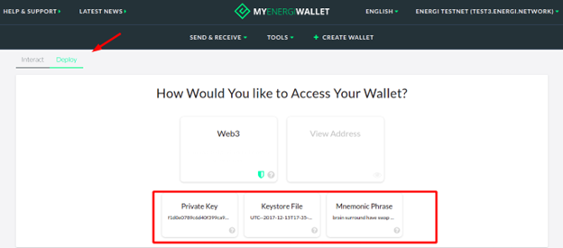


Once we access the account, an interface will be displayed where we will have to add the string of the Byte code and sign / confirm the transaction to Deploy the contract on the Energi Blockchain


MyEnergiWallet shows us a transaction Hash once the transaction has at least 1 confirmation on the network. Check it on the [Explorer](https://explorer.test.energi.network/). You will see the [address of the contract](https://explorer.test.energi.network/tx/0x7de59b7d1ffc0b5ca00b22ae470777482232c07995d37d3539fa66c7f4fd76ba/internal_transactions) if it was deployed successfully. You will need this address to interact with the contract in the Blockchain


Contract address:


```
0x543b0502D0aaf4Fc305dfd0754C551a80763E576
```

## Client-Side Application

Now we will create a graphical user interface which will allow us to interact with our smart contract (which has already been deployed on the Energi network). For this we will use the [React.js](https://reactjs.org/) library. 

We will create a new project with React called interface, in which we will compile our graphical user interface. From the Desktop directory in the PowerShell console execute the following command:


```
npx create-react-app interface
```

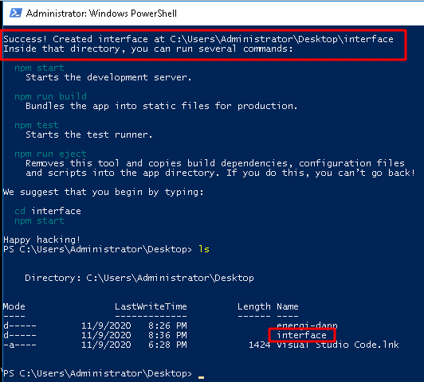
[^2]

This will create our project called interface with the necessary modules for our Web App.

We will start our interface project from VScode. You can do it graphically by dropping the interface folder into the VScode program or from the terminal by going to the project directory and running the `code .` command. 

React.js includes some files as examples for developers that we will not need for our Dapp and will have to remove them. In the following image you can see the files we will delete.


Be sure to delete only these files. Deleting any other files or folders may cause problems when compiling our user interface.

**Adding the Energi Web3js Extension: **The [Energi Web3 Extension](https://docs.google.com/document/d/12SvvrU0BxqrXBGTSTFE6PjuiITq79OuOEi0zAOR1P5I/edit#heading=h.ygoc74erk17b) is a library with modules that allow us to interact with the Energi Blockchain from the PowerShell console. Inside the interface project directory, execute the following command


```
npm i web3 @energi/web3-ext
```


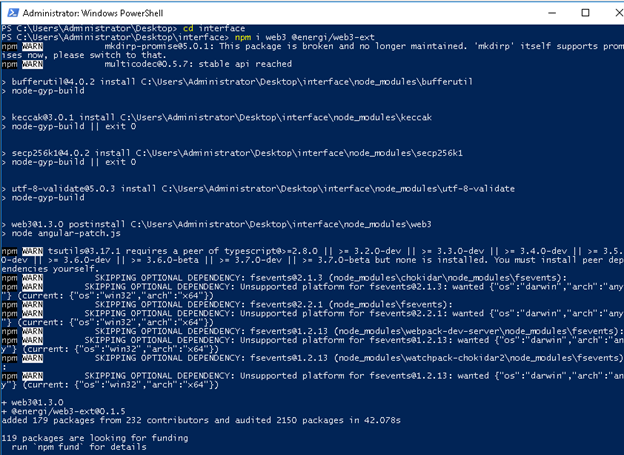
[^3]

This will add the @energi/web3-ext module to our project:


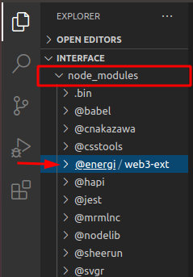


### Compiling code

At this point we will start writing some of the code with which we will create our user interface and connect it to the Energi Blockchain.


#### index.html

In VScode, edit the index.html file on the public directory. This will be a basic HTML skeleton. We will only add a title to our browser tab, a Bootstrap CDN, replace the content in this file with the following:


```
<!DOCTYPE html>
<html lang="en">
  <head>
 <!-- compatibility of some characters with other browsers -->

    <meta chartset="UTF-8"/>

 <!-- title for our browser tab -->

    <title>Energi - Dapp</title>
<!-- this CDN will reduce our code and add some styles to our interface -->

    <link rel="stylesheet" href="https://stackpath.bootstrapcdn.com/bootstrap/4.5.2/css/bootstrap.min.css" integrity="sha384-JcKb8q3iqJ61gNV9KGb8thSsNjpSL0n8PARn9HuZOnIxN0hoP+VmmDGMN5t9UJ0Z" crossorigin="anonymous">


<!-- you can be creative and add an image to the browser tab according to your requirement, favicon is the default name that our browser will recognize for our image either a png or ico file.
make sure the image you want to add to your project is in folder public of you proyect ( optional ) -->

    <link rel="icon" href="favicon.ico">


  <header>
     
  </head>
  <body>
    <noscript>You need to enable JavaScript to run this app.</noscript>
  </header>
  
    <div id="root"></div>

    
  </body>
</html>
```


#### App.js

In this file we will compile our [JSX](https://reactjs.org/docs/introducing-jsx.html#why-jsx) code for our user interface, as well as compiling the components and functions for our final Dapp.

We will need to import the modules and files we will work with:

```
import React, { Component } from 'react';
import './App.css';
import web3 from 'web3';
import { election_ABI, election_address } from './config';
```


We will create a class that will allow us to load the Energi Blockchain to access the information. Next, we will set the default state in the component with the constructor function:


```
class App extends Component {

  componentDidMount() {
  this.loadBlockchainData()
}


constructor(props) {
  super(props)
  this.state = {
    setCandidate: "",  
    candidateName: "",
    account:{} ,
    Contract:{}
  }

  this.handleChange = this.handleChange.bind(this);
  this.handleSetCandidate = this.handleSetCandidate.bind(this);
  this.handleLoadContract = this.handleLoadContract.bind(this);
}
```


We will create a function in which we will instantiate our Web3 extension that will allow us to interact with the network:


```
async loadBlockchainData() {
  const Web3 = require('web3')
  const web3Extension = require('@energi/web3-ext');
  const web3 = new Web3(Web3.givenProvider || "https://nodeapi.test.energi.network")

  web3Extension.extend(web3);
```


Then, we will instantiate our contract on the app. We will also make our interface allow us to connect a Metamask account which will allow us to sign transactions and add values  in the contract:


```
// instantiate the contract and the Metamask app

  const election = await new web3.eth.Contract(election_ABI, election_address)

  this.setState({Contract: election})

  const accounts = await web3.eth.getAccounts()

  this.setState({account: accounts[0]})
```


Next, we will instantiate the methods that our contract will use to interact with the Blockchain. In this case, we will add a value and this value will be read by our interface:


```
// instantiate the methods of the contract

  const getCandidate = await election.methods.candidateName().call()
  this.setState({candidateName: getCandidate})
}
```

Afterwards, we will create functions which will allow us to manage the methods of our contract and associate it to our components:


```
// handling of the smart contract methods


handleChange(e) {    
  this.setState({ setCandidate: e.target.value });
}

handleSetCandidate(e) {    
  this.state.Contract.methods.setCandidate(this.state.setCandidate).send({from: this.state.account});
}


handleLoadContract() {    
  this.loadBlockchainData();

}
```


At this point, we will start to create the components for our user interface that will be rendered in our Dapp. In the next image we can understand it graphically


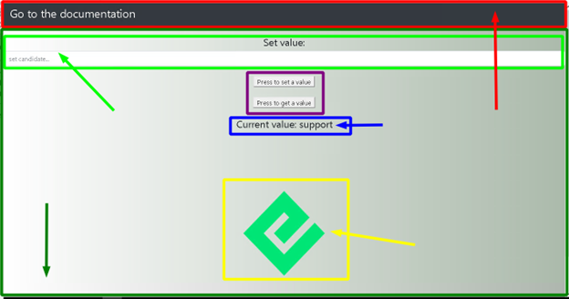


In the red box we see the navigation section. In this section we can add a link to the documentation on how to create our Dapp which was created with the &lt;nav> tag.

The biggest section can be seen in the dark green box, which was sectioned with a &lt;div> tag. This section contains the whole body of our Dapp.

The light green box allows us to set a value in our contract which has been created with an &lt;input> tag.

The **purple** box refers to 2 buttons that will help get the value that is in the contract and another that will allow to sign the transaction once Metamask is connected to the site. They were created with the &lt;button> tag.

The blue box only refers to an &lt;h4> text tag to which has been added a state. This state is associated with the Get function in our contract.

The yellow box refers to a variable called from the index.css file which contains an Energi logo.

Here is our code:

```
// Dapp rendering

render() {
  return (
    <div className="App">
      <div>
        <nav className="navbar navbar-dark bg-dark">
          <a target="_blank" href="https://docs.google.com/document/d/19PXZSRFCZG4Z6c9X_MQgZhN2PH45A2K3yWK7QUM6UqM/edit#" className="text-white">
          <h3>Go to the documentation</h3>
          </a>
        </nav>
      </div>


<br/>
```

Now we will add an input tag which we will use to enter some value we wish to change in our contract. We will also use the button tag to create 2 buttons with which we can read the parameter that is already in the contract and sign a transaction to add a new value to the contract:


```
<div>
       <h4>set value:</h4> 
      <input type="text" className="form-control" onChange={this.handleChange} placeholder="set candidate..." />
     
      <br />
      <button type="submit" onClick={this.handleSetCandidate} value={this.state.setCandidate} formMethod="set" classname1='navbar-dark bg-dark' className='text-black'>
      press to set a candidate 

      </button>
      
      <br/>
      <br/>
      <button type="submit" onClick={this.handleLoadContract}  formMethod="get" classname1='navbar-dark bg-dark' className='text-black' id='getCandidate'> 
      Get Candidate name
      </button>
      <br />
      <br />
      <h4>current value: {this.state.candidateName} </h4>
</div>
```


This will be the end of our code for this file. We will add an Energi logo from the index.css file to add a bit of aesthetics to our Dapp.


```
<div className="logo"> </div>

</div>
  );
}
}

export default App;
```


##### Full Code


From the src directory, replace the content in this file with the following.


```
import React, { Component } from 'react';
import './App.css';
import web3 from 'web3';
import { election_ABI, election_address } from './config';

class App extends Component {

  componentDidMount() {
  this.loadBlockchainData()
}


constructor(props) {
  super(props)
  this.state = {
    setCandidate: "",  
    candidateName: "",
    account:{} ,
    Contract:{}
  }

  this.handleChange = this.handleChange.bind(this);
  this.handleSetCandidate = this.handleSetCandidate.bind(this);
  this.handleLoadContract = this.handleLoadContract.bind(this);
}

// load the Energi Blockchain 
// use the "https://nodeapi.energi.network" Endpoint to connect to the main network

async loadBlockchainData() {
  const Web3 = require('web3')
  const web3Extension = require('@energi/web3-ext');
  const web3 = new Web3(Web3.givenProvider || "https://nodeapi.test.energi.network")

  web3Extension.extend(web3);

// instantiate the contract and the Metamask app

  const election = await new web3.eth.Contract(election_ABI, election_address)

  this.setState({Contract: election})

  const accounts = await web3.eth.getAccounts()

  this.setState({account: accounts[0]})


// instantiate the methods of the contract

  const getCandidate = await election.methods.candidateName().call()
  this.setState({candidateName: getCandidate})


}

// handling of the smart contract functions


handleChange(e) {    
  this.setState({ setCandidate: e.target.value });
  console.log (e.target.value);

}

handleSetCandidate(e) {    
  this.state.Contract.methods.setCandidate(this.state.setCandidate).send({from: this.state.account});
}


handleLoadContract() {    
  this.loadBlockchainData();

}

// Dapp rendering

render() {
  return (
    <div className="App">
      <div>
        <nav className="navbar navbar-dark bg-dark">
          <a target="_blank" href="https://docs.google.com/document/d/13PmFk3SSZxQxjv8nkJVMKadLOfQg01kZEMaMSBFeH8o/edit#heading=h.bvup6pxrwk6b" className="text-white">
          <h3>Go to the documentation</h3>
          </a>
        </nav>
      </div>


<br/>
<div>
       <h4>set value:</h4> 
      <input type="text" className="form-control" onChange={this.handleChange} placeholder="set candidate..." />
     
      <br />
      <button type="submit" onClick={this.handleSetCandidate} value={this.state.setCandidate} formMethod="set" classname1='navbar-dark bg-dark' className='text-black'>
      press to set a candidate 

      </button>
      
<br/>
<br/>
      <button type="submit" onClick={this.handleLoadContract}  formMethod="get" classname1='navbar-dark bg-dark' className='text-black' id='getCandidate'> 
      Get Candidate name
      </button>
      <br />
      <br />
        <h4>current value: {this.state.candidateName} </h4>
</div>
     
     
      <div className="logo"> </div>

</div>
  );
}
}

export default App;
```


#### config.js

This javascript file will be created by us in the src directory. From this file, we will export the ABI and the address of our smart contract. If we go to the App.js file, you will notice at the beginning of the code that we imported a file called config.

You can use any name for this file at the moment of creation. Make sure it is being imported in the App.js file under the name it was created with.


```
export const election_address = '0x543b0502D0aaf4Fc305dfd0754C551a80763E576'

export const election_ABI = [
  {
      "constant": true,
      "inputs": [],
      "name": "candidateName",
      "outputs": [
        {
          "internalType": "string",
          "name": "",
          "type": "string"
        }
      ],
      "payable": false,
      "stateMutability": "view",
      "type": "function"
    },
    {
      "constant": false,
      "inputs": [
        {
          "internalType": "string",
          "name": "_name",
          "type": "string"
        }
      ],
      "name": "setCandidate",
      "outputs": [],
      "payable": false,
      "stateMutability": "nonpayable",
      "type": "function"
    }
]
```

#### index.css

The content of this file will give some styles to our components. Replace the content of this file with the following:


```
.App {
  text-align: center;
}

.logo {
height: 500px;
background-image: url('https://www.energi.world/static/energi-logo-52d829a7ec72ff666d82746188ca0d1f.png');
background-size: 205px 210px;
background-repeat: no-repeat;
background-position: center;
}

body {
  background: #abbaab;  
  background: -webkit-linear-gradient(to right, #ffffff, #abbaab);
  background: linear-gradient(to right, #ffffff, #abbaab); 
  ;
}
```


```mdx-code-block
</TabItem>
<TabItem value="macos" label="MacOS">
```

## Create the smart contract

Smart contracts are computer programs that are stored inside a blockchain. They enforce the negotiation or performance of a contract without relying on a third party. The purpose of smart contracts is to provide superior security and to reduce other transaction costs associated with traditional contracts. We will need to write the contract source code in solidity, compile it, then deploy it to the blockchain. After deployment, clients can send messages and exchange data with the contract.


### What contract will we create?

In this guide, we will create a smart contract called election. Any developer / person can set arbitrary values to the contract. However, it stores the last value only. Setting a new value overwrites the current one. Any developer can query for the current value of the contract. We will also make a simple web interface so we can interact with the contract.


### Installing Dependencies

Before continuing with the contract, we will need to configure the necessary tools to program, compile and deploy the contract, as well as to create the user interface for our Decentralized Application (Dapp).

This project has been compiled in an image to be executed in Docker. ([here is the repository](https://hub.docker.com/r/broje/dapp)) Go to the GitHub repository of this project for more information about how to execute it.


#### Start the project

At this point we will create our project with [truffle](https://www.trufflesuite.com/truffle). For this, we will need to install [npm](https://www.npmjs.com/package/install) and Nodejs which will allow us to handle these packages. From the browser tab go to the [Nodejs](https://nodejs.org/en/) website and download the package manager.


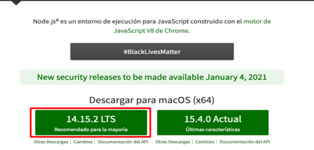


npm is installed with the Nodejs package. Run the installer and follow the installation process for Nodejs:


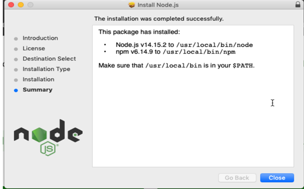


If this does not generate any error, it means that the packages have been updated correctly. 

Now we will be ready to install our [Truffle](https://www.trufflesuite.com/truffle) framework to compile our contract, open the terminal console on your Mac. From the Finder go to Applications, on search bar type ‘’terminal’’ and open it:


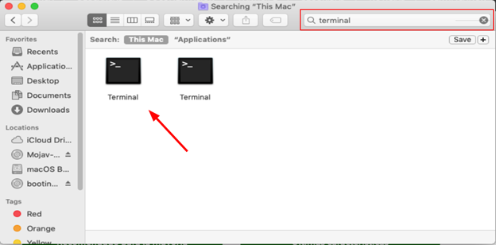


This will open a console in our system. Execute the following command to start the installation.


```
sudo npm install truffle -g
```


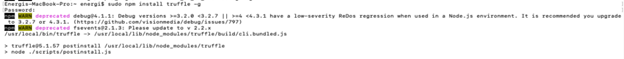
[^1]

Execute the following command to verify that the installation has taken place successfully.


```
truffle version
```


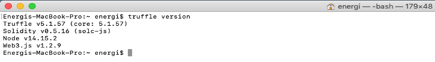


Let's head to Desktop and create an empty folder. In our case we will use the name of energi-dapp


```
cd Desktop
mkdir energi-dapp
```


Inside the energi-dapp directory, from the Mac console, execute the following command:


```
truffle init
```


This will create the directory’s / file: 

Contracts/: Directory where contracts are stored in Solidity. By default, there is a contract called Migrations.sol that is in charge of registering the migrations that have been carried out.

Migrations/: Directory in which the scripts that will deploy the contracts to the Energi network are saved (in the case of connecting an IDE to the Energi network).

Test/: Directory where the contract’s tests are stored.

Truffle-config.js: Truffle configuration file.


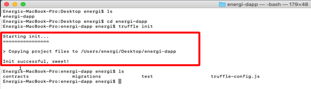


#### Text Editor

Once done, we can start our project with the VScode text editor. You need an editor with an extension for the Solidity language. We suggest:


* [Visual Studio Code](https://code.visualstudio.com/) — with the[ solidity extension ](https://marketplace.visualstudio.com/items?itemName=JuanBlanco.solidity)(this is what we use currently)
* [Atom ](https://atom.io/)— with [language-ethereum ](https://atom.io/packages/language-ethereum)extension

Of course, you can simply choose your favorite code editor — the most popular have available packages for Solidity, for example:


* [Sublime text](https://www.sublimetext.com/) — with [Ethereum ](https://packagecontrol.io/packages/Ethereum)extension.

Start VScode, drop the energi-dapp folder on into the VScode interface, Next, you will see:


Create a .sol file with the name of our smart contract inside the contracts folder that was created at the initiation of the project. In the next section, we will program the simple contract named election.


### Starting the smart contract


* **Compilation version:** On the 1st line of our election.sol file we will need to establish the version of compilation for the contract. Each version may vary according to the needs of the developer.

```
pragma solidity >=0.4.2;
```

Hit the Enter key twice to position on the 3rd line. We will build some functions into the contract. This will be some very basic solidity smart contract code. This tutorial won't be focused on discussing solidity or smart contracts. To learn more, visit the [solidity](https://solidity.readthedocs.io/en/v0.7.1/) documentation.

* **current value of the contract: **will show the current value contained in the contract, is a variable of type string that will be public and will show a text, in this case the Candidate name we will set in the contract by signing a transaction

```
pragma solidity >=0.4.2;

contract election {
    string public candidateName;
```


* **modify values in the contract: **To modify the name of the candidate stored in the contract, a function will be used. It receives a string-type variable as an input parameter. The set functions require a signature to successfully modify some parameters in the contract.

```
pragma solidity >=0.4.2;

contract election {
    string public candidateName;

    function setCandidate (string memory _name) public {
        candidateName = _name;
    }
}
```

### Compiling and Deploying on the Energi network

Now we are ready to compile our contract and deploy it on the Energi Blockchain. We will use the web [MyEnergiWallet](https://wallet.test.energi.network/account) (MEW) as a graphic interface to deploy the contract. We can also interact with the contract for testing purposes. Another way to deploy the contract onto the Energi network is through Truffle. You can read more about it at ( [How to deploy Smart Contracts on the Energi Blockchain](https://dev.to/ogwurujohnson/how-to-deploy-smart-contracts-on-the-energi-blockchain-1188) ).


Make sure you have some tNRG in your account to sign the transaction.

Complete this [form](https://forms.gle/41dRFAFwL4fcgSu46) to get some tNRG.


#### Compile

Once our contract code has been created and debugged, we will have to compile our code. In the energi-dapp directory, from the command line, execute the following command:


```
truffle compile
```


This will compile our contract creating the:

**ABI:**  ABI stands for Application Binary Interface. A smart contract is stored as bytecode (= binary data) in the blockchain under a specific address also known as contract address. The ABI is needed to access the bytecode and interact with the contract either from MyEnergiWallet or from our Dapp’s graphic interface.

**Byte code:** The code of the contract that the blockchain understands which allows us to deploy the smart contract on the Energi Blockchain.

The next message will indicate that the contract has been compiled successfully. 


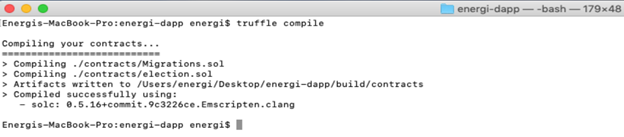


From the VScode interface, we will see that the build and contracts directories are created. Inside these directories you will see a .json file with the name of the contract. In our case it will be election.json.


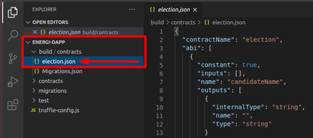


In this .json file we will find the ABI and the byte code.


```
 //"abi": 

[
   {
     "constant": true,
     "inputs": [],
     "name": "candidateName",
     "outputs": [
       {
         "internalType": "string",
         "name": "",
         "type": "string"
       }
     ],
     "payable": false,
     "stateMutability": "view",
     "type": "function"
   },
   {
     "constant": false,
     "inputs": [
       {
         "internalType": "string",
         "name": "_name",
         "type": "string"
       }
     ],
     "name": "setCandidate",
     "outputs": [],
     "payable": false,
     "stateMutability": "nonpayable",
     "type": "function"
   }
 ],


//the .json file will be more bigger, this only will help us to differentiate the useful parameters of this file.

 //bytecode: 


"0x608060405234801561001057600080fd5b5061030b806100206000396000f3fe608060405234801561001057600080fd5b50600436106100365760003560e01c80635ee0541d1461003b578063822d3cf0146100be575b600080fd5b610043610179565b6040518080602001828103825283818151815260200191508051906020019080838360005b83811015610083578082015181840152602081019050610068565b50505050905090810190601f1680156100b05780820380516001836020036101000a031916815260200191505b509250505060405180910390f35b610177600480360360208110156100d457600080fd5b81019080803590602001906401000000008111156100f157600080fd5b82018360208201111561010357600080fd5b8035906020019184600183028401116401000000008311171561012557600080fd5b91908080601f016020809104026020016040519081016040528093929190818152602001838380828437600081840152601f19601f820116905080830192505050505050509192919290505050610217565b005b60008054600181600116156101000203166002900480601f01602080910402602001604051908101604052809291908181526020018280546001816001161561010002031660029004801561020f5780601f106101e45761010080835404028352916020019161020f565b820191906000526020600020905b8154815290600101906020018083116101f257829003601f168201915b505050505081565b806000908051906020019061022d929190610231565b5050565b828054600181600116156101000203166002900490600052602060002090601f016020900481019282601f1061027257805160ff19168380011785556102a0565b828001600101855582156102a0579182015b8281111561029f578251825591602001919060010190610284565b5b5090506102ad91906102b1565b5090565b6102d391905b808211156102cf5760008160009055506001016102b7565b5090565b9056fea265627a7a7231582041833e4fb33ebd12f0bd3e0e09781f04e3b26ac7216c44e3c778f1fee43ab52d64736f6c63430005100032",
```

#### Deploy

In the Tools section of MyEnergiWallet (web version), or the contracts section in the Desktop version, we will see options for Interact / Deploy the contract. To make the deployment on the main Blockchain, only use MyEnergiWallet under the [main network](https://wallet.energi.network/account).


We will use the Deploy section to upload our contract to the Energi Blockchain. First we will have to log in to our Energi account. We will use same access method available in the MyEnergiWallet under the Deploy section


Once we access the account, an interface will be displayed where we will have to add the string of the Byte code and sign / confirm the transaction to Deploy the contract on the Energi Blockchain


MyEnergiWallet shows us a transaction Hash once the transaction has at least 1 confirmation on the network. Check it on the [Explorer](https://explorer.test.energi.network/). You will see the [address of the contract](https://explorer.test.energi.network/tx/0x7de59b7d1ffc0b5ca00b22ae470777482232c07995d37d3539fa66c7f4fd76ba/internal_transactions) if it was deployed successfully. You will need this address to interact with the contract in the Blockchain


Contract address:


```
0x543b0502D0aaf4Fc305dfd0754C551a80763E576
```

## Client-Side Application

Now we will create a graphical user interface which will allow us to interact with our smart contract (which has already been deployed on the Energi network). For this we will use the [React.js](https://reactjs.org/) library.

We will create a new project with React called interface, in which we will compile our graphical user interface. From the Desktop directory in the Mac terminal execute this command[^2].


```
npx create-react-app interface
```


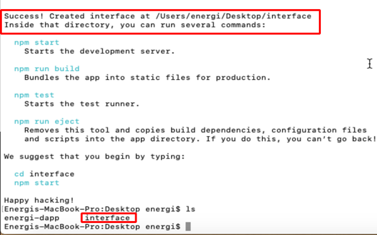


This will create our project called interface with the necessary modules for our Web App.

We will start our interface project from VScode. You can do it graphically by dropping the interface folder into the VScode program or from the terminal by going to the project directory and running the code . command.

React.js includes some files as examples for developers that we will not need for our Dapp and will have to remove them. In the following image you can see the files we will delete.


Be sure to delete only these files. Deleting any other files or folders may cause problems when compiling our user interface.

**Adding the Energi Web3js Extension: **The [Energi Web3 Extension](https://docs.google.com/document/d/12SvvrU0BxqrXBGTSTFE6PjuiITq79OuOEi0zAOR1P5I/edit#heading=h.ygoc74erk17b) is a library with modules that allow us to interact with the Energi Blockchain from the Ubuntu terminal. Inside the interface project directory, execute the following command[^3].


```
npm i web3 @energi/web3-ext
```

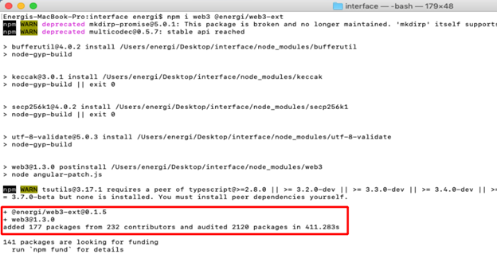


This will add the @energi/web3-ext module to our project


### Compiling code

Now we will start writing some of the code with which we will create our user interface and connect it to the Energi Blockchain.


#### index.html

In VScode, edit the index.html file on the public directory. This will be a basic HTML skeleton. We will only add a title to our browser tab, a Bootstrap CDN, replace the content in this file with the following:


```
<!DOCTYPE html>
<html lang="en">
  <head>
    <!-- compatibility of some characters with other browsers -->
    <meta chartset="UTF-8"/>

    <!-- title for our browser tab -->
    <title>Energi - Dapp</title>

    <!-- this CDN will reduce our code and add some styles to our interface -->
    <link rel="stylesheet" href="https://stackpath.bootstrapcdn.com/bootstrap/4.5.2/css/bootstrap.min.css" integrity="sha384-JcKb8q3iqJ61gNV9KGb8thSsNjpSL0n8PARn9HuZOnIxN0hoP+VmmDGMN5t9UJ0Z" crossorigin="anonymous">


    <!--
    you can be creative and add an image to the browser tab according to your requirement, favicon is the default name that our browser will recognize for our image either a png or ico file.
    make sure the image you want to add to your project is in folder public of you proyect ( optional )
    -->

    <link rel="icon" href="favicon.ico">


    <header>
     
  </head>
  <body>
    <noscript>You need to enable JavaScript to run this app.</noscript>
    </header>
  
    <div id="root"></div>
    
  </body>
</html>
```

#### App.js

In this file we will compile our [JSX](https://reactjs.org/docs/introducing-jsx.html#why-jsx) code for our user interface, as well as compiling the components and functions for our final Dapp.

We will need to import the modules and files we will work with:


```
import React, { Component } from 'react';
import './App.css';
import web3 from 'web3';
import { election_ABI, election_address } from './config';
```


We will create a class that will allow us to load the Energi Blockchain to access the information. Next, we will set the default state in the component with the constructor function:


```
class App extends Component {

  componentDidMount() {
  this.loadBlockchainData()
}


constructor(props) {
  super(props)
  this.state = {
    setCandidate: "",  
    candidateName: "",
    account:{} ,
    Contract:{}
  }

  this.handleChange = this.handleChange.bind(this);
  this.handleSetCandidate = this.handleSetCandidate.bind(this);
  this.handleLoadContract = this.handleLoadContract.bind(this);
}
```


We will create a function in which we will instantiate our Web3 extension that will allow us to interact with the network:


```
async loadBlockchainData() {
  const Web3 = require('web3')
  const web3Extension = require('@energi/web3-ext');
  const web3 = new Web3(Web3.givenProvider || "https://nodeapi.test.energi.network")

  web3Extension.extend(web3);
```


Then, we will instantiate our contract on the app. We will also make our interface allow us to connect a Metamask account which will allow us to sign transactions and add values  in the contract:


```
// instantiate the contract and the Metamask app

  const election = await new web3.eth.Contract(election_ABI, election_address)

  this.setState({Contract: election})

  const accounts = await web3.eth.getAccounts()

  this.setState({account: accounts[0]})
```


Next, we will instantiate the methods that our contract will use to interact with the Blockchain. In this case, we will add a value and this value will be read by our interface:


```
// instantiate the methods of the contract

  const getCandidate = await election.methods.candidateName().call()
  this.setState({candidateName: getCandidate})
}
```

Afterwards, we will create functions which will allow us to manage the methods of our contract and associate it to our components:


```
// handling of the smart contract methods


handleChange(e) {    
  this.setState({ setCandidate: e.target.value });
}

handleSetCandidate(e) {    
  this.state.Contract.methods.setCandidate(this.state.setCandidate).send({from: this.state.account});
}


handleLoadContract() {    
  this.loadBlockchainData();

}
```

At this point, we will start to create the components for our user interface that will be rendered in our Dapp. In the next image we can understand it graphically


In the red box we see the navigation section. In this section we can add a link to the documentation on how to create our Dapp which was created with the &lt;nav> tag.

The biggest section can be seen in the dark green box, which was sectioned with a &lt;div> tag. This section contains the whole body of our Dapp.

The light green box allows us to set a value in our contract which has been created with an &lt;input> tag.

The **purple** box refers to 2 buttons that will help get the value that is in the contract and another that will allow to sign the transaction once Metamask is connected to the site. They were created with the &lt;button> tag.

The blue box only refers to an &lt;h4> text tag to which has been added a state. This state is associated with the Get function in our contract.

The yellow box refers to a variable called from the index.css file which contains an Energi logo.

Here is our code:


```
// Dapp rendering

render() {
  return (
    <div className="App">
      <div>
        <nav className="navbar navbar-dark bg-dark">
          <a target="_blank" href="https://docs.google.com/document/d/13PmFk3SSZxQxjv8nkJVMKadLOfQg01kZEMaMSBFeH8o/edit#heading=h.bvup6pxrwk6b" className="text-white">
          <h3>Go to the documentation</h3>
          </a>
        </nav>
      </div>

<br/>
```


Now we will add an input tag which we will use to enter some value we wish to change in our contract. We will also use the button tag to create 2 buttons with which we can read the parameter that is already in the contract and sign a transaction to add a new value to the contract:


```
<div>
       <h4>set value:</h4> 
      <input type="text" className="form-control" onChange={this.handleChange} placeholder="set candidate..." />
     
      <br />
      <button type="submit" onClick={this.handleSetCandidate} value={this.state.setCandidate} formMethod="set" classname1='navbar-dark bg-dark' className='text-black'>
      press to set a candidate 
      </button>
      
      <br/>
      <br/>

      <button type="submit" onClick={this.handleLoadContract}  formMethod="get" classname1='navbar-dark bg-dark' className='text-black' id='getCandidate'> 
      Get Candidate name
      </button>

      <br />
      <br />

      <h4>current value: {this.state.candidateName} </h4>
</div>
```

This will be the end of our code for this file. We will add an Energi logo from the index.css file to add a bit of aesthetics to our Dapp.


```
      <div className="logo"> </div>

      </div>
        );
  }
}

export default App;
```


##### Full Code


From the src directory, replace the content in this file with the following


```
import React, { Component } from 'react';
import './App.css';
import web3 from 'web3';
import { election_ABI, election_address } from './config';

class App extends Component {

  componentDidMount() {
  this.loadBlockchainData()
}

constructor(props) {
  super(props)
  this.state = {
    setCandidate: "",  
    candidateName: "",
    account:{} ,
    Contract:{}
  }

  this.handleChange = this.handleChange.bind(this);
  this.handleSetCandidate = this.handleSetCandidate.bind(this);
  this.handleLoadContract = this.handleLoadContract.bind(this);
}

// load the Energi Blockchain 
// use the "https://nodeapi.energi.network" Endpoint to connect to the main network

async loadBlockchainData() {
  const Web3 = require('web3')
  const web3Extension = require('@energi/web3-ext');
  const web3 = new Web3(Web3.givenProvider || "https://nodeapi.test.energi.network")

  web3Extension.extend(web3);

// instantiate the contract and the Metamask app

  const election = await new web3.eth.Contract(election_ABI, election_address)

  this.setState({Contract: election})

  const accounts = await web3.eth.getAccounts()

  this.setState({account: accounts[0]})


// instantiate the methods of the contract

  const getCandidate = await election.methods.candidateName().call()
  this.setState({candidateName: getCandidate})


}

// handling of the smart contract functions


handleChange(e) {    
  this.setState({ setCandidate: e.target.value });
  console.log (e.target.value);

}

handleSetCandidate(e) {    
  this.state.Contract.methods.setCandidate(this.state.setCandidate).send({from: this.state.account});
}


handleLoadContract() {    
  this.loadBlockchainData();

}

// Dapp rendering

render() {
  return (
    <div className="App">
      <div>
        <nav className="navbar navbar-dark bg-dark">
          <a target="_blank" href="https://docs.google.com/document/d/13PmFk3SSZxQxjv8nkJVMKadLOfQg01kZEMaMSBFeH8o/edit#heading=h.bvup6pxrwk6b" className="text-white">
          <h3>Go to the documentation</h3>
          </a>
        </nav>
      </div>


<br/>
<div>
       <h4>set value:</h4> 
      <input type="text" className="form-control" onChange={this.handleChange} placeholder="set candidate..." />
     
      <br />
      <button type="submit" onClick={this.handleSetCandidate} value={this.state.setCandidate} formMethod="set" classname1='navbar-dark bg-dark' className='text-black'>
      press to set a candidate 

      </button>
      
<br/>
<br/>
      <button type="submit" onClick={this.handleLoadContract}  formMethod="get" classname1='navbar-dark bg-dark' className='text-black' id='getCandidate'> 
      Get Candidate name
      </button>
      <br />
      <br />
        <h4>current value: {this.state.candidateName} </h4>
</div>
     
     
      <div className="logo"> </div>

</div>
  );
}
}

export default App;
```

#### config.js

This javascript file will be created by us in the src directory. From this file, we will export the ABI and the address of our smart contract. If we go to the App.js file, you will notice at the beginning of the code that we imported a file called config.

You can use any name for this file at the moment of creation. Make sure it is being imported in the App.js file under the name it was created with.


```
export const election_address = '0x543b0502D0aaf4Fc305dfd0754C551a80763E576'

export const election_ABI = [
  {
      "constant": true,
      "inputs": [],
      "name": "candidateName",
      "outputs": [
        {
          "internalType": "string",
          "name": "",
          "type": "string"
        }
      ],
      "payable": false,
      "stateMutability": "view",
      "type": "function"
    },
    {
      "constant": false,
      "inputs": [
        {
          "internalType": "string",
          "name": "_name",
          "type": "string"
        }
      ],
      "name": "setCandidate",
      "outputs": [],
      "payable": false,
      "stateMutability": "nonpayable",
      "type": "function"
    }
]
```

#### index.css

The content of this file will give some styles to our components. Replace the content of this file with the following:


```
.App {
  text-align: center;
}

.logo {
height: 500px;
background-image: url('https://www.energi.world/static/energi-logo-52d829a7ec72ff666d82746188ca0d1f.png');
background-size: 205px 210px;
background-repeat: no-repeat;
background-position: center;
}

body {
  background: #abbaab;  
  background: -webkit-linear-gradient(to right, #ffffff, #abbaab);
  background: linear-gradient(to right, #ffffff, #abbaab); 
  ;
}
```


```mdx-code-block
</TabItem>

</Tabs>
```

<!-- Footnotes themselves at the bottom. -->
## Notes

[^1]:
     ignore warnings that may be generated by unsupported dependencies

[^2]:
     ignore warnings that may be generated by unsupported dependencies

[^3]:
     ignore warnings that may be generated by unsupported dependencies
