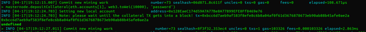

## Introduction
In addition to the current mainnet and testnet networks, a third network version has been added with the goal of creating a network that is easy to test features on without requiring a hard fork of the previous network instance. Simnet network activated by setting `--simnet` flag fits the bill.

Its easy to set up and tear down a simnet network because:


1. The genesis block configuration is stored in the datadir folder as `simnet-genesis.json` file.
2. No migration file setting is necessary because a special migration tx is created to help process the migration block on simnet.
3. It has no default bootnodes unlike all the other networks.

## Setting up the Simnet network.

A minimum of two nodes to run the simnet network are required with one of them being selected as the bootnode. Bootnode helps a node locate other nodes. Only some bootnodes that should run without a bootnode enode url set using `--bootnodes` otherwise any other node that runs without a bootnode enode url set, it will never be able to connect to the simnet network.

### Important Commands.

**_Addresses and other configs defined below here can be modified with any other valid configurations and still run as expected. The only condition is that nodes in a common network have to share a common genesis block; otherwise nodes with a different configuration will be dropped from the network._**


## Instructions to set up nodes


1. Create separate empty datadir directories for those two nodes let’s call them:  

```
mkdir mining-node-datadir
mkdir non-mining-node-datadir
```

2. Run the following command to create initial genesis file to be modified


```
./energi3 --simnet --datadir /dir/to/mining-node-datadir console
```


3. So far we noticed that in `/dir/to/mining-node-datadir `   we have created a default genesis block configuration file called `simnet-genesis.json ` where we need to modify addresses. To have access to new addresses we need to generate them from this console with the following command:


```
personal.newAccount("password")
```

We need to generate 6 addresses as we one for initial balance (initial address 0x844621b803a2a4f2b4a0d5b1cd43ffa7c2f20f94) and others for governance related management

We should notice that in the directory there is keystore folder where our keys are created. 

4. Now we modify genesis block and replace existing default addresses with newly generated addresses.

5. For now we create password file and on each file we have written the password that was used when generating `personal.newAccount ` 

6. For this moment we have stopped node after generating account and now we need to delete blockchain data file which is `/dir-to/mining-node-datadir/energi3 `(otherwise we have have error: “**database already contains an incompatible genesis block**”)

7. For this moment we can start first node by first unlocking migration signer and cpp signer addresses,  password file and  Comma separated list of contract=account pairs `--miner.dpor`:


```
./energi3 --simnet --datadir /dir/to/mining-node-datadir --unlock  0x2345a0469394815a878c7b7162d5873b8412eab9,0xc138a111703dd18500166e038245017e2f34fef0 --password ../mining-node-datadir/password.txt --miner.dpos 0x0000000000000000000000000000000000000308=0x2345a0469394815a878c7b7162d5873b8412eab9,0x0000000000000000000000000000000000000306=0xc138a111703dd18500166e038245017e2f34fef0
```

Where `0x2345a0469394815a878c7b7162d5873b8412eab9 ` and `0xc138a111703dd18500166e038245017e2f34fef0 ` are migration signer and cpp signer addresses correspondingly. 

8. For running second node its directory will be the one created above `/datadir/to/non-mining-node-datadir ` and before starting we need to copy `simnet-genesis.json ` genesis file into this directory.

9. For running the second node we need to copy first mining node’s enode url which is printed upon starting and looks like **enode://e9c78af79305fdf6f6a5cfce17c45976afff667e634cec14f798b2eaeeb79b3627a997307542270309543f2e6d3e7f9d4bc2763e0d6ce4777edea97b020b374d@127.0.0.1:12345**.

And run: 

```
./energi3 --simnet --datadir /dir/to/non-mining-node-datadir --bootnodes enode://aso120312012pasmda;sme12-jeqpwmpqod12od-20j1d1omc1-mm010123@127.0.0.1:12345 console
```

The node will start and connect created network, adding “console” flag when running the first node will open javascript environment for communicating with the network.


Genesis block json example:

```
   {
       "alloc": {
           "0x0000000000000000000000000000000000000308": { "balance": "10000000000000000000" },
           "0x0000000000000000000000000000000000000310": { "balance": "120000000000000000000" },
           "0x844621b803a2a4f2b4a0d5b1cd43ffa7c2f20f94": { "balance": "150000000000000000000000000000"}
       },

       "difficulty": "0x2c",
       "gasLimit"  : "0x2fefd8",
       "timestamp" : "1586995092",
       "nonce"     : "0x00",
       "extraData" : "",
       "coinbase"  : "0x0000000000000000000000000000000000000301",
       "number"    : "0x00",
       "gasUsed"   : "0x3D0900",
       "mixhash"    : "0x0000000000000000000000000000000000000000000000000000000000000400",
       "parentHash" : "0x0000000000000000000000000000000000000000000000000000000000000500",

       "config"    : {
           "chainId"               : 59797,
           "homesteadBlock"        : 0,
           "eip150Block"           : 0,
           "eip150Hash"            : "0x0000000000000000000000000000000000000000000000000000000000000600",
           "eip155Block"           : 0,
           "eip158Block"           : 0,
           "byzantiumBlock"        : 0,
           "constantinopleBlock"   : 0,
           "petersburgBlock"       : 0,
           "energi"  : {
               "backboneAddress": "0xbbf49b4e3e363b5cbf1074cc52f4330764d5cf91",
               "migrationSigner": "0x7d33f22bc04fd4f5041f13eb1183eff9ae7c7712",
               "ebiSigner"      : "0x128eaec174d59a7a77be8a77899efe8ff8469e76",
               "cppSigner"      : "0x21902f8414b0b4810d75ba40c651191bcf311552",
               "hfSigner"       : "0xfadfcbc05aa1f56d9ee0ee162ea9e77f49d5e45d"
           },

           "superblockCycle"       : 100,
           "mnRequireValidation"   : 2,
           "mnValidationPeriod"    : 2,
           "mnCleanupPeriod"       : 86400,
           "mnEverCollateral"      : 3000000000000000000000,
           "mnRewardsPerBlock"     : 10,
           "hfFinalizationPeriod"  : 30
       }
   }
```


* Replace: `hfSigner`, `cppSigner`, `ebiSigner`, `migrationSigner` and `backboneAddress` with locally created addresses within your bootnode. Create an address/account using: `personal.newAccount("set-account-password")`
* Replace `0x844621b803a2a4f2b4a0d5b1cd43ffa7c2f20f94 ` with whatever address you need to have pre-allocated balances. You can also add as many addresses with pre-allocated balances as needed.
* You have to make the node that mines the migration block, i.e. has the `migrationSigner` account be the first miner to join the network.

To make your bootnode, a miner using the migrations contract set the following:

You also need to ensure that this node has the same signer address keys as the other miner if at all this is the second node mining on the migrations contract. 


```
./energi3 --simnet --unlock 0x7d33f22bc04fd4f5041f13eb1183eff9ae7c7712,0x21902f8414b0b4810d75ba40c651191bcf311552 --password ~/passwordFile --miner.dpos 0x0000000000000000000000000000000000000308=0x7d33f22bc04fd4f5041f13eb1183eff9ae7c7712,0x0000000000000000000000000000000000000306=0x21902f8414b0b4810d75ba40c651191bcf311552 console
```

To obtain this node’s enode key, run the command: 


```
admin.nodeInfo.enode
```

Copy the returned value:

**NB:** The returned enode key should have the following format:

```
enode://<public_key_string>@<IP_Address>:<port_number>
```


```
enode://4e115846229e06a477a5f67a7f4e7b9a52ed543960a1fe5df5d8b9f1674c15970c0305b6831969f785bb986a37a03d9abd22c2c15f78071fb65e2f4eb2b86f8d@102.140.244.180:59797
```

Sometimes the returned enode url might be returned with a local/loopback IP address instead of an IP address accessible via internet connection. i.e.


```
enode://c5af006a578bdcd8f77897a95637cabbd8554d0db54882768c3dc2a09aba57ecc37f46c299175f406abd0d4a3bb1380690f6e8c957a41ff2574255f342bb1cb7@127.0.0.1:59797
```


The solution to making this a valid enode url is to obtain the instance’s/machine’s remote IP address and replace the loopback address (“127.0.0.1”) with it.


10. Run the second node:

    The second node is very important, as no blocks mining can happen without at least one peer connected to the mining node. This process can be repeated to set up as many nodes in the network as possible.


* Using the node as a peer:

```
/energi3 --simnet --bootnodes enode://c5af006a578bdcd8f77897a95637cabbd8554d0db54882768c3dc2a09aba57ecc37f46c299175f406abd0d4a3bb1380690f6e8c957a41ff2574255f342bb1cb7@3.136.233.157:59797 console
```


* Using it as a peer and a node mining through the migration contract.

```
./energi3 --simnet --bootnodes enode://c5af006a578bdcd8f77897a95637cabbd8554d0db54882768c3dc2a09aba57ecc37f46c299175f406abd0d4a3bb1380690f6e8c957a41ff2574255f342bb1cb7@3.136.233.157:59797 --unlock 0x7d33f22bc04fd4f5041f13eb1183eff9ae7c7712,0x21902f8414b0b4810d75ba40c651191bcf311552,0x844621b803a2a4f2b4a0d5b1cd43ffa7c2f20f94 --password ~/password.txt --miner.dpos 0x0000000000000000000000000000000000000308=0x7d33f22bc04fd4f5041f13eb1183eff9ae7c7712,0x0000000000000000000000000000000000000306=0x21902f8414b0b4810d75ba40c651191bcf311552 console
```


    `--bootnodes` => Lists the comma separated valid enodes urls from the selected bootnode(s) decided for the network.


    `--unlock` => Lists the specific local account(s) to be unlocked for staking. The are supposed to be comma separated addresses.


    `--password` => Defines a file with all the passwords (each on its own newline) to be used to unlock the specified accounts for staking. If the password file is not provided when the `--unlock` flag is used, a password prompt appears to request the user to input a password for the specified account.


    `--miner.dpos` => Helps define a list commas separated contract to signer mappings.


    **_NB:_** _Having two node mining on the same account especially if the same account is the migration contract isn’t recommended. This makes the difficulty to drop to 1 and can barely be able to rise to a value above 1._


    _Another mining account should only be introduced to the network after block 1 (migrations block) has been mined otherwise such errors will show up:_


    _This happens if an account that was included in the genesis block presale (allocs) configuration, has balance greater than or equal to 1NRG is unlocked for staking while running through the command line arguments._

11. Send a transaction:
To be able to send a transaction using a given account, unlock it first using:

```
personal.unlockAccount('0x128eaec174d59a7a77be8a77899efe8ff8469e76')
```

 **NB:** This command has 2 more optional parameters i.e. password and duration.


If the password is set to null, a password appears  on the command: 


```
personal.unlockAccount('0x128eaec174d59a7a77be8a77899efe8ff8469e76')
```


=> unlocked for 300 secs


```
personal.unlockAccount('0x128eaec174d59a7a77be8a77899efe8ff8469e76', null, 30)
```


=> unlocked for 30 secs


```
personal.unlockAccount('0x128eaec174d59a7a77be8a77899efe8ff8469e76', null, 0)
```


=> unlocked till energi3 shuts down

Then input the prompted password input.

Then you are good to send a transaction:


```
eth.sendTransaction({'to':'0x128eaec174d59a7a77be8a77899efe8ff8469e76', 'from':'0x844621b803a2a4f2b4a0d5b1cd43ffa7c2f20f94', 'value':web3.toWei('100000'), 'gas':21000})
```


It’s always important to confirm if the recipient’s address exists to avoid sending coins to an incorrect address.


12. Deposit Collateral:

If `nrg.accounts` returns:


```
["0x7d33f22bc04fd4f5041f13eb1183eff9ae7c7712", "0x128eaec174d59a7a77be8a77899efe8ff8469e76", "0x21902f8414b0b4810d75ba40c651191bcf311552", "0x844621b803a2a4f2b4a0d5b1cd43ffa7c2f20f94", "0xbbf49b4e3e363b5cbf1074cc52f4330764d5cf91"]
```

And you want to deposit funds to `0x128eaec174d59a7a77be8a77899efe8ff8469e76` as your masternode owner address. You can always select the address using its index:


```
// This will be depositing 10,000 NRG coins.
masternode.depositCollateral(nrg.accounts[1], web3.toWei(10000), 'account-password')
```





After some few seconds the tx, could have been mined into the next block allowing one to proceed with the next operations on a masternode.

13. Announce a Masternode.


```
masternode.announce(nrg.accounts[1], admin.nodeInfo.enode, 'account-password')
```


After some few seconds the tx, could have been mined into the next block allowing one to proceed with the next operations on a masternode.
